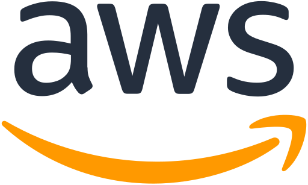

# aws-cookbook

## What is AWS (Amazon Web Services)?

[Amazon Web Services (AWS)](https://aws.amazon.com/what-is-aws/) is the world’s most comprehensive and broadly adopted cloud, offering over 200 fully featured services from data centers globally. Millions of customers—including the fastest-growing startups, largest enterprises, and leading government agencies—are using AWS to lower costs, become more agile, and innovate faster.

AWS has significantly more [services](https://aws.amazon.com/products/?pg=WIAWS-mstf), and more features within those services, than any other cloud provider–from infrastructure technologies like compute, storage, and databases–to emerging technologies, such as machine learning and artificial intelligence, data lakes and analytics, and Internet of Things. This makes it faster, easier, and more cost effective to move your existing applications to the cloud and build nearly anything you can imagine.

## Cookbook
- [Parameterized deploy of single EC2 instance](./cloudformation/parameterized-ec2-deploy/)
- [Run Hello World AWS Lambda function via AWS CLI](./lambda/hello-world-via-cli/)
- [Image Resizing with Lambda using Two S3 Buckets](./s3-trigger-lambda/)
- [Provision EKS Managed Node Groups Cluster via eksctl](./provision-eks-cluster-with-eksctl/)
- [Provision ECS cluster with service via AWS CLI](./provision-ecs-cluster-via-cli/)
- [How to provide Internet access for resources via IGW](./provide-internet-access-via-igw/)
- [Migrate PostgreSQL to AWS RDS](./migrate-to-rds-psql/)
- [AWS CDK Basics](./cdk-basics/)
- [API Gateway Basics: HTTP API with Lambda function](./api-gateway/basics/)
- [API Gateway: CRUD HTTP API with Lambda and DynamoDB](./api-gateway/http-api-lambda-dynamodb/)
- [Run Agones Dedicated Game Server on EKS](./agones-game-server-eks/)