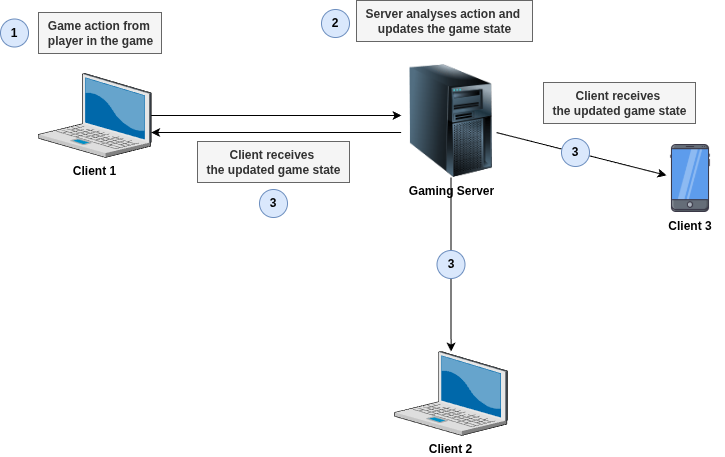
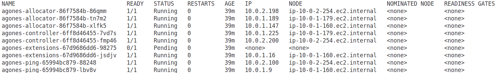

# Run Agones Dedicated Game Server on EKS

[Agones](https://agones.dev/site/docs/overview/) is a library for hosting, running and scaling [dedicated game servers](https://en.wikipedia.org/wiki/Game_server#Dedicated_server) on Kubernetes.

**Dedicated Game Server** -  is a standalone server that acts as the **single source of truth** for everything **happening in the game**. Each player’s device (the client) sends gameplay inputs to the server and receives updates in return. The server processes these inputs, updates the game state, and periodically sends the latest version back to the clients - what players see on their screens.

This setup is the most common approach in the client-server architecture for running multiplayer game servers.



Client-server architecture is ideal for games that are fast-paced, run in real time, and require a lot of computing power. That’s why it’s commonly used in games like first-person shooters (e.g., Call of Duty, CS:GO), massively multiplayer online games (MMOG) (e.g., World of Warcraft), and persistent online worlds (e.g., Minecraft).

For more information about dedicated game servers, review the following resources:
- [Dedicated Game Servers, Drawn Badly (video)](https://www.youtube.com/watch?v=Nl_FIGFtYdc)
- [What Every Programmer Needs To Know About Game Networking](https://gafferongames.com/post/what_every_programmer_needs_to_know_about_game_networking/)
- [Fast-Paced Multiplayer (Part I): Client-Server Game Architecture](https://www.gabrielgambetta.com/client-server-game-architecture.html)
- [Example simple gameserver that responds to UDP and/or TCP commands](https://github.com/googleforgames/agones/blob/release-1.49.0/examples/simple-game-server)


## What is Agones?

[Agones](https://github.com/googleforgames/agones) is an open source platform, for deploying, hosting, scaling, and orchestrating dedicated game servers for large scale multiplayer games, built on top of the industry standard, distributed system platform [Kubernetes](https://kubernetes.io/).

**Agones** replaces custom-built or proprietary systems for managing and scaling game servers with an **open-source** solution. This allows developers to focus on building the multiplayer game itself, instead of spending time and resources on the underlying infrastructure.

Agones is designed to work seamlessly with both cloud and on-premises infrastructure. It dynamically adapts its strategies for fleet management, autoscaling, and more - ensuring that dedicated game servers use resources in a cost-effective way, tailored to their specific environment.

## Why Agones?

Some of Agones’ Key Advantages:
- **Lower development and operational costs** for hosting, scaling, and managing multiplayer game servers.
- **Supports any game server that can run on Linux**, regardless of programming language or dependencies.
- **Runs anywhere Kubernetes does** - in the cloud, on-premises, or even locally.
- **Unifies your game services and game servers** on a single platform, simplifying tooling and operations.
- **Built as an extension of Kubernetes**, Agones leverages the robust features and ecosystem maintained by thousands of contributors.
- **Free and open source**, developed entirely in public.

## Major Features of Agones

Agones provides the following key capabilities:
- **Extends Kubernetes natively**, enabling the creation, management, and scaling of dedicated game server processes using standard Kubernetes tooling and APIs.
- **Manages Fleets of game servers**, allowing updates without disrupting active player sessions.
- **Deploys game servers in Docker containers**, supporting any combination of dependencies or binaries.
- **Includes a built-in game server SDK** for managing server lifecycle, including health checks, state transitions, configuration, and more.
- **Supports autoscaling**, ensuring players always have available game servers when needed.
- **Offers built-in metrics and log aggregation**, providing visibility across all game server sessions.
- **Features a modular architecture**, allowing customization for different multiplayer game mechanics.
- **Implements advanced scheduling and allocation strategies**, optimizing resource usage across both cloud and on-premises environments.

## Game Engine

A **game engine** is a software framework used to build and develop video games. It provides the core building blocks developers need so they don’t have to create everything from scratch.

It typically includes:
- Graphics rendering (2D or 3D visuals)
- Physics simulation (movement, collisions, gravity)
- Audio (music, sound effects)
- Scripting (game logic via code)
- Animation (character or object movement)
- AI (enemy behavior, pathfinding)
- Networking (for multiplayer games)
- Input handling (keyboard, mouse, controller)

Game engines let developers **focus on game design**, not low-level programming. 

The most popular game engines are:
- [Unity](https://unity.com/) - widely used for both 2D and 3D games
- [Unreal Engine](https://www.unrealengine.com/en-US) - popular for high-end 3D games
- [Godot](https://godotengine.org/) - open source and beginner-friendly

Agones supports **Unity** and **Unreal Engine** game engines with built-in SDKs for them.

For more information about Game Development and Network Architechture, see the following resource: [A curated list of Multiplayer Game Network Programming](https://multiplayernetworking.com/)

## Supported platforms and Kubernetes versions

The following container operating systems and architectures can be utilised with Agones:

| OS      | Architecture | Support |
|---------|--------------|---------|
| **linux**   | **amd64**        | **Stable**  |
| linux   | arm64        | Alpha   |
| windows | amd64        | Alpha   |

The stable and tested version of Agones is for Linux on AMD64 architecture.

The most recent version of **Agones 1.49**, supports **Kubernetes versions 1.30, 1.31, 1.32**. For more information, see [Agones and Kubernetes Supported Versions](https://agones.dev/site/docs/installation/#:~:text=any%20issue%20found.-,Agones%20and%20Kubernetes%20Supported%20Versions,-Agones%20will%20support)

## Provision EKS Cluster

Provision EKS cluster with the following parameters:
- Cluster Name: `prod`
- Kubernetes Version: `1.32`
- Node Group Name: `standard-workers`
- Node Type: `t3.medium`
- Node Min Number: `3`
- Node Max Number: `4`

As an example for EKS cluster, checkout this project: [EKS with Managed Node Groups](https://github.com/Brain2life/terraform-cookbook/tree/main/eks-with-managed-node-group)

> [!CAUTION] 
> For Agones to work correctly, update the **EKS worker group security group** and **allow inbound rule for UDP traffic with 7000-8000 port range**.

To provision cluster:
```bash
terraform apply
```

To update your local kubeconfig file and access `prod` cluster, run:
```bash
aws eks update-kubeconfig --region us-east-1 --name prod
```

## Install Agones using Helm

**Versions**  
- Helm package manager 3.2.3+

To install the chart with the release name `my-release` using stable Agones helm repository:
```bash
helm repo add agones https://agones.dev/chart/stable
helm repo update
helm install my-release --namespace agones-system --create-namespace agones/agones
```
> **NOTE**  
> It is recommended installing Agones in its own namespaces, such as `agones-system`.

The commands above deploys Agones on the Kubernetes cluster with the **default configuration**. The [configuration](https://agones.dev/site/docs/installation/install-agones/helm/#configuration) section lists the parameters that can be configured during installation.

You can get the Agones components pods status by running:
```bash
kubectl --namespace agones-system get pods -o wide
```



In a production setup, it's best to run **Agones system components** (like its controller and allocator) on a **dedicated set of nodes**, separate from the nodes used to run your **game server processes**.

Game servers are the actual multiplayer sessions your players connect to - they can be very resource-intensive (CPU, memory, and network), and you don’t want them to interfere with the critical components that keep Agones running.

To help with this separation, Agones **prefers to be scheduled** on Kubernetes nodes that are **labeled** with:

```text
agones.dev/agones-system=true
```

This label tells Kubernetes, “These nodes are meant for Agones system workloads.”

It also **tolerates a taint** with the key and effect:

```text
agones.dev/agones-system=true:NoExecute
```

This taint prevents regular workloads (like game servers or unrelated apps) from being scheduled on those nodes - **unless they explicitly tolerate the taint**, like Agones components do.

If such dedicated nodes are not available, Agones components will fall back to running on regular worker nodes, but **this is not ideal for production** because it mixes infrastructure management with game session workloads, reducing stability and performance.

For instructions on setting up a dedicated node pool for Agones, see the [Agones installation instructions](https://agones.dev/site/docs/installation/) for your preferred environment.

## References

- [Servers.com Blog: What is a gaming server?](https://www.servers.com/news/blog/what-is-a-game-server)
- [Agones Best Practices](https://agones.dev/site/docs/guides/best-practices/)