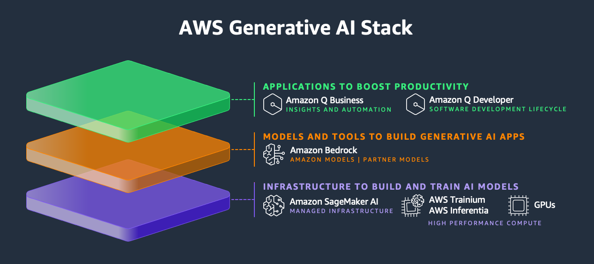
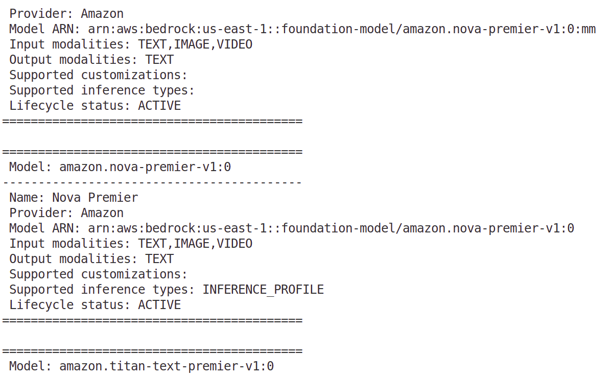

# Getting Started with Amazon Bedrock


[**Amazon Bedrock**](https://docs.aws.amazon.com/bedrock/latest/userguide/what-is-bedrock.html) is a fully managed AWS service that gives you access to high-quality **foundation models (FMs)** from Amazon and other leading AI companies, all through a single, unified API.


Here’s what that means in practice:

* **Wide choice of FMs**: Instead of being locked into one model, you can explore different foundation models (such as text, image, or multi-modal models) and pick the one best suited for your specific use case - whether that’s chatbots, text summarization, content generation, or other AI tasks.

* **No infrastructure management**: Normally, running large AI models requires powerful hardware (like GPUs) and complex setup. With Bedrock, AWS handles all of that for you, so you just focus on building your application.

* **Experiment and evaluate**: You can quickly try out multiple models to see which one gives the best results for your scenario. This lowers the barrier to testing and speeds up innovation.

* **Customization with your data**: Bedrock lets you adapt models to your business context. You can:

  * Use **fine-tuning** to adjust the model with your own training data.
  * Use **Retrieval Augmented Generation (RAG)**, where the model pulls in facts from your private data sources to give more accurate and up-to-date responses without needing full retraining.

* **Enterprise-grade capabilities**: Bedrock includes built-in tools for **security, privacy, and responsible AI**, ensuring your data is handled safely and the models are used in line with ethical best practices.

* **Build AI agents**: Beyond simple responses, you can create **AI agents** that can connect to your existing enterprise systems (like databases, APIs, or internal apps) and actually perform tasks on your behalf.

In short: **Amazon Bedrock makes it easy to try, customize, and scale powerful AI models (FMs) securely - without having to manage the heavy infrastructure yourself.**

For information about pricing for different Amazon Bedrock resources, see [Amazon Bedrock pricing](https://aws.amazon.com/bedrock/pricing).

## Where does Bedrock fits in AWS Generative AI Stack?



## Normal Query to an FM

When you send a query (prompt) directly to a **foundation model (FM)**, the model generates an answer **only from the knowledge it learned during training**.

* Example:
  You ask an FM:
  *“What is the capital of Kazakhstan?”*
  The model answers:
  *“Astana.”*
  --> This works because the model already learned that fact during training.

But... if you ask something very specific or new (e.g., *“What was our company’s revenue in Q2 2024?”*), the FM doesn’t know your private business data. It may **hallucinate** or give a wrong guess.

## RAG (Retrieval Augmented Generation)

With **Retrieval Augmented Generation (RAG)**, you **combine the FM with your own data sources** (documents, databases, APIs).

Here’s how it works:

1. You store your private data in a system (like a [vector database](https://aws.amazon.com/what-is/vector-databases/)). [Amazon OpenSearch Service](https://aws.amazon.com/opensearch-service/) is the recommended vector database for Amazon Bedrock.
2. When you send a query, the system first **retrieves** the most relevant information from your data.
3. That retrieved information is then **given to the FM along with your query** as extra context.
4. The FM generates a response **grounded in your data** instead of just relying on what it “remembers.”

* Example:
  You ask:
  *"What was our company’s revenue in Q2 2024?"*

  * Step 1: The system retrieves your company’s Q2 2024 financial report from your database.
  * Step 2: That report is passed to the FM together with your question.
  * Step 3: The FM answers:
    *"Your company’s revenue in Q2 2024 was \$1.2M."*

This way, the FM isn’t guessing - it’s using your actual data.

## Key Difference

* **Normal query**: FM only uses what it learned during training.
* **RAG query**: FM is "augmented" with **retrieved, up-to-date, and private data**, so answers are more accurate and relevant to your context.

## What can I do with Amazon Bedrock?

With Amazon Bedrock, you can:

1. **Experiment with prompts and models**

   * Try out different prompts, settings, and foundation models (FMs).
   * Use the **console playgrounds** (text, image, chat) for quick testing in a graphical interface.
   * Or, connect programmatically with the **InvokeModel APIs** once you’re ready to integrate into your app.

2. **Enhance responses with your own data (RAG)**

   * Upload your private documents and data sources into **knowledge bases**.
   * The FM can then pull from this data to give more accurate and context-aware answers.

3. **Build reasoning applications with agents**

   * Create **AI agents** that use FMs, make API calls, and query knowledge bases.
   * Agents can reason through steps and perform tasks for your customers instead of just answering questions.

4. **Customize models for your domain**

   * Adapt an FM with your own training data through **fine-tuning** or **continued pretraining**.
   * This helps the model perform better on tasks that are specific to your industry or use case.

5. **Improve efficiency and reduce costs**

   * Use **Provisioned Throughput** to run inference more consistently and at lower rates compared to on-demand usage.

6. **Find the best FM for your app**

   * Compare outputs across different models with built-in or custom prompt datasets.
   * This helps you pick the FM that best matches your application’s goals.

7. **Ensure responsible AI use**

   * Add **guardrails** to prevent harmful, biased, or unwanted content in your generative AI apps.

8. **Optimize performance with faster responses**

   * Use **Latency-optimized inference** to speed up response times and make your AI applications more responsive.

For details on **which AWS Regions** support Amazon Bedrock, and which **foundation models and features** are available in each, check the official docs: [*Supported foundation models in Amazon Bedrock*](https://docs.aws.amazon.com/bedrock/latest/userguide/models-supported.html) and [*Feature support by AWS Region in Amazon Bedrock.*](https://docs.aws.amazon.com/bedrock/latest/userguide/features-regions.html)

## Key Terminology

| **Term**                  | **Explanation** |
|----------------------------|-----------------|
| **Foundation model (FM)** | A very large [AI model](https://docs.aws.amazon.com/bedrock/latest/userguide/models-supported.html) trained on diverse data. Can generate text, images, or embeddings for many use cases. [Access required](https://docs.aws.amazon.com/bedrock/latest/userguide/model-access.html) in Bedrock. |
| **Base model**            | A ready-to-use FM packaged by a provider (e.g., Amazon Titan, Anthropic, Cohere). |
| **Model inference**       | The [process of generating an output (response)](https://docs.aws.amazon.com/bedrock/latest/userguide/inference.html) when a model receives an input (prompt). |
| **Prompt**                | The [input](https://docs.aws.amazon.com/bedrock/latest/userguide/prompt-engineering-guidelines.html) you provide to guide a model’s output. Can be short (a phrase) or detailed (instructions + examples). |
| **Token**                 | A small unit of text/meaning processed by the model. Could be a word, part of a word ("-ed"), punctuation ("?"), or phrase ("a lot"). |
| **Model parameters**      | Internal values that define how a model works. Set during training but can be updated through customization. |
| **Inference parameters**  | [Adjustable settings](https://docs.aws.amazon.com/bedrock/latest/userguide/inference-parameters.html) during inference. Control output style, randomness, length, etc. |
| **Playground**            | A [graphical AWS console tool](https://docs.aws.amazon.com/bedrock/latest/userguide/playgrounds.html) to test prompts, try models, and adjust inference parameters without coding. |
| **Embedding**             | Converts text or images into vectors (numbers) so they [can be compared](https://docs.aws.amazon.com/bedrock/latest/userguide/inference.html) for similarity (text-to-text, image-to-image, or cross-modal). |
| **Orchestration**         | [Coordinating between FMs](https://docs.aws.amazon.com/bedrock/latest/userguide/agents.html), your data, and apps to complete tasks (e.g., AI assistant that calls APIs). |
| **Agent**                 | An [AI app](https://docs.aws.amazon.com/bedrock/latest/userguide/agents.html) that uses orchestration. Reads input --> reasons with an FM --> produces action/output (e.g., customer support agent). |
| **Retrieval Augmented Generation (RAG)** | [Combines FMs with your data](https://docs.aws.amazon.com/bedrock/latest/userguide/knowledge-base.html). Retrieves facts from a database, adds them to the prompt, and produces context-aware responses. |
| **Model customization**   | [Adjusting a base model for your needs with extra training data](https://docs.aws.amazon.com/bedrock/latest/userguide/custom-models.html). Includes **fine-tuning** (labeled data) and **continued pre-training** (unlabeled data). |
| **Hyperparameters**       | [Settings](https://docs.aws.amazon.com/bedrock/latest/userguide/custom-models-hp.html) used during customization (e.g., learning rate, batch size) that control training and influence final performance. |
| **Model evaluation**      | [Comparing outputs of different models](https://docs.aws.amazon.com/bedrock/latest/userguide/evaluation.html) to find the best FM for your use case. |
| **Provisioned Throughput** | [Reserved capacity for a model](https://docs.aws.amazon.com/bedrock/latest/userguide/prov-throughput.html) to handle more tokens, reduce latency, and lower costs at scale. Creates a provisioned model instance for inference. |
    
## Getting Started with Amazon Bedrock

Before you can use Amazon Bedrock, you must carry out the following steps:
- Create an AWS Identity and Access Management role with the necessary permissions for Amazon Bedrock.
- Request access to the foundation models (FM) that you want to use.

## Create an Amazon Bedrock Role

Use IAM to create a role for with the necessary permissions to use Amazon Bedrock. You can then add users to this role to grant the permissions.
1. Create a role with [AmazonBedrockFullAccess](https://docs.aws.amazon.com/bedrock/latest/userguide/security-iam-awsmanpol.html) AWS managed policy permissions. This role gives access to the Bedrock service.
2. Create a custom policy that specifies which models/resources in Bedrock you can actually use.

For example, the following policy lets the principal **view, subscribe to**, and **unsubscribe from** Marketplace products.

Many **third-party Bedrock FMs** (e.g., Anthropic, Cohere, etc.) are offered via **AWS Marketplace**, so you (or an automation role) may need these actions to self-service model subscriptions.
```json
{
    "Version": "2012-10-17",
    "Statement": [
        {
            "Sid": "MarketplaceBedrock",
            "Effect": "Allow",
            "Action": [
                "aws-marketplace:ViewSubscriptions",
                "aws-marketplace:Unsubscribe",
                "aws-marketplace:Subscribe"
            ],
            "Resource": "*"
        }
    ]
}
```

Attach this **in addition to** your Bedrock permissions when the role/user needs to **manage subscriptions** to third-party FMs through Marketplace (e.g., first-time opt-in, renewals, unsubscribes). Often this belongs on a **procurement/admin role** - not on your **runtime/app** role.

Another example policy is to allow invokation of specific models:
```json
{
  "Version": "2012-10-17",
  "Statement": [
    {
      "Sid": "InvokeSpecificModels",
      "Effect": "Allow",
      "Action": [
        "bedrock:InvokeModel",
        "bedrock:InvokeModelWithResponseStream"
      ],
      "Resource": [
        "arn:aws:bedrock:us-east-1::foundation-model/anthropic.claude-3-sonnet-20240229-v1:0",
        "arn:aws:bedrock:us-east-1::foundation-model/amazon.titan-text-lite-v1"
      ]
    }
  ]
}
```

For more information, see [Bedrock API reference](https://docs.aws.amazon.com/bedrock/latest/APIReference/API_Operations_Amazon_Bedrock_Runtime.html).

3. Attach the custom policy you created to your Amazon Bedrock role.
4. Add users to the Amazon Bedrock Role.

## Use Terraform to Create IAM Bedrock Role

To find specific model ARNs, use the following command:
```bash
aws bedrock list-foundation-models --query "modelSummaries[].modelArn" --region us-east-1
```

Use the output from the command above to create a list of specific FM models that are allowed to be invoked by the entity.

The Terraform code creates an IAM Bedrock role with full access permissions and attaches `bedrock_iam_user` to this role. In order to test the role, you have to switch to the role from `bedrock_iam_user` account. 

The switch URL is constructed in the following way:
```bash
https://signin.aws.amazon.com/switchrole?account=your_account_ID_or_alias&roleName=optional_path/role_name
```

For more information, see [Grant a user permissions to switch roles](https://docs.aws.amazon.com/IAM/latest/UserGuide/id_roles_use_permissions-to-switch.html#roles-usingrole-giveuser).

## Request access to an Amazon Bedrock foundation model

After setting up your Amazon Bedrock IAM role, you can sign into the Amazon Bedrock console and request access to foundation models.

**To request access to an Amazon Bedrock FM**:
1. Sign into the AWS Management Console and switch to the Amazon Bedrock role that you set up (or that was set up for you) by following the steps under **To switch to a role (console)** in [Switching to a role (console)](https://docs.aws.amazon.com/IAM/latest/UserGuide/id_roles_use_switch-role-console.html).


2. Open the Amazon Bedrock console at [https://console.aws.amazon.com/bedrock/](https://console.aws.amazon.com/bedrock/).
3. For the purposes of this tutorial, you should be in the US East (N. Virginia) (**us-east-1**) Region. To change Regions, choose the Region name at the top right of the console, next to your IAM role. Then select US East (N. Virginia) (us-east-1).
4. Select **Model access** at the bottom of the left navigation pane.


5. Choose **Modify model access**.
6. Do one of the following:
- To request access to all models, choose **Enable all models**. On the page you're taken to, the checkboxes next to all the models will be filled.
- To request access to specific models, choose **Enable specific models**.


Then choose **Next**.
7. Review the models that you're requesting access to and the **Terms**. When you're ready, choose **Submit** to request access.

Access may take several minutes to complete. When access is granted to a model, the **Access** status for that model will become **Access granted**.

If you want to try out the foundation models you now have access to, here are a few simple ways to start using Amazon Bedrock:

* **Try the Console**: The easiest way to begin is by using the Playgrounds in the Amazon Bedrock console. You can write simple prompts and get responses from the models right away. To learn how, check out the "Getting started in the Amazon Bedrock console" page.


* **Use an API**: For a more hands-on approach, you can learn how to send commands to Bedrock using its API. This is great if you want to integrate Bedrock into your own applications.


* **Use a Programming Toolkit**: If you're a developer, you can use one of the supported software development kits (SDKs). These toolkits make it much easier to connect your code to Bedrock. The ["Using Amazon Bedrock with an AWS SDK"](https://docs.aws.amazon.com/bedrock/latest/userguide/sdk-general-information-section.html) page has more information.

## Hello Amazon Bedrock SDK Example

The SDK example shows how to use Bedrock API to list existing models in the specified region.

In order to run the script, you must have the Bedrock client package installed:
```bash
npm install @aws-sdk/client-bedrock
```

To install all dependencies:
```bash
npm install
```

To run the script:
```bash
node list_models.js
```

**NOTE**  
Be aware that the code is written using ES module syntax (`import` ... `from` ...), while Node.js, by default, expects CommonJS syntax (`require()`). If you have an issue, add `"type": "module"` to `package.json`.

In the output you should see all the models available in the specified region:



For more information, see [ AWS Code Examples Repository](https://github.com/awsdocs/aws-doc-sdk-examples/tree/main/javascriptv3/example_code/bedrock#code-examples).

## References
- [Getting started with Amazon Bedrock](https://docs.aws.amazon.com/bedrock/latest/userguide/getting-started.html)
- [Amazon Bedrock or Amazon SageMaker AI?](https://docs.aws.amazon.com/decision-guides/latest/bedrock-or-sagemaker/bedrock-or-sagemaker.html)