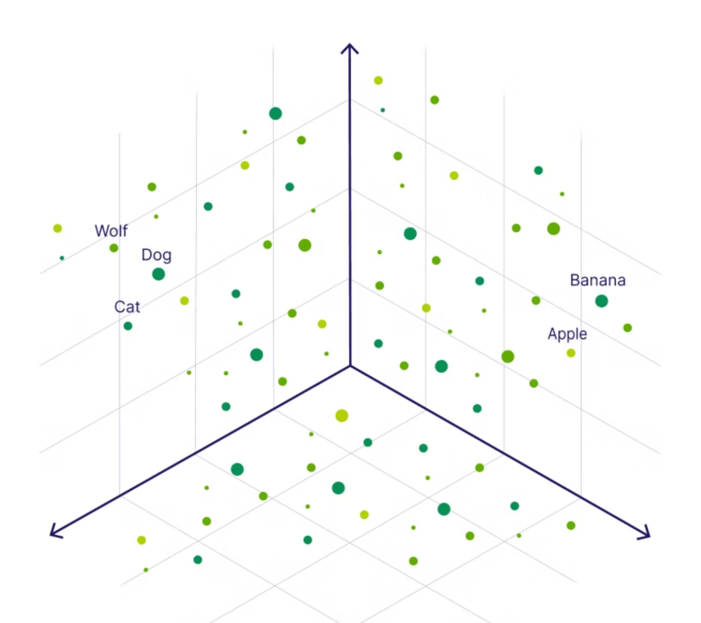

# Getting started with Amazon Titan Text Embeddings in Amazon Bedrock

[**Embeddings**](https://aws.amazon.com/what-is/embeddings-in-machine-learning/) are numerical representations of text that allow [machine learning](https://aws.amazon.com/what-is/machine-learning/) models to work with language. Instead of raw words, text is converted into **vectors** — lists of numbers that live in a high-dimensional space. 



The position of each vector reflects both **semantic relationships** (meaning and context, like “doctor” being closer to “nurse” than “car”) and **syntactic relationships** (patterns and structure in language).

With embeddings, models can:

* **Retrieve information** by comparing similarity between vectors,
* **Classify text** based on learned relationships,
* Support a variety of **NLP tasks** such as clustering, sentiment analysis, or recommendation systems.

In Amazon Bedrock, **Titan Embeddings** provide these vector representations out of the box, so you can easily plug them into search, retrieval-augmented generation (RAG), or other ML workflows without having to train embedding models yourself.

[**Amazon Titan Text Embeddings**](https://docs.aws.amazon.com/bedrock/latest/userguide/titan-embedding-models.html) is a model that transforms natural language text — whether it’s a single word, a phrase, or an entire document — into numerical vectors. These vectors capture the meaning of the text and can be applied to use cases such as semantic search, personalization, and clustering.

In this project, we’ll explore the Titan Text Embeddings model, highlight its key features, and walk through practical examples of how it can be used.

## How is text converted into a vector?

There are several approaches to represent text as vectors. A common method is through **word embedding algorithms** like [*Word2Vec*](https://en.wikipedia.org/wiki/Word2vec), [*GloVe*](https://en.wikipedia.org/wiki/GloVe), or [*FastText*](https://fasttext.cc/). These generate numerical representations for individual words, which can then be combined to create a sentence-level embedding.


A more advanced approach uses **large language models (LLMs)** such as [*BERT*](https://en.wikipedia.org/wiki/BERT_(language_model)) or [*GPT*](https://cloud.google.com/discover/what-is-gpt#what-is-gpt). These models generate **contextual embeddings** for whole sentences by leveraging deep learning architectures like [**Transformers**](https://aws.amazon.com/what-is/transformers-in-artificial-intelligence/), which are designed to capture the meaning, context, and relationships between words more effectively.

## LLMs and Transformers

In the simplest terms, [**Large Language Models (LLMs)**](https://aws.amazon.com/what-is/large-language-model/) are sophisticated AI programs trained on massive amounts of text data to understand and generate human-like language. Think of them as incredibly well-read students who have learned to recognize patterns, context, and nuances in language. This allows them to perform a wide range of tasks, including answering questions, summarizing long documents, translating between languages, and even writing creative content.

The foundational technology that powers most modern LLMs is the **Transformer architecture**. Introduced in a 2017 paper by [Google researchers](https://en.wikipedia.org/wiki/Attention_Is_All_You_Need), the Transformer was a revolutionary breakthrough in how machines process sequential data, like sentences.

The key innovation of the Transformer is a mechanism called **self-attention**. This allows the model to weigh the importance of different words in a sentence when processing it. For example, in the sentence, "The robot picked up the red ball because it was heavy," the self-attention mechanism helps the model understand that "it" refers to the "ball" and not the "robot." This ability to understand relationships between words, even if they are far apart in a text, is what makes Transformers so powerful and enables LLMs to generate coherent and contextually relevant responses.

In essence, you can think of the Transformer as the powerful engine and the LLM as the highly-skilled driver. The Transformer provides the core processing capability, while the LLM is the complete system that has been trained on a vast library of information to become a versatile language expert.

## Why do we need an embeddings model?

Embeddings help computers understand the *meaning* behind words and sentences, not just the words themselves. This is important for tasks like figuring out if a review is positive or negative (sentiment analysis), recognizing names of people or places, or sorting text into categories.

They’re also what makes **semantic search** possible — where the computer can find results based on meaning, not just exact keywords. Another powerful use is [**Retrieval Augmented Generation (RAG)**](https://aws.amazon.com/what-is/retrieval-augmented-generation/), where embeddings help large language models give more accurate answers by pulling in extra information.

To make this work, the embeddings need to be stored in a special kind of database called a [**vector database**](https://aws.amazon.com/what-is/vector-databases/), which is designed for searching and comparing these numerical representations.


The **Amazon Titan Text Embeddings** model is designed for efficient text retrieval, making it ideal for **Retrieval-Augmented Generation (RAG)** use cases. It works by converting your text data into numerical vectors, which can then be stored in a vector database and searched to quickly find the most relevant passages. This lets you combine your own proprietary data with other foundation models for more accurate results.

Since Titan Text Embeddings is fully managed within [**Amazon Bedrock**](https://aws.amazon.com/bedrock/), it provides a **serverless experience** — no infrastructure management required. You can access it through the [**Amazon Bedrock REST API**](https://docs.aws.amazon.com/bedrock/latest/APIReference/welcome.html) or the **AWS SDK**, supplying two key inputs: the *text* you want to embed and the `modelId` parameter, which specifies the Titan Text Embeddings model.

## SDK

To run the example `titan_embeddings_demo.py` file in `sdk` folder:
1. Ensure that you have AWS CLI configured and have permissions and access to use AWS Bedrock
```bash
aws sts get-caller-identity
```
2. Activate virtual environment:
```bash
python -m venv .venv
source .venv/bin/activate
```
3. Install [`boto3`](https://aws.amazon.com/sdk-for-python/) library:
```bash
pip install --upgrade boto3
```
4. If you need to deactivate environment:
```bash
deactivate
```
5. To run the file:
```bash
python titan_embeddings_demo.py
```

Example SDK script shows how the input prompt text is converted into numberical representations (embeddings) by using [`amazon.titan-embed-text-v2:0`](https://docs.aws.amazon.com/bedrock/latest/userguide/titan-embedding-models.html) model.

## Features of Amazon Titan Text Embeddings

Amazon Titan Text Embeddings can handle a wide range of text, from a single word to an entire document, with inputs of up to **8,192 tokens**. It produces embeddings (vectors) that are **1,024 numbers long**, giving accurate results while still being fast and cost-efficient.

Another strength is that Titan supports **up to 108 languages** including Kazakh and Uzbek. Instead of training or managing a separate model for each language, you can use one model that works across them all.

This brings a few key benefits:

* **Wider reach** – Your applications can support users and content in many different languages out of the box.
* **Consistency** – Because one model handles all supported languages, you get stable and reliable results no matter the language.
* **Multilingual flexibility** – You can search or analyze text across languages in the same way, making it easier to build apps that work with multilingual data.

## Using Amazon Titan Text Embeddings with LangChain

[LangChain](https://python.langchain.com/) is a widely used open-source framework for building applications with [generative AI](https://aws.amazon.com/generative-ai/) models and related tools. It provides a [`BedrockEmbeddings`](https://python.langchain.com/docs/integrations/text_embedding/bedrock/) client, which simplifies interaction with Amazon Bedrock by wrapping the Boto3 SDK in an easy-to-use abstraction. With this client, you can work directly with text and embeddings without needing to manage the underlying JSON request or response formats yourself.

You can use LangChain’s `BedrockEmbeddings` client together with the Amazon Bedrock LLM client to streamline building advanced AI workflows. In this setup, the embeddings client converts your text into vectors for tasks like storing and retrieving data, while the LLM client generates natural language responses.

This combination makes it easier to implement **Retrieval-Augmented Generation (RAG)**, where embeddings help you fetch the most relevant context from your data, and the LLM uses that context to generate accurate answers. It also simplifies patterns like **semantic search**, clustering, and other applications that depend on embeddings.

For demo run the `bedrock_langchain_embeddings.py` file:
```bash
python bedrock_langchain_embeddings.py
```

Before that ensure that you have installed the [LangChain library for AWS](https://python.langchain.com/docs/integrations/providers/aws/#bedrock-1):
```bash
pip install langchain-aws
```

## Use cases for embeddings

Embeddings are most often used in **Retrieval-Augmented Generation (RAG)**, but they can also be applied in many other ways. Here are some examples:

* **Question answering** – By turning both your questions and your documents into embeddings, you can quickly find the closest matches in your knowledge base. This makes it easier to build Q\&A systems.

* **Personalized recommendations** – Embeddings can be used to match people with things they might like, such as travel destinations, colleges, or cars. You can simply return the best matches, or combine them with an LLM to explain why each option fits the user’s needs.

* **Finding duplicates in data** – Sometimes records don’t look the same on the surface (different spelling, abbreviations, or languages), but embeddings can spot when they actually mean the same thing. For example, detecting duplicate job applications or customer records.

* **Comparing applications or systems** – In large organizations, embeddings can help spot which apps do similar things, making it easier to find overlap and simplify your portfolio.

* **Content grouping** – If you have lots of text, like customer emails or product reviews, embeddings can be used to automatically group them into themes (praise, complaints, feature requests, etc.). After grouping, you can use an LLM to generate summaries of each category.

## References
- [Amazon Bedrock Workshop](https://github.com/aws-samples/amazon-bedrock-workshop)
- [Building with Amazon Bedrock and LangChain](https://catalog.workshops.aws/building-with-amazon-bedrock)
- [Amazon OpenSearch Service as a Vector Database](https://aws.amazon.com/opensearch-service/serverless-vector-database/)
- [`pgvector` extension for PostgreSQL](https://github.com/pgvector/pgvector)
- [In-memory FAISS database to store and search for embeddings vectors](https://github.com/facebookresearch/faiss)