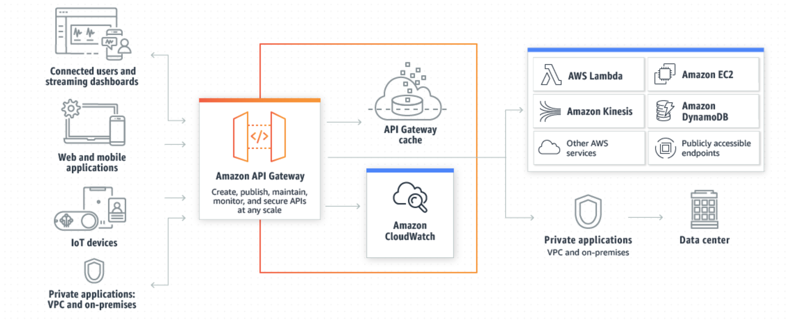
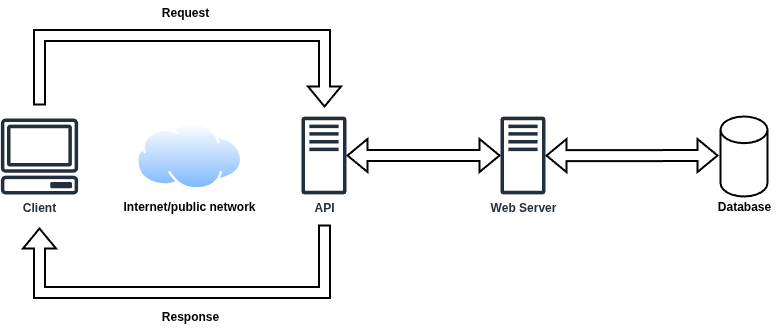
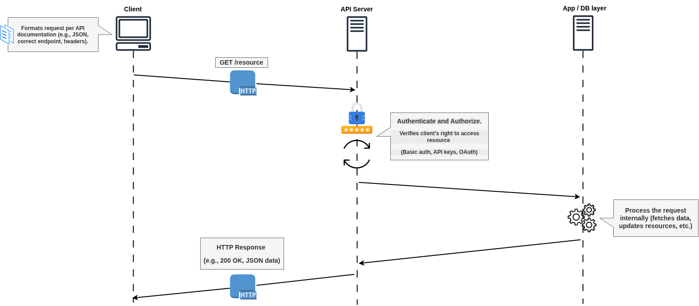
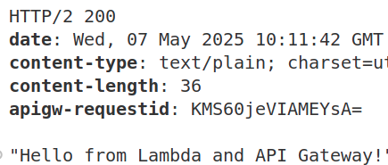

# AWS API Gateway basics

[AWS API Gateway](https://docs.aws.amazon.com/apigateway/latest/developerguide/welcome.html) is a fully managed service by Amazon Web Services that enables developers to create, publish, maintain, monitor, and secure APIs at any scale. It acts as a front door for applications to access backend services, handling tasks like request routing, API versioning, authentication, authorization, and throttling. It supports [RESTful](https://aws.amazon.com/what-is/restful-api/) and WebSocket APIs, integrates with AWS services like Lambda, and provides features like caching, logging, and metrics for performance monitoring. Developers can deploy APIs to handle varying traffic loads while ensuring low latency and high reliability.



API Gateway creates RESTful APIs that:

- Are HTTP-based.
- Enable stateless client-server communication.
- Implement standard HTTP methods such as GET, POST, PUT, PATCH, and DELETE.

## What is an API (Application Programming Interface)? 

An application programming interface (API) defines the rules that you must follow to communicate with other software systems. Developers expose or create APIs so that other applications can communicate with their applications programmatically. 



For example, the timesheet application exposes an API that asks for an employee's full name and a range of dates. When it receives this information, it internally processes the employee's timesheet and returns the number of hours worked in that date range.

## What is REST?

[REST](https://aws.amazon.com/what-is/restful-api/) (Representational State Transfer) is an architectural style for designing networked applications, commonly used in web services and APIs. It relies on stateless, client-server communication, typically over HTTP, where resources (like data or objects) are identified by URLs and manipulated using standard methods like GET (retrieve), POST (create), PUT (update), DELETE (remove), and PATCH (partial update). REST emphasizes simplicity, scalability, and loose coupling, using representations (e.g., JSON or XML) to transfer data. It leverages HTTP status codes and headers for communication and is widely adopted for its flexibility and ease of integration.

## What is RESTful?

RESTful refers to systems, services, or APIs that adhere to the principles of REST (Representational State Transfer). A RESTful API or application follows these key characteristics:

- **Stateless**: In REST architecture, statelessness refers to a communication method in which the server completes every client request independently of all previous requests. Clients can request resources in any order, and every request is stateless or isolated from other requests. This REST API design constraint implies that the server can completely understand and fulfill the request every time. 
- **Client-Server**: The architecture separates client and server concerns, allowing independent evolution of front-end and back-end.
- **Resource-Based**: Resources (e.g., data entities like users or products) are identified by unique URLs and manipulated using standard HTTP methods (GET, POST, PUT, DELETE, PATCH).
- **Representation**: Resources are represented in formats like JSON or XML, and clients interact with these representations, not the resources directly.
- **Standardized Methods**: Uses HTTP methods and status codes consistently to perform actions and communicate outcomes.
- **Hypermedia (optional)**: In fully RESTful systems (per the HATEOAS principle), responses include links to related resources, guiding clients on possible next actions.
- **Layered System**: In a RESTful system, the layered system principle ensures that clients interact with a unified interface (e.g., a URL), unaware of the internal layers processing the request. For instance, a GET request to `/users/{id}` might pass through an API gateway, authentication layer, and database layer, but the client only sees the final JSON response.
- **Cacheability**: Is a core principle of REST (Representational State Transfer) that enhances performance and scalability. It requires that responses from a server explicitly indicate whether they can be cached by clients or intermediaries (like browsers or proxies) and, if so, for how long. This reduces server load and improves response times by allowing clients to reuse previously fetched data without making redundant requests. For example, a RESTful API returning a list of products (`GET /products`) might include a `Cache-Control: max-age=3600` header, allowing clients to cache the response for an hour.
- **Code on Demand**: Is an optional constraint in REST (Representational State Transfer). It allows a server to send executable code (e.g., JavaScript, applets) to the client, which the client can run to extend its functionality. This reduces the need for clients to have pre-implemented logic for certain tasks, enhancing flexibility. For instance, a RESTful web app might return a JSON response with embedded JavaScript to dynamically update a webpage (browser higlight mistakes in the page) without additional server requests.

A RESTful API is designed for simplicity, scalability, and interoperability, making it easy to integrate with web and mobile applications. For example, a RESTful API for a blog might use `/posts` to list all posts (GET), create a new post (POST), or update a specific post at `/posts/{id}` (PUT).

## How do RESTful APIs work?

The basic function of a RESTful API is the same as browsing the internet. The client contacts the server by using the API when it requires a resource. API developers explain how the client should use the REST API in the server application API documentation. These are the general steps for any REST API call:



1. The client sends a request to the server. The client follows the API documentation to format the request in a way that the server understands.
2. The server authenticates the client and confirms that the client has the right to make that request.
3. The server receives the request and processes it internally.
4. The server returns a response to the client. The response contains information that tells the client whether the request was successful. The response also includes any information that the client requested.

The REST API request and response details vary slightly depending on how the API developers design the API.

## Features of API Gateway

Amazon API Gateway offers the following features:
- Support for stateful ([WebSocket](https://docs.aws.amazon.com/apigateway/latest/developerguide/apigateway-websocket-api.html)) and stateless ([HTTP](https://docs.aws.amazon.com/apigateway/latest/developerguide/http-api.html) and [REST](https://docs.aws.amazon.com/apigateway/latest/developerguide/apigateway-rest-api.html)) APIs.
- Authentication mechanisms, such as AWS IAM policies, Lambda authorizer functions, and Amazon Cognito user pools
- [Canary release deployments](https://docs.aws.amazon.com/apigateway/latest/developerguide/canary-release.html) for safely rolling out changes.
- [CloudTrail](https://docs.aws.amazon.com/apigateway/latest/developerguide/cloudtrail.html) logging and monitoring of API usage and API changes.
- CloudWatch access logging and execution logging, including the ability to set alarms. For more information, see [Monitor REST API execution with Amazon CloudWatch metrics](https://docs.aws.amazon.com/apigateway/latest/developerguide/monitoring-cloudwatch.html) and [Monitor WebSocket API execution with CloudWatch metrics](https://docs.aws.amazon.com/apigateway/latest/developerguide/apigateway-websocket-api-logging.html).
- Ability to use AWS CloudFormation templates to enable API creation. For more information, see [Amazon API Gateway Resource Types Reference](https://docs.aws.amazon.com/AWSCloudFormation/latest/UserGuide/AWS_ApiGateway.html) and [Amazon API Gateway V2 Resource Types Reference](https://docs.aws.amazon.com/AWSCloudFormation/latest/UserGuide/AWS_ApiGatewayV2.html).
- Support for [custom domain names](https://docs.aws.amazon.com/apigateway/latest/developerguide/how-to-custom-domains.html).
- Integration with [AWS WAF](https://docs.aws.amazon.com/apigateway/latest/developerguide/apigateway-control-access-aws-waf.html) for protecting your APIs against common web exploits.
- Integration with [AWS X-Ray](https://docs.aws.amazon.com/apigateway/latest/developerguide/apigateway-xray.html) for understanding and triaging performance latencies.

For a complete list of API Gateway feature releases, see [Document history](https://docs.aws.amazon.com/apigateway/latest/developerguide/history.html).

## Workshop: Create a serverless HTTP API

Serverless APIs let you focus on your applications, instead of spending time provisioning and managing servers.

> 📌 **Note:** This exercise uses an HTTP API. HTTP API is limited and has less features. API Gateway also supports REST APIs, which include more features. For more information about the difference between HTTP APIs and REST APIs, see [Choose between REST APIs and HTTP APIs](https://docs.aws.amazon.com/apigateway/latest/developerguide/http-api-vs-rest.html).

When you invoke your HTTP API, API Gateway routes the request to your Lambda function. Lambda runs the Lambda function and returns a response to API Gateway. API Gateway then returns a response to you.


## Overview

- Nodejs22.x runtime
- HTTP API type

### Deploy the infrastructure

To deploy Lambda function and API gateway, run:
```bash
terraform apply
```

By default, Anton Babenko's Terraform modules for Lambda and API gateway provision CloudWatch Log groups for monitoring purposes. To integrate Lambda with API gateway, use `AWS_PROXY` integration type.

- [AWS Lambda Runtime Environments](https://docs.aws.amazon.com/lambda/latest/dg/lambda-runtimes.html)
- [Terraform Docs: Specify Lambda permissions for API Gateway REST API](https://registry.terraform.io/providers/hashicorp/aws/3.2.0/docs/resources/lambda_permission#specify-lambda-permissions-for-api-gateway-rest-api)
- [Terraform module to create AWS API Gateway v2 (HTTP/WebSocket)](https://registry.terraform.io/modules/terraform-aws-modules/apigateway-v2/aws/latest)

### Test your API

Copy your API's invoke URL, and enter it in a web browser. Append the name of your Lambda function to your invoke URL to call your Lambda function. To get these values run:
```bash
terraform output
```

To test the HTTP API endpoint that invokes our Lambda function:
```bash
curl -i <http_api_endpoint>/<lambda_function_name>
curl -i https://iazw95w2kg.execute-api.us-east-1.amazonaws.com/simple-nodejs-lambda
```

You should see the following response:



## References
- [Get started with API Gateway](https://docs.aws.amazon.com/apigateway/latest/developerguide/getting-started.html)
- [YouTube Serverless Land Series](https://www.youtube.com/watch?v=10t2H9aT5Kc&t)
- [Happy Little API Shorts Video Series](https://www.youtube.com/playlist?list=PLJo-rJlep0EDFw7t0-IBHffVYKcPMDXHY)

