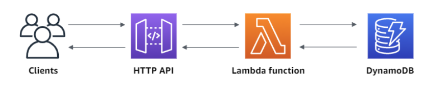
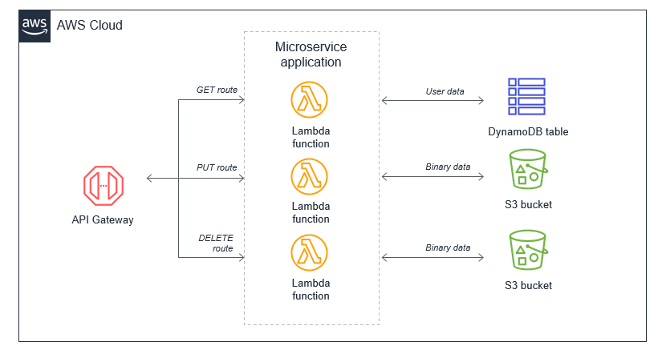

# CRUD HTTP API with Lambda and DynamoDB

In this tutorial, you create a serverless API that **creates**, **reads**, **updates**, and **deletes** **(CRUD)** items from a DynamoDB table. DynamoDB is a fully managed NoSQL database service that provides fast and predictable performance with seamless scalability.



When you invoke your HTTP API, API Gateway routes the request to your Lambda function. The Lambda function interacts with DynamoDB, and returns a response to API Gateway. API Gateway then returns a response to you.

To deploy the infrastructure:
```bash
terraform apply
```

## DynamoDB

You use a [DynamoDB](https://docs.aws.amazon.com/amazondynamodb/latest/developerguide/Introduction.html) table to store data for your API. Each item has a unique ID, which we use as the [partition key](https://docs.aws.amazon.com/amazondynamodb/latest/developerguide/HowItWorks.CoreComponents.html#HowItWorks.CoreComponents.PrimaryKey) for the table.

## Lambda function

You create a [Lambda](https://docs.aws.amazon.com/lambda/latest/dg/welcome.html) function for the backend of your API. This Lambda function creates, reads, updates, and deletes items from DynamoDB. The function uses [events from API Gateway](https://docs.aws.amazon.com/apigateway/latest/developerguide/http-api-develop-integrations-lambda.html#http-api-develop-integrations-lambda.proxy-format) to determine how to interact with DynamoDB. For simplicity this tutorial uses a single Lambda function. As a best practice, you should create separate functions for each route. 



For more information, see The [Lambda monolith](https://serverlessland.com/content/service/lambda/guides/aws-lambda-operator-guide/monolith)

The Lambda function module creates a new IAM role with inline attached policy for DynamoDB access. 

> 📌 **Note:** This tutorial uses a '*' permissive policy for simplicity. As a best practice, you should create your own IAM policy to grant the minimum permissions required.

## API Gateway

The HTTP API provides an HTTP endpoint for your Lambda function. The Terraform API module configures routes and integrations to connect your API and your Lambda function.

Routes are a way to send incoming API requests to backend resources. Routes consist of two parts: an HTTP method and a resource path, for example, `GET /items`. For this example API, we create four routes:

- `GET /items/{id}`
- `GET /items`
- `PUT /items`
- `DELETE /items/{id}`

The `{id}` at the end of the path is a path parameter that API Gateway retrieves from the request path when a client makes a request.

## Create an integration

You create an integration to connect a route to backend resources. For this example API, you create one Lambda integration that you use for all routes.

After you attach the integration to all of the API's routes, your Lambda function is invoked when a client calls any of your routes.

API trigger for Lambda enabled by the following piece of code:
```terraform
  ...

  # Enable API trigger 
  allowed_triggers = {
    AllowExecutionFromAPIGateway = {
      service    = "apigateway"
      source_arn = "${module.my_http_api.api_execution_arn}/*/*"
    }
  }
  ...
```

## Test API

Use the following command to create or update an item. The command includes a request body with the item's ID, price, and name. The path is `items`:
```bash
curl -X "PUT" -H "Content-Type: application/json" -d "{\"id\": \"123\", \"price\": 12345, \"name\": \"myitem\"}" https://ssw9zqgorl.execute-api.us-east-1.amazonaws.com/items
```

To get all items:
```bash
curl https://ssw9zqgorl.execute-api.us-east-1.amazonaws.com/items
```

To get an item (with `id`:`123`):
```bash
curl https://ssw9zqgorl.execute-api.us-east-1.amazonaws.com/items/123
```

To delete an item:
```bash
curl -X "DELETE" https://ssw9zqgorl.execute-api.us-east-1.amazonaws.com/items/123
```

To verify deletion:
```bash
curl https://ssw9zqgorl.execute-api.us-east-1.amazonaws.com/items
```

## References
- [Tutorial: Create a CRUD HTTP API with Lambda and DynamoDB](https://docs.aws.amazon.com/apigateway/latest/developerguide/http-api-dynamo-db.html)
- [Terraform module to create AWS DynamoDB resources](https://registry.terraform.io/modules/terraform-aws-modules/dynamodb-table/aws/latest)