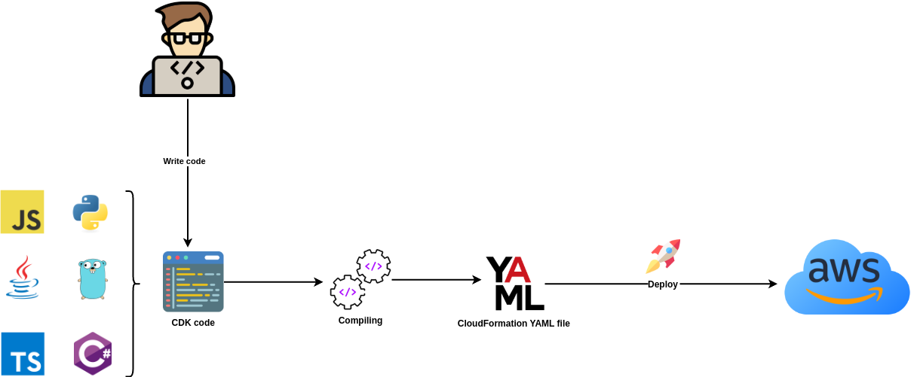
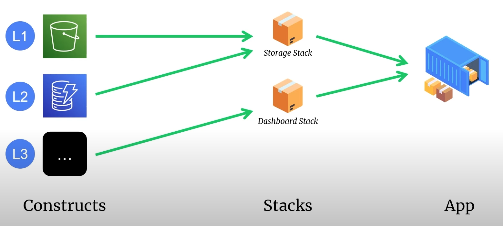
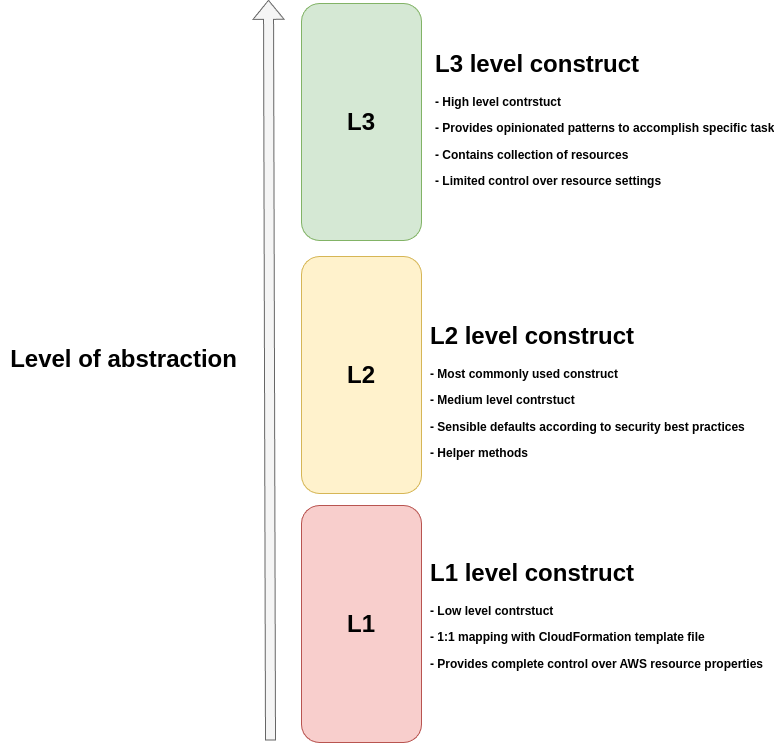
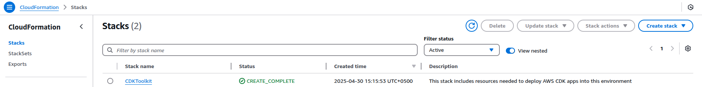
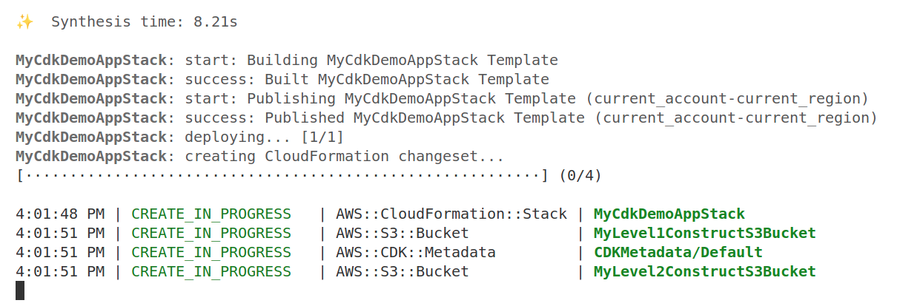
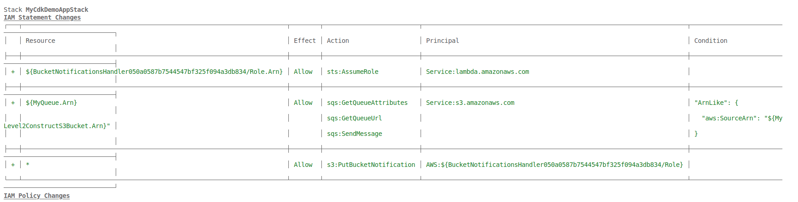
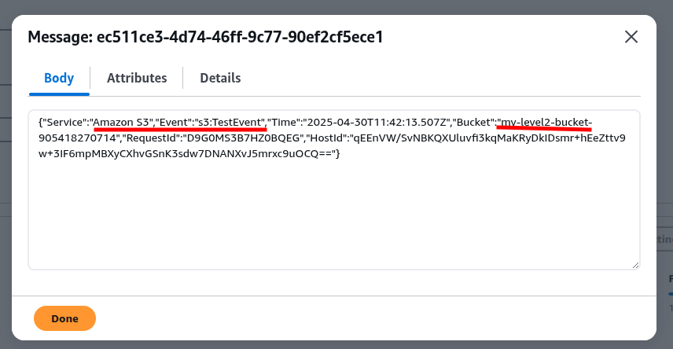
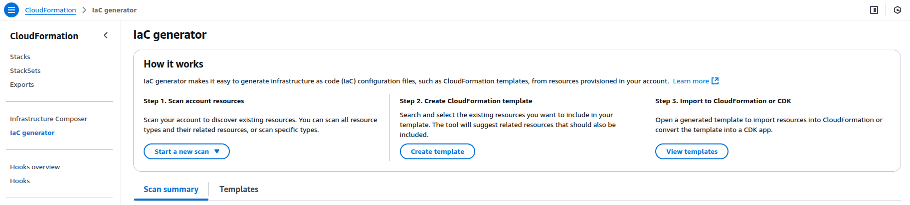

[The AWS Cloud Development Kit (AWS CDK)](https://docs.aws.amazon.com/cdk/v2/guide/home.html) is an open-source software development framework that allows developers to define cloud infrastructure in code and provision it through AWS CloudFormation. It enables you to model and configure AWS resources using familiar programming languages like TypeScript, JavaScript, Python, Java, C#, and Go, instead of writing JSON or YAML templates manually.

## Benefits

Using CDK provides several benefits:
- Infrastrucure code can be **stored and versioned in Git**
- Apply common **code review processes** via Git merge
- **Use common programming constructs** such as for loops, if-else and etc to define complex infrastructure
- You **get quickest and native support** for new AWS features
- CDK **encapsulates the complex logic of provisioning required IAM resources** (permissions, roles, policies) and allows to grant permissions in one line of code. For example, to grant `Read` and `Write` permissions to S3 bucket for Lambda function: `bucket.grantReadWrite(lambdaFunction)`
- **Increases speed of development** for complex infrastructure
- **Enables reusability and modularization**: You can create reusable infrastructure components just like you create libraries in programming
- You **have ability to manage app and infrastructure code together**. This is especially useful for serverless apps. 

## How CDK works?

CDK code compiles into CloudFormation YAML/JSON template files. Next, CloudFormation deploys the compiled files into AWS.



## Supported languages

CDK supports the following languages:
- JavaScript
- TypeScript
- Python
- Java
- C#
- Go

For more information, see [Supported languages](https://docs.aws.amazon.com/cdk/v2/guide/languages.html).

> TypeScript was the first language supported by the AWS CDK, and much of the AWS CDK example code is written in TypeScript.

## Core concepts

| Concept  | Description |
|:---------|:------------|
| **App**      | The collection of one or more stacks. You can have only one app for one project. |
| **Stack**    | A unit of deployment (mapped to CloudFormation stacks). Allows to logically separate the resources. |
| [**Construct**](https://docs.aws.amazon.com/cdk/v2/guide/constructs.html) | Building blocks for AWS resources (basic, custom, or composite). |
| **Resource**  | Represents a specific AWS service (like S3 bucket, EC2 instance). |



### Constructs

[Constructs](https://docs.aws.amazon.com/cdk/v2/guide/constructs.html) are the basic building blocks of AWS Cloud Development Kit (AWS CDK) applications. A construct is a component within your application that represents one or more AWS CloudFormation resources and their configuration. You build your application, piece by piece, by importing and configuring constructs.

Constructs comes in three levels: L1, L2 and L3. Each level offers an increasing level of abstraction. The higher the abstraction, the easier to configure, requiring less expertise. The lower the abstraction, the more customization available, requiring more expertise.



### L1 Constructs

L1 constructs, also known as *CFN resources*, are the **lowest-level construct and offer no abstraction**. Each L1 construct maps directly to a single AWS CloudFormation resource. With L1 constructs, you import a construct that represents a specific AWS CloudFormation resource. You then define the resource’s properties within your construct instance.

L1 constructs provides you complete control over all AWS resource properties.

In the [AWS Construct Library](https://docs.aws.amazon.com/cdk/v2/guide/libraries.html#libraries-construct), L1 constructs are named starting with `Cfn`, followed by an identifier for the AWS CloudFormation resource that it represents. For example, the [`CfnBucket`](https://docs.aws.amazon.com/cdk/api/v2/docs/aws-cdk-lib.aws_s3.CfnBucket.html) construct is an L1 construct that represents an [`AWS::S3::Bucket`](https://docs.aws.amazon.com/AWSCloudFormation/latest/UserGuide/aws-resource-s3-bucket.html) AWS CloudFormation resource.

### L2 Constructs

L2 constructs, also known as *curated* constructs, are thoughtfully developed by the CDK team and are usually the most widely used construct type. L2 constructs **map directly to single AWS CloudFormation resources**, similar to L1 constructs. Compared to L1 constructs, L2 constructs provide a higher-level abstraction through an intuitive intent-based API. L2 constructs include sensible default property configurations, best practice security policies, and generate a lot of the boilerplate code and glue logic for you.

L2 constructs also provide helper methods for most resources that make it simpler and quicker to define properties, permissions, event-based interactions between resources, and more.

The [`s3.Bucket`](https://docs.aws.amazon.com/cdk/api/v2/docs/aws-cdk-lib.aws_s3.Bucket.html) class is an example of an L2 construct for an Amazon Simple Storage Service (Amazon S3) bucket resource.

### L3 Constructs

L3 constructs, also known as *patterns*, are the highest-level of abstraction. Each L3 construct can **contain a collection of resources that are configured to work together to accomplish a specific task or service within your application**. L3 constructs are used to create entire AWS architectures for particular use cases in your application.

To provide complete system designs, or substantial parts of a larger system, L3 constructs offer opinionated default property configurations. They are built around a particular approach toward solving a problem and providing a solution. With L3 constructs, you can create and configure multiple resources quickly, with the fewest amount of input and code.

The [`ecsPatterns.ApplicationLoadBalancedFargateService`](https://docs.aws.amazon.com/cdk/api/v2/docs/aws-cdk-lib.aws_ecs_patterns.ApplicationLoadBalancedFargateService.html) class is an example of an L3 construct that represents an AWS Fargate service running on an Amazon Elastic Container Service (Amazon ECS) cluster and fronted by an application load balancer.

### Construct Libraries

AWS has built-in construct library, however you can also find additional libraries from open-source Construct registry: [Construct Hub](https://constructs.dev/)

### Stacks

A **CDK stack** is a core concept in the CDK, representing a collection of AWS resources that are deployed and managed together as a single unit.

- A **stack** is a deployable unit of AWS resources defined in your CDK application.
- It maps directly to an **AWS CloudFormation stack**, meaning each CDK stack becomes a CloudFormation stack when synthesized and deployed.
- Stacks contain **constructs**, which are the building blocks of your infrastructure (e.g., an S3 bucket, a Lambda function, or an EC2 instance).
- You define stacks in code, and the CDK converts them into CloudFormation templates for deployment.

### Key features of CDK stacks

1. **Logical Grouping**: A stack groups related resources that share the same lifecycle (e.g., all resources for a web app’s backend).
2. **Single Deployment Unit**: Resources in a stack are deployed, updated, or deleted together via a single command (`cdk deploy`).
3. **Isolation**: Stacks are independent, allowing you to manage different environments (e.g., dev, prod) or components (e.g., frontend, backend) separately.
4. **Cross-Stack References**: Stacks can share resources (e.g., a VPC created in one stack can be used in another) by passing references explicitly.
5. **Region and Account Scope**: Each stack is deployed to a specific AWS account and region, defined in the CDK app’s context or environment settings.

## Hands-on

### Requirements

- [NodeJS](https://nodejs.org/en)
- [AWS CLI](https://docs.aws.amazon.com/cli/latest/userguide/getting-started-install.html)
- [CDK](https://docs.aws.amazon.com/cdk/v2/guide/getting-started.html)
- [Typescript](https://www.typescriptlang.org/)

### Initialize the app

1. Create app directory:
```bash
mkdir myCDKDemoApp
```
2. Inside the directory initialize the predefined CDK project template:
```bash
cdk init app --language typescript 
```

The sample app project structure looks like this:
```
my-cdk-demo-app/           # Root directory of the CDK app
├── bin/                   # Contains the entry point script for the CDK app
├── lib/                   # Contains the stack definitions (infrastructure code)
├── test/                  # Contains unit tests for the stacks
├── .gitignore             # Specifies files/folders to ignore in Git
├── .npmignore             # Specifies files and directories to exclude when publishing the project as an npm package
├── cdk.json               # Configuration file for the CDK app
├── jest.config.js         # Configuration for Jest (testing framework)
├── package.json           # Node.js package configuration (dependencies, scripts)
├── package-lock.json      # Lockfile for exact dependency versions (if using npm)
├── README.md              # Project documentation and setup instructions
├── tsconfig.json          # TypeScript configuration file
```

### CDK basic commands

`[STACKS..]` - names of stacks

1. To get help:
```bash
cdk help
```
2. To list all stacks in the app:
```bash
cdk list [STACKS..]
```
3. To print the CloudFormation YAML template file:
```bash
cdk synthesize [STACKS..]
```
4. To initialize your CDK to work with your AWS account and specific region:
```bash
cdk bootstrap [ENVIRONMENTS..]
```
5. To deploy stack into AWS account:
```bash
cdk deploy [STACKs..]
```
6. To monitor code changes in live deployment:
```bash
cdk watch [STACKS..]
```
7. To delete created stack(s):
```bash
cdk destroy [STACKS..]
```
8. To create a new, empty CDK project from a template:
```bash
cdk init [TEMPLATE_NAME] --language [PROGRAMMING_LANGUAGE]
```

### Bootstrap the project

After initializing the project, you normally need to connect your CDK project with your AWS account.

To connect AWS account run:
```bash
cdk bootstrap
```

This command will create `CDKToolkit` stack in CloudFormation console. This stack contains all resources needed to deploy AWS CDK app into AWS account.



### Compare L1 and L2 Constructs of an S3 bucket

To create S3 bucket with L1 construct:
```typescript
    // L1 Construct of an S3 bucket
    const level1S3Bucket = new CfnBucket(this, "MyLevel1ConstructS3Bucket", {
      bucketName: "my-level1-bucket", // Ensure the Bucket name is gloabbly unique
      versioningConfiguration: {
        status: "Enabled"
      }
    });
```

To create S3 bucket with L2 construct (don't forget to import `Bucket` class from CDK library):
```typescript
    // L2 Construct of an S3 bucket
    const level2S3Bucket = new Bucket(this, "MyLevel2ConstructS3Bucket", {
      bucketName: "my-level2-bucket",
      versioned: true
    })
```

To compare generated CloudFormation templates, run:
```bash
cdk synth 
```

```yaml
  MyLevel1ConstructS3Bucket:
    Type: AWS::S3::Bucket
    Properties:
      VersioningConfiguration:
        Status: Enabled
    Metadata:
      aws:cdk:path: MyCdkDemoAppStack/MyLevel1ConstructS3Bucket
  MyLevel2ConstructS3Bucket182046CC:
    Type: AWS::S3::Bucket
    Properties:
      VersioningConfiguration:
        Status: Enabled
    UpdateReplacePolicy: Retain
    DeletionPolicy: Retain
    Metadata:
      aws:cdk:path: MyCdkDemoAppStack/MyLevel2ConstructS3Bucket/Resource
```

> [!CAUTION] 
> Default behavior for L1 construct during renaming is to delete and recreate the resource!  
> L2 constructs by default creates a new bucket and then deletes the resource.

```yaml
DeletionPolicy: Retain 
```
means that if the resource is deleted from the stack, `cdk` will keep it and do not actually delete it from AWS.

### Deploy the app

To deploy the app, run:
```bash
cdk deploy
```



### Deploy S3 put event notifications with SQS queue

On any object creation event in Level2 S3 bucket, the event will be automatically sent to SQS queue:
```typescript
    // SQS queue for S3 put event notifications
    const queue = new Queue(this, "MyQueue", {
      queueName: "MyQueue"
    })

    // Add event notification
    level2S3Bucket.addEventNotification(EventType.OBJECT_CREATED, new SqsDestination(queue))
```

Any IAM permission changes will be viewed and asked to be reviewed before applying the changes:



On successful deployment you should see the queue and the test S3 event notification message:



### Importing resources 

To import existing resources created outside of CDK use CloudFormation's IaC generator tool. This tool scans all your resources in your AWS account and creates a CloudFormation template file.



After downloading the template, to import the resources run:
```bash
cdk migrate --stack-name <stack_name> --language <programming_language> --from-path <path_to_cloudformation_yaml_file>
```

**NOTE**  
The code from IaC generator is translated into L1 constructs

### Delete the app

To delete the app run:
```bash
cdk destroy
```

This will delete all resources, except that has `retain` policy enabled.

## References
- [YouTube: AWS CDK Crash Course for Beginners](https://www.youtube.com/watch?v=D4Asp5g4fp8)
- [CDK v2 API reference](https://docs.aws.amazon.com/cdk/api/v2/docs/aws-construct-library.html)
- [CDK GitHub repository](https://github.com/aws/aws-cdk)
- [AWS CDK Immersion Day Workshop](https://catalog.us-east-1.prod.workshops.aws/workshops/10141411-0192-4021-afa8-2436f3c66bd8/en-US)