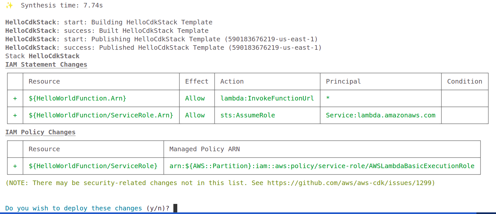

# Getting Started with Cloud Development Kit (CDK)

This project shows the sample getting started workflow with AWS CDK by:
- **Installing** and **Configuring the AWS CDK Command Line Interface (AWS CDK CLI)**,
- **Create CDK app**, 
- **Bootstrap AWS environment**,
- **Deploy application**.

## Prerequisites

- [AWS CLI installed](https://docs.aws.amazon.com/cli/latest/userguide/getting-started-install.html)
- [Node.js 22.x or later](https://nodejs.org/en/download/)
- Typescript 3.8 or later

To install Typescript globally:
```bash
npm -g install typescript
```

To learn more, see [What is the AWS CDK?](https://docs.aws.amazon.com/cdk/v2/guide/home.html) and [Learn AWS CDK core concepts](https://docs.aws.amazon.com/cdk/v2/guide/core-concepts.html).

## Install AWS CDK CLI

To install globally:
```bash
npm install -g aws-cdk
```

To install specific version:
```bash
npm install -g aws-cdk@X.YY.Z
```

For more information, see [CDK versions](https://www.npmjs.com/package/aws-cdk?activeTab=versions).

To install on project level:
```bash
npm install aws-cdk
```
then to invoke the CLI use:
```bash
npx aws-cdk
```

To verify the installation, run:
```bash
cdk --version
```

To uninstall:
```bash
npm uninstall -g aws-cdk
```

The CDK CLI will automatically use the security credentials that you configure with the AWS CLI. For example:
- if you are an *IAM Identity Center user*, you can use the `aws configure sso` command to configure security credentials. 
- If you are an *IAM user*, you can use the `aws configure` command. 

Just like the AWS CLI, the CDK CLI will use your `default` profile by default. You can specify a profile using the CDK CLI `--profile` option.

## What is `npx`?
[`npx`](https://docs.npmjs.com/cli/v8/commands/npx) is a command-line tool that lets you run Node.js package executables without having to install the package globally or locally. Think of it as a temporary installer and runner for command-line tools. It's bundled with npm (Node Package Manager) version 5.2 and later.

### How it Works
When you run a command with `npx` (e.g., `npx create-react-app my-app`), it first checks if the package executable exists in your local project's `node_modules/.bin` directory. If it doesn't find it there, it downloads the package to a temporary cache, runs the command, and then removes the temporary files. This is different from the traditional `npm install` approach, which would permanently install the package into your project's `node_modules` folder or to your system globally.

### Why Use npx?
* **Avoids Global Installation:** It helps to keep your system clean by not cluttering it with globally installed packages that you might only need once. For example, instead of running `npm install -g live-server` to quickly serve a static site, you can just run `npx live-server`.
* **Runs the Latest Version:** Since `npx` downloads the package fresh from the registry, it ensures you're always using the latest version of a tool without needing to manually update. This is especially useful for scaffolding tools like `create-react-app`, as it guarantees you're starting with the most recent boilerplate.
* **Convenience:** It simplifies running packages that are installed locally in your project. Normally, you'd have to specify the full path (e.g., `node_modules/.bin/your-package`), but `npx` makes it as simple as just running the command name. 

For more information, see [npm vs. npx: What’s the Difference and How to Use Them](https://www.youtube.com/watch?v=b5n1fP9wCDU)

## (Optional) Additional Tools

You can install additional tools such as [AWS Toolkit for VSCode](https://docs.aws.amazon.com/toolkit-for-vscode/latest/userguide/setup-toolkit.html) and [AWS CDK for VSCode](https://docs.aws.amazon.com/toolkit-for-vscode/latest/userguide/cdk-explorer.html). 

The AWS CDK Explorer feature of the AWS Toolkit enables you to **list your AWS CDK projects** and **visualize**, **browse the various components of the CDK application**.

For more information, see [Install additional AWS CDK tools](https://docs.aws.amazon.com/cdk/v2/guide/getting-started.html#getting-started-tools).

## Application

In this workshop, you will create and deploy a simple application on AWS using the AWS CDK. The application consists of an AWS Lambda function that returns a Hello World! message when invoked. The function will be invoked through a Lambda function URL that serves as a dedicated HTTP(S) endpoint for your Lambda function.


### Flow:

1. The **client** (like a browser or cURL) sends an HTTP(S) request.
2. The request hits the **Lambda Function URL** (dedicated HTTPS endpoint).
3. The **Lambda Function** executes.
4. The function responds with `"Hello World!"`.

## Step 1: Create your CDK project

In this step, you create a new CDK project. A CDK project should be in its own directory, with its own local module dependencies.

1. Create and navigate to a directory named `hello-cdk`:
```bash
mkdir hello-cdk && cd hello-cdk
```

> [!CAUTION] 
> The CDK CLI uses this directory name to name things within your CDK code. If you use a different directory name, you will run into issues during this workshop.  

2. From the `hello-cdk` directory, initialize a new CDK project using the CDK CLI `cdk init` command. Specify the `app` template and your preferred programming language with the `--language` option:
```bash
cdk init app --language typescript
```

### App Templates

In AWS CDK, an **app template** is a **starter project structure** that the `cdk init` command generates for you. It gives you the boilerplate code and files needed to begin writing CDK code in your chosen language.

When you run something like:

```bash
cdk init app --language typescript
```

* `app` = the **template type** (here, a CDK application).
* `--language typescript` = the programming language of the generated files.

### Main template types in CDK

* **`app`** --> A complete CDK application (most common).

  * Generates: `bin/`, `lib/`, `cdk.json`, language-specific project files (e.g. `package.json`, `requirements.txt`).
  * Example: `cdk init app --language python`

* **`sample-app`** --> Like `app`, but includes a small working example (like a Lambda + API Gateway) so you can see CDK in action.

* **`lib`** --> Used for creating a **construct library** instead of a deployable app.

  * Example: `cdk init lib --language java`

For more information, see [CDK Init Arguments](https://docs.aws.amazon.com/cdk/v2/guide/ref-cli-cmd-init.html#ref-cli-cmd-init-args).

The `cdk init` command creates a structure of files and folders within the `hello-cdk` directory to help organize the source code for your CDK app. This structure of files and folders is called your *CDK project*. 

```bash
.
├── bin                            # Directory for the CDK application entry point.
│   └── hello-cdk.ts               # The main application file that instantiates the CDK stacks.
├── cdk.json                       # The CDK configuration file, telling the toolkit how to run the app.
├── jest.config.js                 # Configuration for the Jest testing framework.
├── lib                            # Directory for defining the CDK stacks (your AWS infrastructure).
│   └── hello-cdk-stack.ts         # A CDK stack definition, where AWS resources are declared.
├── package.json                   # Node.js manifest file, listing dependencies and scripts.
├── README.md                      # Project documentation.
├── test                           # Directory for unit tests.
│   └── hello-cdk.test.ts          # Unit tests to validate the CDK stack definitions.
└── tsconfig.json                  # TypeScript compiler configuration file.

4 directories, 8 files
```

If you have Git installed, each project you create using `cdk init` is also **initialized as a Git repository**.

During project initialization, the CDK CLI creates a CDK app containing a single CDK stack. The CDK app instance is created using the [App](https://docs.aws.amazon.com/cdk/api/v2/docs/aws-cdk-lib.App.html) construct.

The CDK stack is created using the [Stack](https://docs.aws.amazon.com/cdk/api/v2/docs/aws-cdk-lib.Stack.html) construct.

### Project Structure

The files in the main directory are for project-level configuration and documentation.

* `cdk.json`: This is the **CDK configuration file**. It tells the CDK toolkit how to execute your application, usually pointing to the entry file (e.g., `bin/hello-cdk.ts`).
* `jest.config.js`: This is the **configuration file for Jest**, a JavaScript testing framework. It sets up how tests are run for the project.
* `package.json`: A standard **Node.js manifest file**. It lists the project's metadata, dependencies (libraries the project needs), and scripts for running tasks like building or testing.
* `README.md`: A markdown file for **project documentation**. It typically provides instructions on how to set up and use the project.
* `tsconfig.json`: The **TypeScript configuration file**. It defines the compiler options for transpiling the TypeScript code (`.ts` files) into JavaScript (`.js` files).

### Key Directories

The directories organize the core logic and tests of the CDK application.

* `bin`: This directory contains the **CDK application entry point**.
    * `hello-cdk.ts`: The main application file. It's responsible for creating the CDK app and instantiating the stacks defined in the `lib` directory. Think of it as the starting point of your infrastructure-as-code application.
* `lib`: This is where the **CDK stacks** are defined. Stacks are the core building blocks of a CDK application, representing a unit of deployment.
    * `hello-cdk-stack.ts`: This file contains the **definition of a CDK stack**. It's where you define the AWS resources (like S3 buckets, EC2 instances, or Lambda functions) that you want to deploy to your AWS account.
* `test`: This directory holds the **unit tests** for the CDK stacks.
    * `hello-cdk.test.ts`: This file contains tests for the `hello-cdk-stack.ts` to ensure that the defined resources have the correct properties and configurations before deployment. It's crucial for validating your infrastructure code.

## Step 2: Configure your AWS environment

In this step, you configure the AWS environment for your CDK stack. By doing this, you specify which environment your CDK stack will be deployed to.

First, determine the AWS environment that you want to use. An AWS environment consists of an **AWS account** and **AWS Region**.

Run the following AWS CLI command to get the AWS account ID for your default profile:
```bash
aws sts get-caller-identity --query "Account" --output text
```

If you prefer to use a named profile, provide the name of your profile using the `--profile` option:
```bash
aws sts get-caller-identity --profile your-profile-name --query "Account" --output text
```

Run the following AWS CLI command to get the Region that you configured for your `default` profile:
```bash
aws configure get region
```

If you prefer to use a named profile, provide the name of your profile using the `--profile` option:
```bash
aws configure get region --profile your-profile-name
```

### Hard-code Environments Values on Production

It is recommended to **hardcode the values of AWS Account ID and region in stack code for production deployments**.  By explicitly specifying the environment in this way, you can ensure that the stack is always deployed to the specific environment.

For example:
```typescript
const envEU  = { account: '2383838383', region: 'eu-west-1' };
const envUSA = { account: '8373873873', region: 'us-west-2' };

new MyFirstStack(app, 'first-stack-us', { env: envUSA });
new MyFirstStack(app, 'first-stack-eu', { env: envEU });
```

For more information, see [How to specify environments with the AWS CDK](https://docs.aws.amazon.com/cdk/v2/guide/configure-env.html).

To configure the environment for your CDK stack, in your application file, use the `env` property of the `Stack` construct to configure your environment. The following is an example:
```typescript
// bin/hello-cdk.ts
#!/usr/bin/env node
import 'source-map-support/register';
import * as cdk from 'aws-cdk-lib';
import { HelloCdkStack } from '../lib/hello-cdk-stack';

const app = new cdk.App();
new HelloCdkStack(app, 'HelloCdkStack', {
  env: { account: '123456789012', region: 'us-east-1' },
});
```

### Environment precedence with the AWS CDK

If you use multiple methods of specifying environments, the AWS CDK adheres to the following precedence:

1. Hard-coded values specified with the `env` property of the `Stack` construct.
2. `AWS_DEFAULT_ACCOUNT` and `AWS_DEFAULT_REGION` environment variables specified with the `env` property of the `Stack` construct.
3. Environment information associated with the profile from your `credentials` and `config` files and passed to the CDK CLI using the `--profile` option.
4. The `default` profile from your credentials and config files.

## Step 3: Bootstrap your AWS environment

In this step, you bootstrap the AWS environment that you configured in the previous step. This prepares your environment for CDK deployments.

Before bootstrapping, ensure that you have all your dependencies installed:
```bash
npm install
```

To bootstrap your environment, run the following from the root of your CDK project:
```bash
cdk bootstrap
```


By bootstrapping from the root of your CDK project, you don’t have to provide any additional information. The CDK CLI obtains environment information from your project. When you bootstrap outside of a CDK project, you must provide environment information with the cdk bootstrap command. 

For more information, see [Bootstrap your environment for use with the AWS CDK](https://docs.aws.amazon.com/cdk/v2/guide/bootstrapping-env.html).

### What `cdk boostrap` does?

[**`cdk bootstrap`**](https://docs.aws.amazon.com/cdk/v2/guide/ref-cli-cmd-bootstrap.html) is one of the most important CDK commands, and it’s usually the first thing you run before `cdk deploy`.

`cdk bootstrap` **prepares your AWS environment** (account + region) so that the AWS CDK can deploy stacks into it.

Specifically, it creates a **CDK toolkit stack** in your AWS account. This stack provisions infrastructure that CDK needs to perform deployments.

#### Resources it creates (default modern bootstrap stack)

* **S3 bucket** --> to store synthesized CloudFormation templates and Lambda/Docker assets before deployment.
* **ECR repository** --> to store container images if your stacks include Docker assets.
* **IAM roles** --> used by the CDK CLI and CloudFormation to perform deployments safely.

The stack is usually named:

```
CDKToolkit
```


#### Why it’s required

When you run `cdk deploy`, CDK needs a place to **upload files/assets** (like Lambda zip packages, Docker images, etc.).
Without a bootstrap stack, it wouldn’t know where to store them.

For example:

```bash
cdk bootstrap aws://123456789012/us-east-1
```

* `123456789012` = your AWS account
* `us-east-1` = the region

This provisions the toolkit stack in that specific environment.

You need to run `cdk bootstrap` **once per account per region** you want to deploy CDK stacks into.

## Step 4: Build your CDK app

In most programming environments, you build or compile code after making changes. This isn’t necessary with the AWS CDK since the CDK CLI will automatically perform this step. However, you can still build manually when you want to catch syntax and type errors. To build your application code, run:
```bash
npm run build
```

To list CDK stacks in your app, use:
```bash
cdk list
```

You should see `HelloCdkStack` in the output.

## Step 5: Define your Lambda function

In this step, you import the [aws_lambda](https://docs.aws.amazon.com/cdk/api/v2/docs/aws-cdk-lib.aws_lambda-readme.html) module from the AWS Construct Library and use the [Function](https://docs.aws.amazon.com/cdk/api/v2/docs/aws-cdk-lib.aws_lambda.Function.html) L2 construct.

This is the sample code for your Lambda construct:

```typescript
import * as cdk from 'aws-cdk-lib';
import { Construct } from 'constructs';
// Import the Lambda module
import * as lambda from 'aws-cdk-lib/aws-lambda';

export class HelloCdkStack extends cdk.Stack {
  constructor(scope: Construct, id: string, props?: cdk.StackProps) {
    super(scope, id, props);

    // Define the Lambda function resource
    const myFunction = new lambda.Function(this, "HelloWorldFunction", {
      runtime: lambda.Runtime.NODEJS_20_X, // Provide any supported Node.js runtime
      handler: "index.handler",
      code: lambda.Code.fromInline(`
        exports.handler = async function(event) {
          return {
            statusCode: 200,
            body: JSON.stringify('Hello World!'),
          };
        };
      `),
    });
  }
}
```

### When you create a construct in CDK (like a Lambda `Function`), you always pass three things:

1. **scope**

   * Think of *scope* as the **parent container** where your resource will live.
   * In most cases, this is your **stack**.
   * Example: When you write `new lambda.Function(this, ...)`, the `this` means *“put this function inside the current stack.”*
   * You can also nest constructs inside each other, forming a **tree structure**.

---

2. **id**

   * This is the **unique identifier** of the resource inside your CDK app.
   * Example: `HelloWorldFunction` is the ID of your Lambda.
   * CDK uses this ID (plus a hash) to keep track of the resource between deployments.
   * ⚠️ Don’t confuse this with the **AWS resource name** - the actual Lambda function name can be set separately using the `functionName` property.

---

3. **props**

   * These are the **settings or configuration** for the resource.
   * Example for a Lambda: runtime, handler, and code location.
   * In TypeScript/JavaScript: you pass `props` as a single object:

     ```ts
     new lambda.Function(this, 'HelloWorldFunction', {
       runtime: lambda.Runtime.NODEJS_18_X,
       handler: 'index.handler',
       code: lambda.Code.fromAsset('lambda')
     });
     ```
   * If all the properties are optional, you can even omit `props`.

* **scope** = where the resource belongs
* **id** = unique label for the resource inside CDK
* **props** = how the resource should behave/configure

## Step 6: Define your Lambda function URL

In this step, you use the `addFunctionUrl` helper method of the Function construct to define a Lambda function URL. To output the value of this URL at deployment, you will create an AWS CloudFormation output using the [CfnOutput](https://docs.aws.amazon.com/cdk/api/v2/docs/aws-cdk-lib.CfnOutput.html) construct.

This is the sample of what should be added to your ` lib/hello-cdk-stack.ts`:
```typescript
// ...

export class HelloCdkStack extends cdk.Stack {
  constructor(scope: Construct, id: string, props?: cdk.StackProps) {
    super(scope, id, props);

    // Define the Lambda function resource
    // ...

    // Define the Lambda function URL resource
    const myFunctionUrl = myFunction.addFunctionUrl({
      authType: lambda.FunctionUrlAuthType.NONE,
    });

    // Define a CloudFormation output for your URL
    new cdk.CfnOutput(this, "myFunctionUrlOutput", {
      value: myFunctionUrl.url,
    })

  }
}
```

> [!CAUTION] 
> Your Lambda function URL is defined without authentication. When deployed, this creates a publicly accessible endpoint that can be used to invoke your function.  
> Don't forget to clean up the resources after finishing the workshop.  

## Step 7: Synthesize a CloudFormation template

In this step, you prepare for deployment by synthesizing a CloudFormation template with the CDK CLI `cdk synth` command. This command performs basic validation of your CDK code, runs your CDK app, and generates a CloudFormation template from your CDK stack.

If your app contains more than one stack, you must specify which stacks to synthesize. Since your app contains a single stack, the CDK CLI automatically detects the stack to synthesize.

If you don’t synthesize a template, the CDK CLI will automatically perform this step when you deploy. However, it is recommended that you **run this step before each deployment to check for synthesis errors**.

To synthesize a CloudFormation template, run the following from the root of your project:
```bash
cdk synth
```

If successful, the CDK CLI will output a YAML - formatted CloudFormation template to `stdout` and save a JSON - formatted template in the `cdk.out` directory of your project.


Every generated template contains an `AWS::CDK::Metadata` resource by default. The AWS CDK team uses this metadata to gain insight into AWS CDK usage and find ways to improve it. For details, including how to opt out of version reporting, see [Version reporting](https://docs.aws.amazon.com/cdk/v2/guide/cli.html#version-reporting).

By defining a single L2 construct, the AWS CDK creates an extensive CloudFormation template containing your Lambda resources, along with the permissions and glue logic required for your resources to interact within your application.

## Step 8: Deploy your CDK stack

In this step, you use the CDK CLI `cdk deploy` command to deploy your CDK stack. This command retrieves your generated CloudFormation template and deploys it through AWS CloudFormation, which provisions your resources as part of a CloudFormation stack.

From the root of your project, run the following. Confirm changes if prompted:
```bash
cdk deploy
```



On successfull deployment you should see the Lambda function's URL:


To verify if URL is working properly:
```bash
curl https://<api-id>.lambda-url.<Region>.on.aws/
```

You should get `"Hello, World!"` response.

## Step 9: Modify your application

In this step, you modify the message that the Lambda function returns when invoked. You perform a diff using the CDK CLI `cdk diff` command to preview your changes and deploy to update your application. 

Modify the `myFunction` instance in your CDK stack with a new message.

Currently, your code changes have not made any direct updates to your deployed Lambda resource. Your code defines the desired state of your resource. To modify your deployed resource, you will use the CDK CLI to synthesize the desired state into a new AWS CloudFormation template. Then, you will deploy your new CloudFormation template as a change set. Change sets make only the necessary changes to reach your new desired state.

To preview your changes, run the `cdk diff` command.


To create this diff, the CDK CLI queries your AWS account account for the latest AWS CloudFormation template for the `HelloCdkStack` stack. Then, it compares the latest template with the template it just synthesized from your app.

To implement your changes, run the `cdk deploy` command.

## Step 10: Delete your application

To delete your application, run the `cdk destroy` command and confirm your request to delete the application.
```bash
$ cdk destroy
Are you sure you want to delete: HelloCdkStack (y/n)? y
HelloCdkStack: destroying... [1/1]

 ✅  HelloCdkStack: destroyed
```

## (Optional). Use `.env` File to Keep CDK Deployment Configuration

`.env` files are just **plain text files** with `KEY=VALUE` pairs. They’re used to store environment variables so your app or tools (like CDK) can load them automatically.

### 1. Create a `.env` file in your project root

```bash
touch .env
```

### 2. Add your variables (example for CDK)

```ini
# AWS settings
CDK_ACCOUNT=123456789012
CDK_REGION=us-east-1
CDK_PROFILE=dev

# App-specific (optional)
APP_NAME=hello-cdk
STACK_NAME=HelloCdkStack
```

### 3. Load `.env` in your CDK app

Install `dotenv` if not already:

```bash
npm install dotenv
```

Then in `bin/hello-cdk.ts`:

```ts
import * as cdk from 'aws-cdk-lib';
import { HelloCdkStack } from '../lib/hello-cdk-stack';
import * as dotenv from 'dotenv';

// Load .env variables
dotenv.config();

const app = new cdk.App();

new HelloCdkStack(app, process.env.STACK_NAME || 'HelloCdkStack', {
  env: {
    account: process.env.CDK_ACCOUNT,
    region: process.env.CDK_REGION,
  }
});
```

### Security tip

Add `.env` to `.gitignore` so you don’t accidentally commit credentials:

```
# .gitignore
.env
```

## (Optional). Automate CDK Commands with Make

A **Makefile** is great for wrapping common CDK workflows into short, repeatable commands.

### How to use

```bash
# First time in a new account/region
make bootstrap PROFILE=dev REGION=us-east-1

# Normal loop
make install
make build
make synth
make diff
make deploy

# Different profile/region
make deploy PROFILE=stage REGION=us-west-2

# CI-friendly (no approval prompt)
make deploy-auto
```

### Tips

* If you keep **account/region** in `.env`, the Makefile above will auto-load them.
* Prefer `npx cdk` to avoid global version drift.
* For TypeScript projects, ensure `npm run build` exists or let CDK run via ts-node (the `build` target is safe either way).
* Add more stacks? call with `STACK=OtherStackName`.

## References
- [CDK Workshop](https://cdkworkshop.com/)
- [CDK API Reference](https://docs.aws.amazon.com/cdk/api/v2/docs/aws-construct-library.html)
- [Construct Hub](https://constructs.dev/search?q=&cdk=aws-cdk&cdkver=2&sort=downloadsDesc&offset=0)
- [CDK Examples](https://github.com/aws-samples/aws-cdk-examples)
- [Contributing to the AWS CDK](https://github.com/aws/aws-cdk/blob/main/CONTRIBUTING.md)