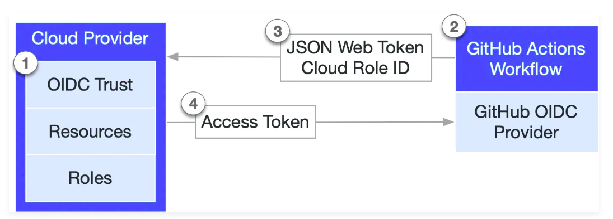
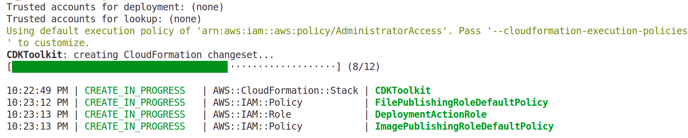
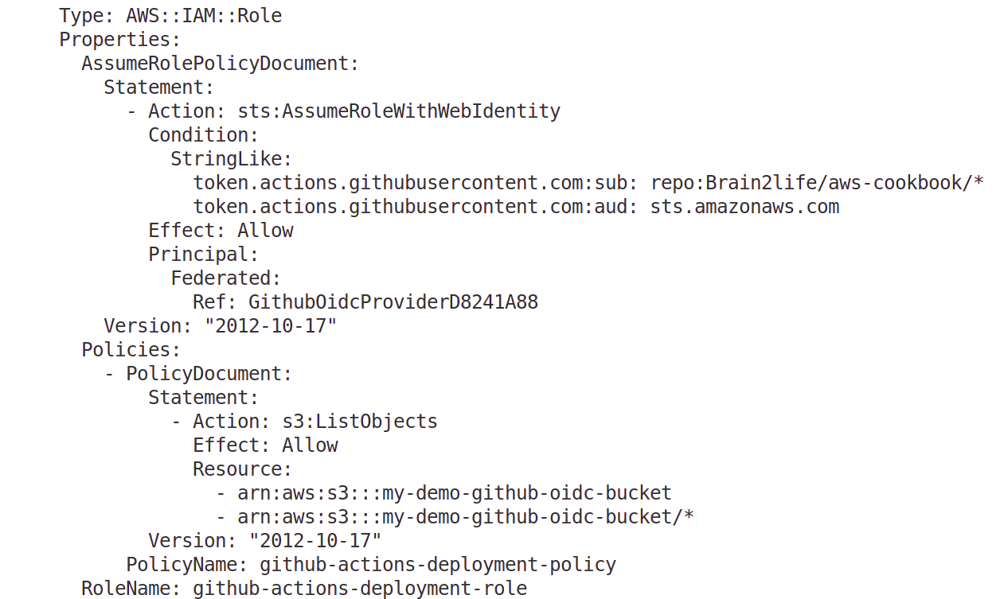

# Configure Github OIDC with AWS via Cloud Development Kit (CDK)

[GitHub's OIDC (OpenID Connect) provider](https://docs.github.com/en/actions/concepts/security/openid-connect), is a powerful feature for secure authentication in Github CI/CD pipelines.

## The Core Problem: The Old Way of Authenticating

Imagine your GitHub Actions workflow needs to deploy an application to a cloud provider like AWS, Azure, or Google Cloud. To do this, the workflow needs credentials (like an access key and secret key).

Traditionally, you would:

1.  Create a long-lived access key in your cloud account.
2.  Copy this key and its secret.
3.  Store them as "Secrets" in your GitHub repository settings (`repo settings > Secrets and variables > Actions`).
4.  Your workflow would then use these secrets to authenticate.

This works, but it has significant security drawbacks:

  * **Long-lived Credentials:** These secrets are powerful and usually don't expire. If they are ever leaked, an attacker has persistent access to your cloud account until you manually revoke them.
  * **Secret Management Overhead:** You are responsible for rotating these keys regularly, which is often forgotten.
  * **Broad Permissions:** Often, these keys have broader permissions than necessary for a single workflow.

## What is GitHub's OIDC Provider?

**At its core, GitHub's OIDC provider is a built-in feature that allows your GitHub Actions workflows to obtain short-lived access tokens directly from cloud providers without needing to store any long-lived secrets in GitHub.**

It acts as a trusted identity provider. Instead of using a static password (a secret key), your workflow proves its identity to the cloud provider by presenting a special, temporary, and verifiable token generated by GitHub.

## How Does It Work? The Step-by-Step Flow

The process relies on a standard protocol called OpenID Connect (OIDC), which is built on top of OAuth 2.0. Here's the magic behind it:



**Phase 1: Setting up the Trust Relationship (One-time setup)**

1.  **On the Cloud Provider (e.g., AWS):** You configure an "Identity Provider." You tell your cloud account, "I trust GitHub. Any workflow that comes from my organization/repository on GitHub should be treated as a potential identity." You provide GitHub's OIDC provider URL (`https://token.actions.githubusercontent.com`).

2.  **Create a Role with a Trust Policy:** You create a role (e.g., an AWS IAM Role) that your workflow can "assume." The critical part is the **Trust Policy** on this role. This policy specifies the *exact conditions* under which a GitHub workflow is allowed to assume this role.

    For example, the trust policy can say:

      * "Only allow workflows from the `my-org/my-repo` repository."
      * "Only from the `main` branch."
      * "Only when deploying to the `production` [environment](https://docs.github.com/en/actions/how-tos/deploy/configure-and-manage-deployments/manage-environments)."

**Phase 2: The Workflow Run (Happens on every run)**

1.  **Workflow Starts:** Your GitHub Actions workflow is triggered (e.g., by a `git push`).
2.  **GitHub Generates a JWT:** When your workflow needs to authenticate, the GitHub OIDC provider generates a unique [**JSON Web Token (JWT)**](https://auth0.com/docs/secure/tokens/json-web-tokens). This token is like a temporary, cryptographically signed ID card.
3.  **The JWT Contains "Claims":** This JWT is packed with verifiable information (called [claims](https://auth0.com/docs/secure/tokens/json-web-tokens/json-web-token-claims)) about the workflow's context, such as:
      * `iss` (Issuer): Who issued the token (`https://token.actions.githubusercontent.com`).
      * `aud` (Audience): Who the token is intended for (usually the cloud provider, e.g., `sts.amazonaws.com`).
      * `sub` (Subject): Detailed information about the source, like the repository name, branch, environment, tag, or pull request number. For example: `repo:my-org/my-repo:ref:refs/heads/main`.

      The following example OIDC token uses a subject (`sub`) that references a job environment named `prod` in the `octo-org/octo-repo` repository:
      ```json
        {
        "typ": "JWT",
        "alg": "RS256",
        "x5t": "example-thumbprint",
        "kid": "example-key-id"
        }
        {
        "jti": "example-id",
        "sub": "repo:octo-org/octo-repo:environment:prod",
        "environment": "prod",
        "aud": "sts.amazonaws.com",
        "ref": "refs/heads/main",
        "sha": "example-sha",
        "repository": "octo-org/octo-repo",
        "repository_owner": "octo-org",
        "actor_id": "12",
        "repository_visibility": "private",
        "repository_id": "74",
        "repository_owner_id": "65",
        "run_id": "example-run-id",
        "run_number": "10",
        "run_attempt": "2",
        "runner_environment": "github-hosted",
        "actor": "octocat",
        "workflow": "example-workflow",
        "head_ref": "",
        "base_ref": "",
        "event_name": "workflow_dispatch",
        "ref_type": "branch",
        "job_workflow_ref": "octo-org/octo-automation/.github/workflows/oidc.yml@refs/heads/main",
        "iss": "https://token.actions.githubusercontent.com",
        "nbf": 1632492967,
        "exp": 1632493867,
        "iat": 1632493567
        }
      ```

4.  **Workflow Presents the JWT:** An action in your workflow (e.g., the official [`aws-actions/configure-aws-credentials`](https://github.com/aws-actions/configure-aws-credentials) action) sends this JWT to the cloud provider's security service (like AWS STS).
5.  **Cloud Provider Verifies the JWT:** The cloud provider does two things:
      * **Verifies the Signature:** It checks the JWT's cryptographic signature against GitHub's public keys to ensure the token is authentic and wasn't tampered with.
      * **Checks the Claims:** It inspects the claims inside the JWT (`repo`, `branch`, etc.) and compares them against the conditions you defined in the IAM Role's Trust Policy.
6.  **Cloud Provider Issues a Short-Lived Token:** If the JWT is valid and the claims match the trust policy, the cloud provider issues a **short-lived access token** back to the workflow runner. This token is typically valid for an hour or less.
7.  **Workflow Accesses Resources:** The rest of your workflow steps use this temporary token to interact with the cloud provider's services (e.g., deploy to S3, update a Lambda function). Once the token expires, it's useless.

### Key Benefits

1.  **Secretless Authentication:** This is the primary advantage. You no longer need to store long-lived cloud credentials in GitHub Secrets. Your secrets can't be stolen if they don't exist.
2.  **Enhanced Security:** Access is granted via short-lived tokens that automatically expire, drastically reducing the window of opportunity for an attacker if a token were ever compromised.
3.  **Granular and Flexible Access Control:** You can create highly specific trust policies. You can have one role for deployments from the `main` branch and a completely different, read-only role for workflows running on pull requests. This enforces the principle of least privilege.
4.  **Simplified Management:** You eliminate the need to manually create, rotate, and manage static credentials in GitHub, simplifying your security operations.

### Example: AWS and GitHub Actions

**1. AWS IAM Role's Trust Policy (JSON)**

This policy allows a workflow from the `my-org/my-app` repository's `main` branch to assume this role.

```json
{
    "Version": "2012-10-17",
    "Statement": [
        {
            "Effect": "Allow",
            "Principal": {
                "Federated": "arn:aws:iam::YOUR_AWS_ACCOUNT_ID:oidc-provider/token.actions.githubusercontent.com"
            },
            "Action": "sts:AssumeRoleWithWebIdentity",
            "Condition": {
                "StringEquals": {
                    "token.actions.githubusercontent.com:aud": "sts.amazonaws.com",
                    "token.actions.githubusercontent.com:sub": "repo:my-org/my-app:ref:refs/heads/main"
                }
            }
        }
    ]
}
```

**2. GitHub Actions Workflow (YAML)**

Notice there are **no secrets** used here for authentication.

```yaml
name: Deploy to AWS

on:
  push:
    branches:
      - main

# This permission is essential for the workflow to request the OIDC JWT.
permissions:
  id-token: write
  contents: read

jobs:
  deploy:
    runs-on: ubuntu-latest
    steps:
      - name: Checkout repository
        uses: actions/checkout@v4

      - name: Configure AWS credentials
        uses: aws-actions/configure-aws-credentials@v4
        with:
          role-to-assume: arn:aws:iam::YOUR_AWS_ACCOUNT_ID:role/GitHubAction-DeployRole # The role with the trust policy
          aws-region: us-east-1

      - name: Deploy to S3
        run: |
          aws s3 sync ./dist s3://my-production-bucket
          echo "Deployment successful!"
```

In summary, GitHub's OIDC provider is the modern, secure, and recommended way to connect your GitHub Actions workflows to external systems, eliminating the risks associated with long-lived credentials.

## GitHub OIDC with CDK

1. The project was initialized with:
```bash
cdk init app --language typescript
```
2. The GitHub OIDC providers is set by using [`OpenIdConnectProvider`](https://docs.aws.amazon.com/cdk/api/v2/docs/aws-cdk-lib.aws_iam.OpenIdConnectProvider.html) construct class in `lib/demo-github-oidc-stack.ts` file 
3. Create S3 bucket for demo purposes:
```bash
aws s3api create-bucket \
  --bucket my-demo-github-oidc-bucket \
  --region us-east-1
```
4. Upload sample image files from `sample-files` folder:
```bash
aws s3 cp sample-files s3://my-demo-github-oidc-bucket/images/ --recursive
```
5. Verify files in the bucket:
```bash
aws s3 ls s3://my-demo-github-oidc-bucket/images/
```
6. Bootstrap environment:
```bash
npm install
cdk bootstrap
```



7. Build CDK app:
```bash
npm run build
```
If you want to list your stacks in the app:
```bash
cdk list
```
8. Synthesize a CloudFormation template:
```bash
cdk synth
```
If successful, the CDK CLI will output a YAML - formatted CloudFormation template to `stdout`. Review it.



9. Deploy your stack:
```bash
cdk deploy
```

## References
- [GitHub Docs: Configuring OpenID Connect in Amazon Web Services](https://docs.github.com/en/actions/how-tos/secure-your-work/security-harden-deployments/oidc-in-aws)
- [Medium Blog: Github Actions, CDK and OIDC](https://ryancormack.medium.com/github-actions-cdk-and-oidc-f638582a2d5b)
- [Getting started with CDK: Full workflow](https://github.com/Brain2life/aws-cookbook/tree/main/cdk/getting-started-with-cdk)
- [AWS Samples: Github Actions AWS Auth CDK Stack](https://github.com/aws-samples/github-actions-oidc-cdk-construct)
- [AWS Docs: Obtain the thumbprint for an OpenID Connect identity provider](https://docs.aws.amazon.com/IAM/latest/UserGuide/id_roles_providers_create_oidc_verify-thumbprint.html)
- [GitHub Blog: GitHub Actions – Update on OIDC integration with AWS June 27, 2023](https://github.blog/changelog/2023-06-27-github-actions-update-on-oidc-integration-with-aws/)
- [https://gist.github.com/guitarrapc/8e6b68f21bc1eef8e7b66bde477d5859](https://gist.github.com/guitarrapc/8e6b68f21bc1eef8e7b66bde477d5859)
- [StackOverflow: How can I calculate the thumbprint of an OpenID Connect server?](https://stackoverflow.com/questions/69247498/how-can-i-calculate-the-thumbprint-of-an-openid-connect-server)