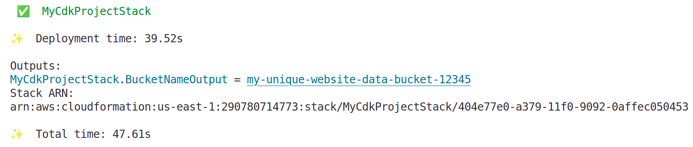

# How to Organize Your AWS CDK Constructs for Better Maintainability

This article discusses the fundamental question of structuring custom [constructs](https://docs.aws.amazon.com/cdk/v2/guide/constructs.html) in AWS CDK project.

### Simple Case: The `lib/` Directory

The standard and most recommended place to create your custom constructs is within the **`lib/`** directory.

The default CDK project structure looks like this:

```
my-cdk-project/
├── bin/
│   └── my-cdk-project.ts  # Entrypoint: Creates the App and Stacks
├── lib/
│   └── my-cdk-project-stack.ts # Main stack definition
├── test/
│   └── my-cdk-project.test.ts
├── cdk.json
├── jest.config.js
├── package.json
├── package-lock.json
└── tsconfig.json
```

  - The **`bin/`** directory is for the executable "App" file. Its job is to instantiate the CDK `App` and your `Stack` classes. You should keep this file lightweight.
  - The **`lib/`** directory is where the "library" of your infrastructure code lives. This includes your main stack definitions and, crucially, any custom L2 or L3 constructs you build.

## Best Practices and Examples

While you can just put new construct files directly in `lib/`, your project will become cleaner and more maintainable if you organize them.

### 1\. Simple Case: A Single New Construct File

For a small project, you can start by creating a new file directly inside `lib/`.

Let's say you want to create a custom construct for a secure S3 bucket that enforces encryption and blocks public access.

**Project Structure:**

```
my-cdk-project/
├── bin/
│   └── my-cdk-project.ts
├── lib/
│   ├── my-cdk-project-stack.ts # Main stack
│   └── secure-s3-bucket.ts   # <-- YOUR NEW CONSTRUCT
...
```

**`lib/secure-s3-bucket.ts`:**

```typescript
import { Construct } from 'constructs';
import * as s3 from 'aws-cdk-lib/aws-s3';
import { RemovalPolicy } from 'aws-cdk-lib';

// Define the properties your construct will accept
export interface SecureS3BucketProps extends s3.BucketProps {
  // You can add custom properties here if needed
}

export class SecureS3Bucket extends Construct {
  public readonly bucket: s3.Bucket;

  constructor(scope: Construct, id: string, props: SecureS3BucketProps) {
    super(scope, id);

    this.bucket = new s3.Bucket(this, 'SecureBucket', {
      ...props, // Pass through any standard bucket props
      // Enforce your security best practices
      blockPublicAccess: s3.BlockPublicAccess.BLOCK_ALL,
      encryption: s3.BucketEncryption.S3_MANAGED,
      enforceSSL: true,
      versioned: true,
      removalPolicy: RemovalPolicy.RETAIN, // Safer default for production
    });
  }
}
```

**How to use it in `lib/my-cdk-project-stack.ts`:**

```typescript
import * as cdk from 'aws-cdk-lib';
import { Construct } from 'constructs';
import { SecureS3Bucket } from './secure-s3-bucket'; // <-- IMPORT IT

export class MyCdkProjectStack extends cdk.Stack {
  constructor(scope: Construct, id: string, props?: cdk.StackProps) {
    super(scope, id, props);

    // Instantiate your custom construct just like any other CDK construct
    const mySecureBucket = new SecureS3Bucket(this, 'MyWebsiteData', {
      // You can still override properties if you allow it via props
      bucketName: 'my-unique-website-data-bucket-12345',
    });

    // You can access the underlying resources via public properties
    new cdk.CfnOutput(this, 'BucketNameOutput', {
      value: mySecureBucket.bucket.bucketName,
    });
  }
}
```

### 2\. Scalable Approach: Using a `constructs` Subdirectory

As your project grows, you'll create more constructs. To keep the `lib/` directory clean, it's a great practice to group them in a dedicated subdirectory.

**Project Structure:**

```
my-cdk-project/
├── bin/
│   └── my-cdk-project.ts
├── lib/
│   ├── constructs/             # <-- DEDICATED FOLDER
│   │   ├── secure-s3-bucket.ts
│   │   └── another-construct.ts
│   └── my-cdk-project-stack.ts # Main stack
...
```

This approach makes it immediately clear where to find reusable components versus the primary stack definitions. Your import statement in the stack file would simply change to:

```typescript
import { SecureS3Bucket } from './constructs/secure-s3-bucket';
```

### 3\. Advanced Case: Shared Constructs in a Monorepo or Separate Package

If you have constructs that need to be shared across multiple CDK projects or teams, you should not keep them inside a single project's `lib/` directory.

The best practice in this scenario is to create a separate, versioned NPM package for your shared constructs. This ensures that different projects can use specific, stable versions of your infrastructure patterns. You can manage this using tools like [`pnpm workspaces`](https://pnpm.io/workspaces), [`yarn workspaces`](https://yarnpkg.com/features/workspaces), or [`Lerna`](https://lerna.js.org/) in a monorepo setup.

**Example Monorepo Structure:**

```
company-infra-monorepo/
├── packages/
│   ├── cdk-shared-constructs/  # <-- YOUR SHARED CONSTRUCTS PACKAGE
│   │   ├── lib/
│   │   │   ├── secure-s3-bucket.ts
│   │   │   └── index.ts        # Exports all constructs
│   │   └── package.json
│   ├── project-a-app/          # CDK App for Project A
│   │   ├── lib/
│   │   │   └── project-a-stack.ts
│   │   └── package.json        # Depends on 'cdk-shared-constructs'
│   └── project-b-app/          # CDK App for Project B
│       ├── lib/
│       │   └── project-b-stack.ts
│       └── package.json        # Depends on 'cdk-shared-constructs'
└── package.json
```

## Summary

| Scenario             | Where to Place Constructs                                      | Why                                                                       |
| -------------------- | -------------------------------------------------------------- | ------------------------------------------------------------------------- |
| **Simple/Standard** | Directly in the `lib/` directory as separate `.ts` files.      | Easy and sufficient for small projects with a few custom constructs.      |
| **Growing Project** | In a `lib/constructs/` subdirectory.                           | Better organization, separation of concerns, and improved maintainability. |
| **Large/Shared** | In a separate NPM package (often within a monorepo).           | Promotes reuse, versioning, and decouples shared patterns from specific applications. |

For most projects, starting with the **`lib/constructs/`** subdirectory is the best and most scalable approach.

## Demo

1. Initialize the project:
```bash
cdk init app --language typescript
```
2. Create separate `constructs` folder in `lib` and place custom construct file there.
3. Bootstrap the project:
```bash
npm install
cdk bootstrap
```
4. Deploy the project:
```bash
npm install
npm run build
cdk deploy
```



## References
- [YouTube: How to make your own NPM package](https://www.youtube.com/watch?v=xnfdm-s8adI)
- [YouTube: NPM for absolute beginners](https://www.youtube.com/watch?v=UYz-9UaUp2E)