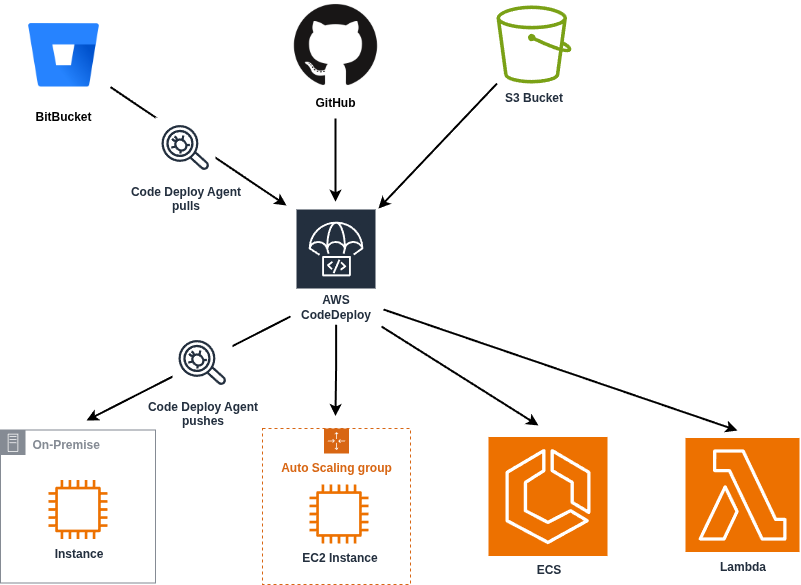
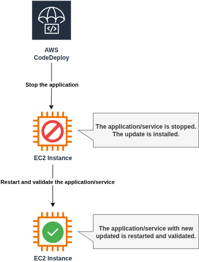
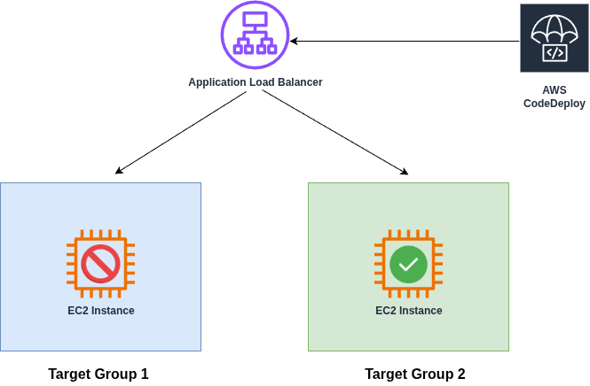

# CodeDeploy Basics

[CodeDeploy](https://docs.aws.amazon.com/codedeploy/latest/userguide/welcome.html) is a deployment service that automates application deployments to:
- Amazon EC2 instances, 
- on-premises instances, 
- serverless Lambda functions, 
- Amazon ECS services.

You can deploy a nearly unlimited variety of application content, including:
- Code
- Serverless AWS Lambda functions
- Web and configuration files
- Executables
- Packages
- Scripts
- Multimedia files

CodeDeploy can deploy application content that runs on a: 
- server,
- stored in Amazon S3 buckets, 
- GitHub repositories, 
- Bitbucket repositories.



For more information about supported repository types, see [Choose a CodeDeploy repository type](https://docs.aws.amazon.com/codedeploy/latest/userguide/application-revisions-repository-type.html).

## AWS CodeDeploy Components Across Platforms

| **Component**         | **EC2 / On-Premises**                                                                                                          | **AWS Lambda**                                                                                                   | **Amazon ECS**                                                                                                                                                                 |
| --------------------- | ------------------------------------------------------------------------------------------------------------------------------ | ---------------------------------------------------------------------------------------------------------------- | ------------------------------------------------------------------------------------------------------------------------------------------------------------------------------ |
| **Deployment group**  | Targets a group of EC2 or on-prem servers and deploys a specific revision to them.                                             | Updates a Lambda function by deploying a new version on managed serverless infrastructure.                       | Points to an ECS service. Defines the new task set to deploy, listeners for traffic routing, when to switch traffic, terminate the old task set, and optional alarms/rollback. |
| **Deployment**        | Rolls out a new revision (application files + AppSpec). The AppSpec describes how to install and run it on the target servers. | Shifts production traffic from one Lambda function version to another. The AppSpec defines which version to use. | Creates a new task set with the updated container image, shifts production traffic to it, and removes the old task set once stable.                                            |
| **Deployment config** | Controls rollout speed (e.g., how many servers update at once) and ensures a minimum number of healthy instances.              | Controls how production traffic is gradually routed to the new Lambda version (e.g., canary or linear shift).    | Controls how traffic is shifted between the old and new ECS task sets.                                                                                                         |
| **Revision**          | Bundle of application files + AppSpec (includes executables, configs, etc.).                                                   | AppSpec defines which Lambda version to deploy, plus optional validation hooks.                                  | AppSpec defines ECS task definition, target container, exposed port, optional network settings, and validation hooks.                                                          |
| **Application**       | Logical collection of revisions + deployment groups for EC2/On-Prem.                                                           | Logical collection of revisions + deployment groups for Lambda.                                                  | Logical collection of revisions + deployment groups for ECS.                                                                                                                   |

## AWS CodeDeploy Key Terminologies

| **Term**                     | **Explanation**                                                                                                                                                                                                                                                                                                                                                                                                               |
| ---------------------------- | ----------------------------------------------------------------------------------------------------------------------------------------------------------------------------------------------------------------------------------------------------------------------------------------------------------------------------------------------------------------------------------------------------------------------------- |
| **Application**              | A logical container in CodeDeploy that uniquely identifies your app. It ties together the right **revision**, **deployment group**, and **deployment configuration** for deployments.                                                                                                                                                                                                                                         |
| **Compute Platform**         | The environment where CodeDeploy deploys applications. Options are: <br>• **EC2/On-Premises** (servers or Auto Scaling groups) <br>• **AWS Lambda** (serverless functions) <br>• **Amazon ECS** (containerized services).                                                                                                                                                                                                     |
| **Deployment Configuration** | A set of rules that define how deployments happen and what counts as success or failure. <br>• For **EC2/On-Premises**: minimum number of healthy instances. <br>• For **Lambda/ECS**: how production traffic shifts to the new version using strategies like: <br> – **Canary**: traffic moves in two steps. <br> – **Linear**: traffic shifts in equal steps over time. <br> – **All-at-once**: traffic switches instantly. |
| **Deployment Group**         | A collection of target instances or resources where CodeDeploy will deploy. This could be EC2 instances (tagged), Auto Scaling groups, or on-premises servers.                                                                                                                                                                                                                                                                |
| **Deployment Type**          | How the new app revision is made available: <br>• **In-place**: Updates existing servers in batches. <br>• **Blue/Green**: Launches a parallel environment with the new version and switches traffic once validated.                                                                                                                                                                                                          |
| **Revision**                 | A specific version of your application. <br>• **EC2/On-Premises**: an archive (code, executables, configs, AppSpec file). Stored in **S3** or **GitHub**. <br>• **Lambda**: a YAML/JSON file defining which function version to deploy. Stored in **S3**.                                                                                                                                                                     |
| **Service Role**             | An **IAM role** CodeDeploy uses to access AWS resources on your behalf. The attached policies define what actions CodeDeploy can perform.                                                                                                                                                                                                                                                                                     |
| **Target Revision**          | The specific application revision you want to deploy. It’s the latest uploaded version marked for deployment and is pulled automatically by CodeDeploy during rollouts.                                                                                                                                                                                                                                                       |

## Deployment Types in AWS CodeDeploy

When working with AWS CodeDeploy, you typically choose between two [core deployment strategies](https://docs.aws.amazon.com/codedeploy/latest/userguide/welcome.html#welcome-deployment-overview): **In-place** and **Blue/Green**. Both aim to deliver new application versions reliably, but they differ in how updates are rolled out and how downtime and risk are managed.

### In-Place Deployment

In an **in-place deployment** (sometimes called rolling update), the existing instances or servers are updated directly with the new application version.



* **How it works**:

  * CodeDeploy takes a batch of target instances (EC2, on-prem, or Auto Scaling group).
  * Stops the running application or service.
  * Installs the updated files defined in the `appspec.yml`.
  * Restarts and validates the service before moving to the next batch.

* **Pros**:

  * Simple setup.
  * No need to provision additional infrastructure.
  * Cost-effective since you reuse the same servers.

* **Cons**:

  * Risk of partial downtime during updates.
  * Rollback can take longer because it requires re-deploying the old version to the same servers.
  * Not ideal for zero-downtime requirements.

In-place deployments fit smaller environments or internal apps where downtime tolerance is higher.

### Blue/Green Deployment

A **blue/green deployment** creates a separate environment with the new application version, leaving the existing one untouched until the switch.



* **How it works**:

  * The **blue** environment represents the current, production version.
  * The **green** environment is provisioned with the new application version (new EC2 instances, ECS task set, or Lambda alias).
  * CodeDeploy reroutes traffic from blue to green once the green environment is validated.
  * If successful, blue can be terminated; if issues arise, traffic can quickly be switched back.

* **Pros**:

  * Enables **zero downtime** updates.
  * Provides fast rollback by shifting traffic back to blue.
  * Safer for production workloads with high availability needs.

* **Cons**:

  * Requires extra infrastructure (duplicate servers, ECS tasks, or Lambda versions).
  * Slightly higher operational and cost overhead.

Blue/green deployments are the go-to for mission-critical applications where uptime and safety matter most.

**Key takeaway**:  
Use **in-place** when you need simplicity and cost savings, and **blue/green** when you prioritize uptime, safe rollbacks, and smoother user experience.

## Service Role for CodeDeploy EC2 Deployments

An **AWS CodeDeploy Service Role** is an IAM (Identity and Access Management) role that **grants the AWS CodeDeploy service the permissions it needs to perform deployment operations on your behalf**. This role is essential for enabling CodeDeploy to interact with other AWS services, such as **EC2 instances**, **Auto Scaling groups**, **Lambda functions**, or **ECS services**, to deploy application code and manage the deployment process.

For EC2/On-Premises deployments the [AWSCodeDeployRole](https://docs.aws.amazon.com/aws-managed-policy/latest/reference/AWSCodeDeployRole.html) managed policy is sufficient. It allows to:

- Read the tags on your instances or identify your Amazon EC2 instances by Amazon EC2 Auto Scaling group names.
- Read, create, update, and delete Amazon EC2 Auto Scaling groups, lifecycle hooks, and scaling policies.
- Publish information to Amazon SNS topics.
- Retrieve information about CloudWatch alarms.
- Read and update Elastic Load Balancing.

If you create your Auto Scaling group with a launch template, you must add the following permissions:
- `ec2:RunInstances`
- `ec2:CreateTags`
- `iam:PassRole`

For more information, see [Create a service role for CodeDeploy](https://docs.aws.amazon.com/codedeploy/latest/userguide/getting-started-create-service-role.html).

The example of creating sample CodeDeploy Service Role for EC2 deployments can be found at `terraform` folder. In that example, **first you have to define the EC2 Instance Profile** that will assume the CodeDeploy Service Role and be used as in launch templates for EC2 AutoScaling Groups. Next, you **define the Service Role itself** with permssions of `AWSCodeDeployRole` with added permissions for launch template of autoscaling group.

To get the values of the roles:
```bash
terraform output
```

## References
- [YouTube: What is AWS CodeDeploy?](https://www.youtube.com/watch?v=lbBg9FMnnPM&t)
- [AWS Whitepapers: CodeDeploy](https://docs.aws.amazon.com/whitepapers/latest/overview-deployment-options/aws-codedeploy.html)