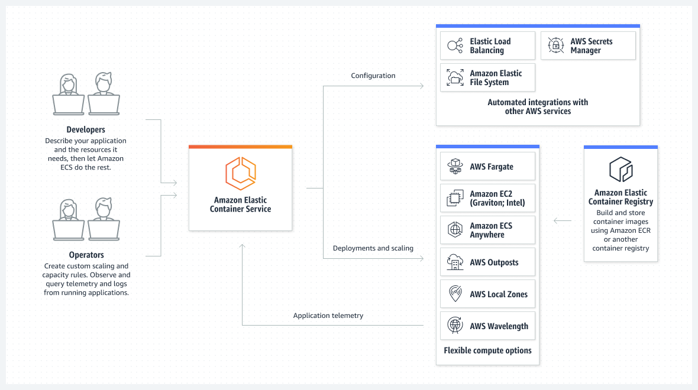
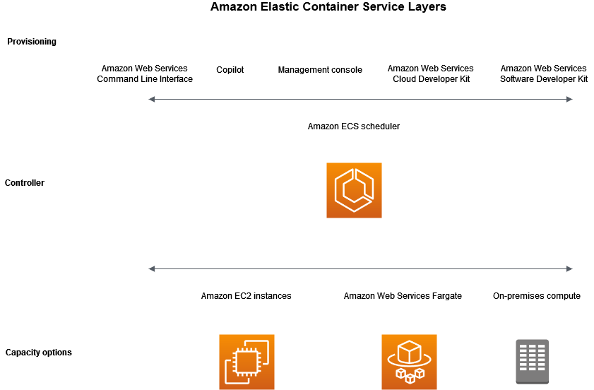
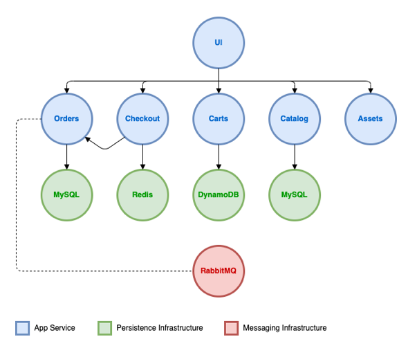
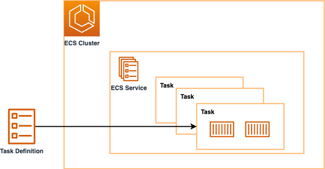
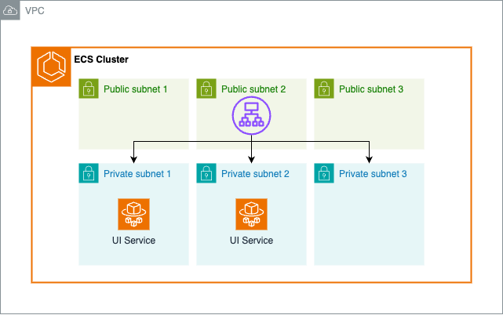
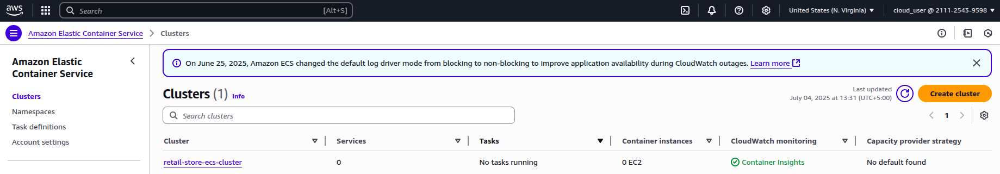
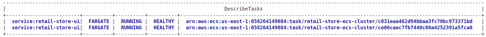
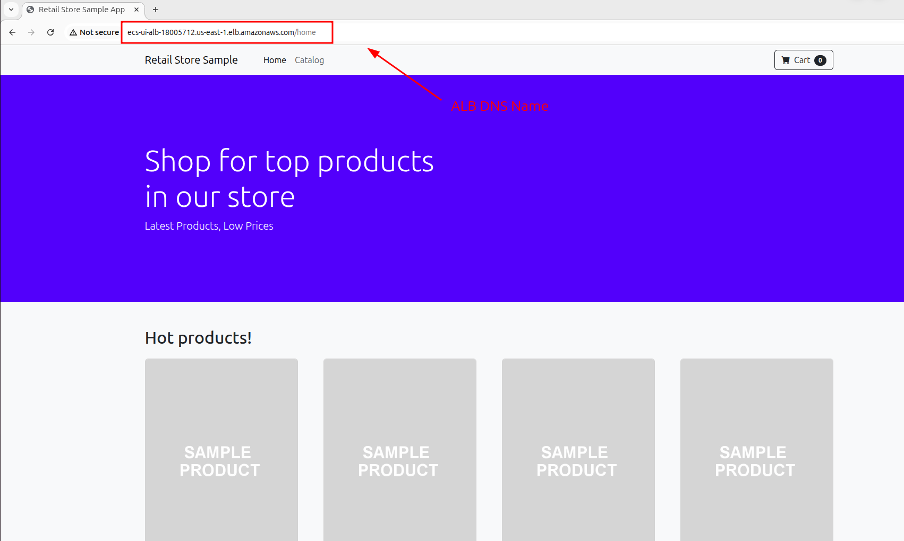
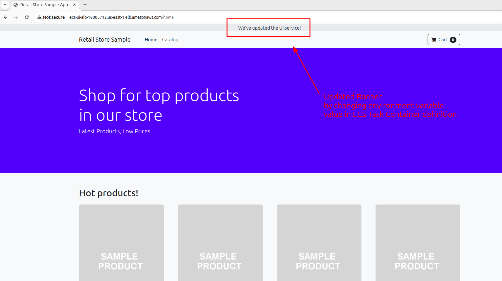

# ECS (Elastic Container Service) Foundations



[Amazon Elastic Container Service (Amazon ECS)](https://docs.aws.amazon.com/AmazonECS/latest/developerguide/Welcome.html) is a fully managed container orchestration service that helps you easily deploy, manage, and scale containerized applications. As a fully managed service, Amazon ECS comes with AWS configuration and operational best practices built-in. It's integrated with both AWS tools, such as Amazon Elastic Container Registry, and third-party tools, such as Docker. This integration makes it easier for teams to focus on building the applications, not the environment. You can run and scale your container workloads across AWS Regions in the cloud, and on-premises, without the complexity of managing a control plane.

## Goal of the project

In this lab, you will build the **core components of Amazon ECS**, including an **ECS cluster**, **task definition**, and **ECS service**. The ultimate goal is to deploy a container sitting behind an **Application Load Balancer (ALB)**.

## ECS Layers

There are three layers in Amazon ECS:
- Capacity - The infrastructure where your containers run
- Controller - Deploy and manage your applications that run on the containers
- Provisioning - The tools that you can use to interface with the scheduler to deploy and manage your applications and containers

The following diagram shows the Amazon ECS layers:



The **capacity** is the **infrastructure where your containers run**. The following is an overview of the capacity options:
- **Amazon EC2 instances in the AWS cloud**: You choose the instance type, the number of instances, and manage the capacity.
- **Serverless (AWS Fargate) in the AWS cloud**: [Fargate](https://aws.amazon.com/fargate/) is a serverless, pay-as-you-go compute engine. With Fargate you don't need to manage servers, handle capacity planning, or isolate container workloads for security.
- **On-premises virtual machines (VM) or servers**: [Amazon ECS Anywhere](https://docs.aws.amazon.com/AmazonECS/latest/developerguide/launch-type-external.html) provides support for registering an external instance such as an on-premises server or virtual machine (VM), to your Amazon ECS cluster.

The **Amazon ECS scheduler** is the **software that manages your applications**.

## Pricing

Amazon ECS pricing depends on the capacity option you choose for your containers:
- [Amazon ECS pricing](https://aws.amazon.com/ecs/pricing) – Pricing information for Amazon ECS.
- [AWS Fargate pricing](https://aws.amazon.com/fargate/pricing) – Pricing information for Fargate.

## Related services to use with Amazon ECS

You can use other AWS services to help you deploy yours tasks and services on Amazon ECS.

- [**Amazon EC2 Auto Scaling**](https://docs.aws.amazon.com/autoscaling/): Helps ensure you have the correct number of Amazon EC2 instances available to handle the load for your application.
- [**Amazon CloudWatch**](https://docs.aws.amazon.com/cloudwatch/): Monitor your services and tasks.
- [**Amazon Elastic Container Registry**](https://docs.aws.amazon.com/ecr/): Store and manage container images.
- [**Elastic Load Balancing**](https://docs.aws.amazon.com/elasticloadbalancing/): Automatically distribute incoming service traffic.
- [**Amazon GuardDuty**](https://docs.aws.amazon.com/guardduty/): Detect potentially unauthorized or malicious use of your container instances and workloads.

## AWS Fargate

[AWS Fargate](https://aws.amazon.com/fargate/) is a serverless, pay-as-you-go compute engine that allows you to focus on building applications without the need to manage servers. AWS Fargate is compatible with both Amazon Elastic Container Service (ECS) and Amazon Elastic Kubernetes Service (EKS).


### Benefits of AWS Fargate

- **Focus on applications, not infrastructure**: Deploy and manage your applications without the operational overhead of scaling, patching, securing, and managing servers.
- **Gain insights through comprehensive monitoring**: Monitor your applications using built-in integrations with AWS services like Amazon CloudWatch Container Insights or collect metrics and logs using third-party tools.
- **Enhance security through workload isolation**: Improve security by design with workload isolation. Each AWS Fargate workload runs on its own single-use, single-tenant compute instance, isolated by a virtualization boundary. Every Amazon ECS Task or Kubernetes pod operates on a newly provisioned instance. For more details on the AWS Fargate architecture, refer to the [AWS Fargate Security Whitepaper](https://d1.awsstatic.com/whitepapers/AWS_Fargate_Security_Overview_Whitepaper.pdf).
- **Optimize costs efficiently**: Pay only for the compute resources you use, with no upfront expenses. Further reduce costs by leveraging Savings Plans, Fargate Spot, or AWS Graviton processors.

## Sample application

The sample application models a simple web store application, where customers can browse a catalog, add items to their cart, and complete an order through the checkout process.



| Component     | Description                                                                 |
|---------------|-----------------------------------------------------------------------------|
| UI            | Provides the front end user interface and aggregates API calls to the various other services. |
| Catalog       | API for product listings and details                                        |
| Cart          | API for customer shopping carts                                             |
| Checkout      | API to orchestrate the checkout process                                     |
| Orders        | API to receive and process customer orders                                  |
| Static assets | Serves static assets like images related to the product catalog             |

You can find the complete source code for the sample application on [GitHub](https://github.com/aws-containers/retail-store-sample-app).

Before a workload can be deployed to ECS, it must first be packaged as a container image and published to a container registry.

The table below provides links to the ECR Public repository for each component, as well as the Dockerfile that was used to build each component.

| Component       | ECR Public Repository | Dockerfile |
|----------------|------------------------|------------|
| UI             | [Repository](https://gallery.ecr.aws/aws-containers/retail-store-sample-ui)             | [Dockerfile](https://github.com/aws-containers/retail-store-sample-app/blob/0.8.5/src/ui/Dockerfile) |
| Catalog        | [Repository](https://gallery.ecr.aws/aws-containers/retail-store-sample-catalog)             | [Dockerfile](https://github.com/aws-containers/retail-store-sample-app/blob/0.8.5/src/catalog/Dockerfile) |
| Shopping cart  | [Repository](https://gallery.ecr.aws/aws-containers/retail-store-sample-cart)             | [Dockerfile](https://github.com/aws-containers/retail-store-sample-app/blob/0.8.5/src/cart/Dockerfile) |
| Checkout       | [Repository](https://gallery.ecr.aws/aws-containers/retail-store-sample-checkout)             | [Dockerfile](https://github.com/aws-containers/retail-store-sample-app/blob/0.8.5/src/checkout/Dockerfile) |
| Orders         | [Repository](https://gallery.ecr.aws/aws-containers/retail-store-sample-orders)             | [Dockerfile](https://github.com/aws-containers/retail-store-sample-app/blob/0.8.5/src/orders/Dockerfile) |
| Assets         | [Repository](https://gallery.ecr.aws/aws-containers/retail-store-sample-assets)             | [Dockerfile](https://github.com/aws-containers/retail-store-sample-app/blob/0.8.5/src/assets/Dockerfile) |

## Amazon ECS Core Components



Amazon ECS has four core components:
- **Cluster**: A logical grouping of services and tasks
- **Service**: A group of identical tasks
- **Task**: One or more containers performing a specific application function
- **Task Definition**: Describes the task requirements (CPU, Memory, container images, networking type, IAM, etc.)

For more information, see:
- [YouTube: Amazon ECS: Service Overview](https://www.youtube.com/watch?v=fXiUlXy5kRA)
- [YouTube: Amazon ECS: Task and Task Definition Overview](https://www.youtube.com/watch?v=5uJUmGWjRZY)

Understanding these components is crucial for effectively using Amazon ECS to manage your containerized applications. Each component plays a vital role in the overall architecture and functionality of your ECS deployments.

## Create VPC

Before creating ECS Cluster, you need to create VPC with required public/private subnets where you plan to run your ECS Container workloads.

## Delete Default VPC

Deleting a default Virtual Private Cloud (VPC) using the AWS Command Line Interface (CLI) requires a sequence of commands to first remove its dependencies. Attempting to delete a VPC with existing resources will result in a `DependencyViolation` error.

### Step 1: Identify the Default VPC

First, identify the VPC ID of your default VPC. You can do this by filtering for the VPC where the `isDefault` attribute is `true`.

```bash
aws ec2 describe-vpcs --filters "Name=is-default,Values=true" --query "Vpcs[0].VpcId" --output text
```

This command will return the VPC ID of the default VPC. Store this ID in a variable for ease of use in subsequent commands.

```bash
VPC_ID=$(aws ec2 describe-vpcs --filters "Name=is-default,Values=true" --query "Vpcs[0].VpcId" --output text)
```

If you have multiple default VPCs in different regions, specify the region using the `--region` flag.

### Step 2: Delete Subnets

Next, you need to delete all subnets within the default VPC. First, list the subnet IDs associated with the VPC.

```bash
aws ec2 describe-subnets --filters "Name=vpc-id,Values=$VPC_ID" --query "Subnets[*].SubnetId" --output json
```

Then, iterate through the list of subnet IDs and delete each one.

```bash
for SUBNET_ID in $(aws ec2 describe-subnets --filters "Name=vpc-id,Values=$VPC_ID" --query "Subnets[*].SubnetId" --output text); do
  aws ec2 delete-subnet --subnet-id $SUBNET_ID
  echo "Deleted subnet: $SUBNET_ID"
done
```

### Step 3: Detach and Delete the Internet Gateway

A default VPC has an internet gateway attached to it. You must first detach it before you can delete it.

1.  **Identify the Internet Gateway ID:**

    ```bash
    IGW_ID=$(aws ec2 describe-internet-gateways --filters "Name=attachment.vpc-id,Values=$VPC_ID" --query "InternetGateways[0].InternetGatewayId" --output text)
    ```

2.  **Detach the Internet Gateway from the VPC:**

    ```bash
    aws ec2 detach-internet-gateway --internet-gateway-id $IGW_ID --vpc-id $VPC_ID
    echo "Detached internet gateway: $IGW_ID"
    ```

3.  **Delete the Internet Gateway:**

    ```bash
    aws ec2 delete-internet-gateway --internet-gateway-id $IGW_ID
    echo "Deleted internet gateway: $IGW_ID"
    ```

### Step 4: Delete the Default VPC

Once all dependencies have been removed, you can delete the VPC. Note that the default security group, default network ACL, and default route table associated with the VPC will be deleted automatically when the VPC is deleted. You cannot delete these default components while the VPC exists.

```bash
aws ec2 delete-vpc --vpc-id $VPC_ID
echo "Deleted VPC: $VPC_ID"
```

After executing these steps, your default VPC and its associated resources will be successfully deleted.

## Create ALB

To distribute traffic across tasks in ECS Service, you need to provision Application Load Balancer in public subnets with target group.
The overall scheme should look similar to this:



ALB is provisioned via using [Terraform module](https://registry.terraform.io/modules/terraform-aws-modules/alb/aws/5.9.0#terraform-versions). To avoid any conflicts with newer Terraform and AWS Provider 6.x.x versions, ALB uses old 5.0.x versions.

## Create ECS Cluster

### Create via CLI

Tp create an Amazon ECS Cluster named `retail-store-ecs-cluster` with [CloudWatch Container Insights](https://docs.aws.amazon.com/AmazonECS/latest/developerguide/cloudwatch-container-insights.html)  enabled use the following command:
```bash
aws ecs create-cluster --cluster-name retail-store-ecs-cluster --region $AWS_REGION --settings name=containerInsights,value=enabled
```

Container Insights collects, aggregates, and summarizes metrics and logs from your containerized applications and microservices:

### Create via Terraform

In [ECS Terraform module](https://registry.terraform.io/modules/terraform-aws-modules/ecs/aws/latest), to enable CloudWatch Container Insights setting, see [`cluster_settings`](https://registry.terraform.io/modules/terraform-aws-modules/ecs/aws/latest#input_cluster_settings) input parameter.

> [!CAUTION] 
> The Terraform uses the [`v5.100.0`](https://github.com/hashicorp/terraform-provider-aws/releases/tag/v5.100.0) AWS provider version in order to avoid any errors or conflicts with the latest `v6.x.x` versions that have breaking changes.

1. Initialize and install the providers and modules:
```bash
terraform init
```
2. Apply changes:
```bash
terraform apply
```

You should see, that Terraform will create ECS Cluster and enable CloudWath Log Group:
```json
Terraform will perform the following actions:

  # module.ecs.module.cluster.aws_cloudwatch_log_group.this[0] will be created
  + resource "aws_cloudwatch_log_group" "this" {
      + arn               = (known after apply)
      + id                = (known after apply)
      + log_group_class   = (known after apply)
      + name              = "/aws/ecs/retail-store-ecs-cluster"
      + name_prefix       = (known after apply)
      + retention_in_days = 90
      + skip_destroy      = false
      + tags              = {
          + "Environment" = "dev"
          + "Terraform"   = "true"
        }
      + tags_all          = {
          + "Environment" = "dev"
          + "Terraform"   = "true"
        }
    }

  # module.ecs.module.cluster.aws_ecs_cluster.this[0] will be created
  + resource "aws_ecs_cluster" "this" {
      + arn      = (known after apply)
      + id       = (known after apply)
      + name     = "retail-store-ecs-cluster"
      + tags     = {
          + "Environment" = "dev"
          + "Terraform"   = "true"
        }
      + tags_all = {
          + "Environment" = "dev"
          + "Terraform"   = "true"
        }

      + configuration {
          + execute_command_configuration {
              + logging = "DEFAULT"
            }
        }

      + setting {
          + name  = "containerInsights"
          + value = "enabled"
        }
    }

Plan: 2 to add, 0 to change, 0 to destroy.
```

In AWS Console you should see ECS Cluster created and CloudWatch Container Insights enabled:



## Fargate Capaciy Providers

A [**capacity provider**](https://docs.aws.amazon.com/AmazonECS/latest/developerguide/fargate-capacity-providers.html) tells ECS **where and how to run your tasks**. For example:

* `FARGATE`: Runs tasks on regular Fargate infrastructure
* `FARGATE_SPOT`: Runs tasks on spare (cheaper, but interruptible) Fargate capacity

---

### What Does `weight` Mean?

The `weight` defines **how ECS splits tasks between multiple capacity providers**, like a load balancer.

#### Example:

```hcl
fargate_capacity_providers = {
  FARGATE = {
    default_capacity_provider_strategy = {
      weight = 100
    }
  }
  FARGATE_SPOT = {
    default_capacity_provider_strategy = {
      weight = 0
    }
  }
}
```

This means:

* **100% of tasks will run on FARGATE**
* **0% will run on FARGATE\_SPOT**

---

### More Interesting Example:

```hcl
fargate_capacity_providers = {
  FARGATE = {
    default_capacity_provider_strategy = {
      weight = 50
    }
  }
  FARGATE_SPOT = {
    default_capacity_provider_strategy = {
      weight = 50
    }
  }
}
```

This tells ECS:

> "Distribute tasks **evenly** between FARGATE and FARGATE\_SPOT."

If you're running 10 tasks, ECS will try to:

* Run 5 on FARGATE
* Run 5 on FARGATE\_SPOT

⚠️ ECS does *not* guarantee exact distribution — it’s a **best effort**.

---

### Current Config:

```hcl
fargate_capacity_providers = {
  FARGATE = {
    default_capacity_provider_strategy = {
      weight = 100
    }
  }
}
```

Means:

* Use **only** regular `FARGATE` (no spot instances).
* All tasks will be placed on on-demand Fargate capacity.

---

### Why Set Weight?

Use it when you:

* Want to **save money** with `FARGATE_SPOT`
* Accept **interruption risk** for non-critical workloads
* Need a **mix of stability and cost-efficiency**

## ECS Services

An [**ECS service**](https://docs.aws.amazon.com/AmazonECS/latest/developerguide/ecs_services.html) enables you to **run and maintain a specified number of instances of a task definition simultaneously** in an Amazon ECS cluster. If any of these tasks fail or stop for any reason, the ECS service scheduler launches another instance of your task definition to replace it, maintaining the desired number of tasks in the service. This ensures high availability for your application.

ECS services are used to manage long-running applications, microservices, or other software components that require high availability. Services in ECS can be integrated with Elastic Load Balancing (ELB) to distribute traffic evenly across the tasks in the service, providing a seamless way to deploy, manage, and scale your containerized applications.

Once the service is stable, you can view the running tasks from the CLI:
```bash
aws ecs describe-tasks \
    --cluster retail-store-ecs-cluster \
    --tasks $(aws ecs list-tasks --cluster retail-store-ecs-cluster --query 'taskArns[]' --output text) \
    --query "tasks[*].[group, launchType, lastStatus, healthStatus, taskArn]" --output table
```



You can retrieve the load balancer URL like so:
```bash
export RETAIL_ALB=$(aws elbv2 describe-load-balancers --name ecs-ui-alb \
 --query 'LoadBalancers[0].DNSName' --output text)

echo http://${RETAIL_ALB} ; echo
```

Paste the URL into a web browser to access the application. You should see a screen like the one below:



## Updating a ECS Service

This process is useful in scenarios such as **changing the container image** or **modifying the configuration**.

Environment variables are one of the primary mechanisms used to configure container workloads, regardless of the orchestrator. You'll alter the configuration of the UI service by passing a new environment variable that will alter the behavior of the workload. In this case, you'll use the `RETAIL_UI_BANNER` setting, which will add a banner to the page.

Environment variables are expressed in ECS task definitions with a name and a value like so:
```json
"environment": [
    {
        "name": "RETAIL_UI_BANNER",
        "value": "We've updated the UI service!"
    }
]
```

This banner can be updated in ECS Task Container definition of by using the new value of environment variable (you need to uncomment the subsequent code section). In ECS Terraform module definition:
```terraform
      container_definitions = {
        application = {
          image     = "public.ecr.aws/aws-containers/retail-store-sample-ui:0.7.0"
          essential = true

          port_mappings = [
            {
              containerPort = 8080
              protocol      = "tcp"
              name          = "application"
            }
          ]

          linux_parameters = {
            initProcessEnabled = true
          }

          # Update the Banner by using environment variable
          environment = [
            {
              name  = "RETAIL_UI_BANNER"
              value = "We've updated the UI service!"
            }
          ]
```

After applying the changes, you should see the updated banner:



It's important to note that **ECS task definitions are immutable**, which means **they cannot be modified after creation**. Instead, applying changes will **create a new task definition revision**, which is a copy of the current task definition with the new parameter values replacing the existing ones.

You can check that you now have multiple task definition revisions with the following command:
```bash
aws ecs list-task-definitions --family-prefix retail-store-ui
```

The output will show all of the revisions of the UI service:
```json
{
    "taskDefinitionArns": [
        "arn:aws:ecs:us-west-2:XXXXXXXXXXXX:task-definition/retail-store-ecs-ui:1",
        "arn:aws:ecs:us-west-2:XXXXXXXXXXXX:task-definition/retail-store-ecs-ui:2"
    ]
}
```

In Terraform ECS module, the task definition `family` is automatically derived from the **service name**, which is:
```json
services = {
  retail-store-ui = { ... }
}
```

So the family name becomes: `retail-store-ui`.

## References
- [Amazon ECS Workshop](https://catalog.workshops.aws/ecs-immersion-day/en-US)
- [YouTube: Getting started with Amazon ECS Core Concepts](https://www.youtube.com/watch?v=o6M8GXwDr9w)
- [YouTube: Amazon ECS: AWS Fargate Overview](https://www.youtube.com/watch?v=yi22xrvPnPk)
