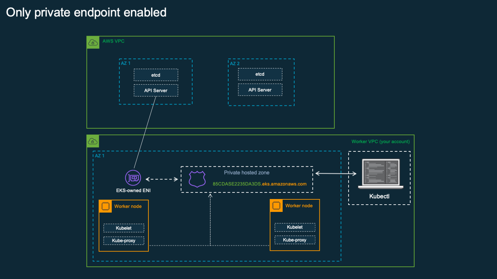
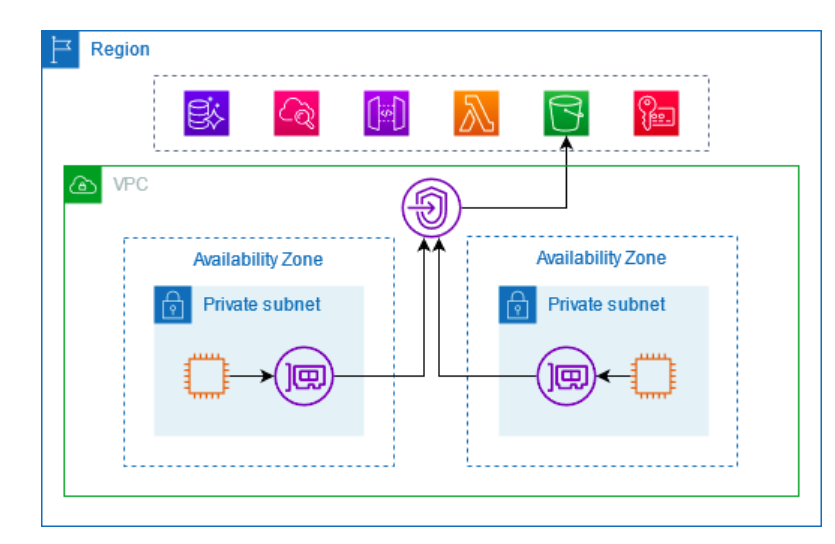
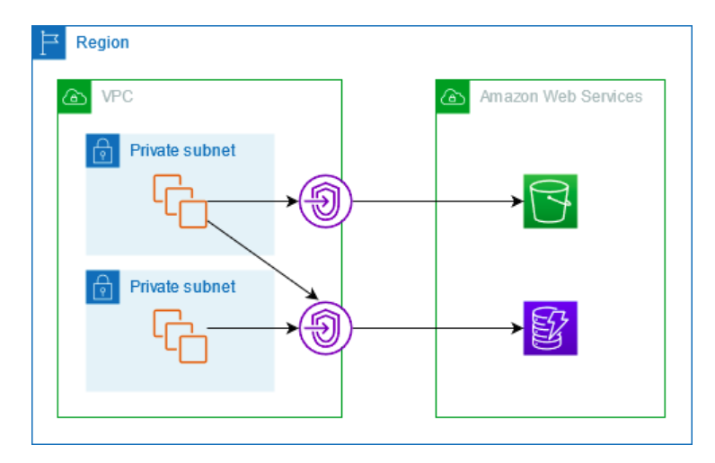

# Fully Private EKS Cluster

This project shows how to deploy secure, private Kubernetes on AWS. For more information, see [Deploy private clusters with limited internet access](https://docs.aws.amazon.com/eks/latest/userguide/private-clusters.html)



## **What is a Fully Private EKS Cluster?**

* **EKS (Elastic Kubernetes Service)**: AWS’s managed Kubernetes service.
* **Fully private EKS**: The **control plane** and all **worker nodes** are only accessible inside the VPC - **no public internet access**.

  * **No public IPs** on nodes.
  * Nodes, applications, and Kubernetes APIs are not reachable from the public internet.
  * All communication must occur over private networking (inside your VPC).

## **The Problem: Private Clusters Need AWS APIs**

Even in a fully private setup, EKS worker nodes (and often the control plane itself) need to **talk to AWS services**.
**Examples:**

* **Pulling container images** from Amazon ECR.
* **Storing logs** in CloudWatch.
* **Using S3** for data or configuration.
* **Using SSM** (AWS Systems Manager) for patching, automation, or Secrets.
* **Autoscaling**, managed node groups, etc.

**But:**
If your nodes have **no public IPs** and your VPC has **no NAT Gateway**, they **cannot reach AWS APIs** via the public internet.

## **Solution: VPC Endpoints**

[**VPC Endpoints**](https://docs.aws.amazon.com/vpc/latest/privatelink/create-interface-endpoint.html) allow you to privately connect your VPC to supported AWS services **without requiring internet access, public IPs, or a NAT Gateway**.

There are two main types used with EKS:

### **Interface Endpoints (AWS PrivateLink)**

* **ENIs** (Elastic Network Interfaces) in your subnets.
* Provide private connectivity to AWS services via [PrivateLink](https://docs.aws.amazon.com/vpc/latest/userguide/endpoint-services-overview.html).



* **Example services:** ECR API, SSM, CloudWatch, STS, EC2 API, etc.
* **How to use:**

  * Create VPC Endpoints for each service your EKS cluster needs.
  * Nodes can now talk to AWS APIs over the private network.

### **Gateway Endpoints**



* **Route table entries** for S3 and DynamoDB.
* No ENIs created, but routes traffic to these services privately.
* **Example:** S3 access (common for pulling Helm charts, storing artifacts, etc.).

For more information, see [Gateway endpoints](https://docs.aws.amazon.com/vpc/latest/privatelink/gateway-endpoints.html)

## **How it Looks in Practice**

**Without endpoints:**
EKS nodes in private subnets **cannot reach** ECR, S3, CloudWatch, etc., unless you add a NAT Gateway (costly, less secure).

**With endpoints:**
Nodes can securely reach AWS services via the VPC’s private network.

### **Typical Endpoints to Add for EKS:**

* **Interface Endpoints:**

  * `com.amazonaws.<region>.ecr.api` (Elastic Container Registry)
  * `com.amazonaws.<region>.ecr.dkr` (Elastic Container Registry)
  * `com.amazonaws.<region>.logs` (CloudWatch Logs)
  * `com.amazonaws.<region>.ssm` (Systems Manager)
  * `com.amazonaws.<region>.ssmmessages` (Systems Manager)
  * `com.amazonaws.<region>.ec2` (EC2)
  * `com.amazonaws.<region>.ec2messages` (EC2)
  * `com.amazonaws.<region>.sts` (Security Token Service)
  * `com.amazonaws.<region>.elasticloadbalancing`
  * `com.amazonaws.<region>.kms` (KMS)

* **Gateway Endpoints:**

  * `com.amazonaws.<region>.s3`
  * `com.amazonaws.<region>.dynamodb`

---

## **Benefits**

* **Security**: No need for NAT Gateway or public internet; all AWS API traffic stays inside AWS’s backbone.
* **Cost**: Avoids NAT Gateway costs, especially for high-throughput workloads.
* **Compliance**: Easier to enforce data residency and audit requirements.

For more information, see [AWS PrivateLink Pricing](https://aws.amazon.com/privatelink/pricing/).

> **VPC endpoints are essential for a fully private EKS cluster** - they enable your worker nodes to access AWS services without ever leaving your private network, maintaining security, compliance, and often reducing cost.

## Access Cluster

This is a **classic challenge** with fully private EKS clusters.
Access and management are a bit different from public clusters, but you have secure and robust options.

## **How Do You Access a Fully Private EKS Cluster?**

### **kubectl and API Access is Only Available From Inside the VPC**

* The EKS **Kubernetes API endpoint** is not exposed to the public internet.
* You **cannot** run `kubectl` or Kubernetes API commands from your laptop or CI unless you are inside the VPC network.

## **Access Options for Cluster Admins & Developers**

### **A. Bastion Host (Jump Box)**

* Deploy an **EC2 instance** (Linux or Windows) in a **private or public subnet** within the VPC.
* Admins/Developers connect to the bastion host (via SSH, SSM, or RDP), and from there run `kubectl`, `helm`, etc.
* Bastion should have `aws` and `kubectl` CLI tools installed and configured.
* **Variants:**

  * **Public Bastion:** Accessible via public IP, but restrict with security groups and maybe use a VPN.
  * **Private Bastion:** Only accessible via AWS SSM Session Manager (no public IP, more secure).

### **B. AWS Systems Manager (SSM) Session Manager**

* **No need for public IPs** or open SSH ports.
* Enable **SSM agent** on EC2 (bastion or dedicated admin node).
* Admins connect via the AWS Console or CLI (`aws ssm start-session --target <instance-id>`).
* Once on the instance, use `kubectl` and other tools as needed.
* SSM is **auditable** and more secure than SSH.

### **C. VPN to VPC**

* Deploy a **VPN server** (e.g., AWS Client VPN, OpenVPN, WireGuard) in your VPC.
* Cluster users connect to the VPN, and their traffic is routed into the VPC, making the EKS API endpoint reachable from their machine.
* They can then run `kubectl` directly from their laptops.
* Useful for larger teams, not just admins.

### **D. Private Connectivity from On-Prem/Corporate Network**

* Use **AWS Direct Connect** or **Site-to-Site VPN** to link your corporate/on-premises network to the VPC.
* Anyone on the corporate network can access the private API endpoint as if it was internal.

## **Typical Real-World Setup**

* **Admins:** Use SSM Session Manager or connect to a private bastion to run `kubectl` and cluster operations.
* **Developers:** Use VPN for deployments. If they need `kubectl`, connect to the VPN or use the bastion.

## **Key Points**

* **Never expose the EKS API publicly** for a private cluster.
* **SSM Session Manager** is the most secure and auditable for admin access.
* **VPN** is the most convenient for larger developer teams.
* Use **role-based IAM/Kubernetes RBAC** for secure access control.

> For a fully private EKS cluster, admins and developers access the cluster by first connecting to the private VPC - using a bastion host, SSM Session Manager, or VPN - then using `kubectl` or other tools from inside the private network.

## Deploy Cluster

To deploy cluster:
```bash
terraform apply
```

> ⚠️ **IMPORTANT**  
> In order to make the worker nodes of the cluster to be able to register with the cluster control plane, enable admin access for the Terraform caller via  
> `enable_cluster_creator_admin_permissions = true` command

With `enable_cluster_creator_admin_permissions = true`:
- AWS maps your IAM principal to the Kubernetes `system:masters` group at cluster creation.
- This gives you full admin rights inside the cluster.
- The module can now update the `aws-auth` ConfigMap to map the worker node IAM role, allowing the nodes to join.

In production setups avoid using this setting and use a dedicated IAM Admin role instead.

## References
- [https://github.com/aws-ia/terraform-aws-eks-blueprints/tree/main/patterns/fully-private-cluster](https://github.com/aws-ia/terraform-aws-eks-blueprints/tree/main/patterns/fully-private-cluster)
- [https://github.com/aws-ia/terraform-aws-eks-blueprints/tree/v4.32.1/examples/fully-private-cluster](https://github.com/aws-ia/terraform-aws-eks-blueprints/tree/v4.32.1/examples/fully-private-cluster)
- [AWS Blog: De-mystifying cluster networking for Amazon EKS worker nodes](https://aws.amazon.com/blogs/containers/de-mystifying-cluster-networking-for-amazon-eks-worker-nodes/)
- [`eksctl`: EKS Fully-Private Cluster](https://eksctl.io/usage/eks-private-cluster/)
- [Cluster Access Entry](https://registry.terraform.io/modules/terraform-aws-modules/eks/aws/20.11.1#cluster-access-entry)