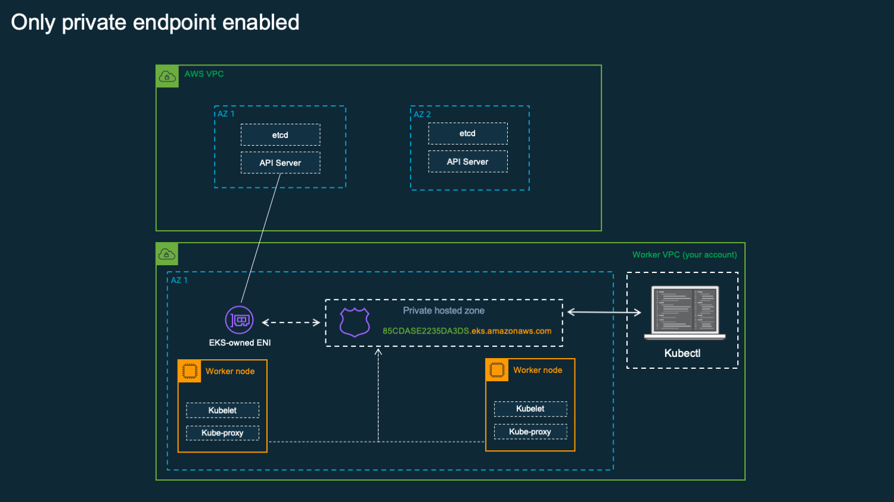

# AWS VPC Networking Modes for Amazon Elatic Kubernetes Service

This project reviews **different types of AWS VPC Networking modes used for AWS EKS Worker nodes** in Data Plane to communicate with AWS Managed Control Plane and external Client requests.

## EKS Cluster Architecture

When you create an EKS cluster, there are **two separate networks (VPCs)** involved:

1. **AWS-managed VPC** --> You don’t see this one in your account.

   * This is where AWS runs the **Kubernetes control plane** (the API server, etcd, scheduler, etc.).
   * You can’t access or modify this VPC directly.

2. **Your VPC** --> This is in *your* AWS account.

   * This is where your **worker nodes** (EC2 instances) live.
   * This VPC also hosts other AWS resources the cluster uses — for example:

     * Load balancers
     * NAT gateways
     * VPC endpoints

---

**Why worker nodes need to connect to the API server:**

* When a worker node starts, it must **register** with the Kubernetes control plane (so Kubernetes knows it exists).
* The API server also needs to **send instructions** to the node — for example:

  * “Run this pod”
  * “Delete this pod”
  * “Send me logs”

Without that connection, your nodes can’t join the cluster or receive workloads.

Worker nodes connect to the Kubernetes control plane either through the **public API endpoint** or via **EKS-managed elastic network interfaces (ENIs)** placed in the subnets you specified when creating the cluster.
The path they use depends on whether the cluster’s **private endpoint** is enabled or disabled.
Even if the private endpoint is disabled, EKS still creates these ENIs so the control plane can initiate actions toward the nodes — for example, when you run `kubectl exec` or `kubectl logs`.


## **How a worker node joins an EKS cluster**

1. **Node starts up**

   * An EC2 instance is launched.
   * During boot, two important components start:

      * Kubelet (the Kubernetes node agent) --> Runs on every node, talks to the Kubernetes API server, starts and stops pods as instructed, and reports the node’s status back to the control plane.


2. **Node registers with the control plane**

   * Kubelet connects to the **Kubernetes API server endpoint**:

     * If using the **public endpoint** --> Traffic leaves the VPC (direct internet or via NAT).
     * If using the **private endpoint** --> Traffic stays within your VPC.

3. **Ongoing communication**

   * Once registered, Kubelet:

     * Receives commands from the API server (e.g., “Run this pod”).
     * Sends **status updates** and **heartbeats** regularly.
   * When you run `kubectl get nodes`, you see the information Kubelet last reported.

4. **If connection fails**

   * Node can’t register with the control plane.
   * Node won’t get any workloads assigned.
   * New nodes that can’t connect are essentially useless in the cluster until connectivity is fixed.

💡 **Key point:** The worker node must reach the API server endpoint right from the start. If that fails, it never becomes an active part of the cluster.

## Networking Modes

In Amazon EKS, you can control **how clients and nodes connect to the Kubernetes API server** (the cluster endpoint).
You can choose:

* **Public endpoint** --> Accessible over the internet. *(Default setting)*
* **Private endpoint** --> Accessible only from inside your VPC.
* **Both** --> Lets you use private access inside your VPC, while still allowing internet access if needed.

If you enable the public endpoint, you can optionally set **IP address allowlists** (CIDR ranges) to restrict which external IPs can connect.

How your worker nodes talk to the control plane depends on the endpoint setting:

* **Private only** --> Nodes must connect through your VPC’s private network.
* **Public only** --> Nodes connect over the internet (directly or via a NAT gateway).
* **Both** --> Nodes inside the VPC use the private path, and you still have the option for public access.

You can change these endpoint settings anytime from the EKS console or API.

## Public Endpoint Only


This is the default setting for new Amazon EKS clusters.
If only the **public endpoint** is enabled, Kubernetes API requests from inside your cluster’s VPC — such as worker nodes communicating with the control plane — will exit your VPC but stay within Amazon’s network.

For the nodes to connect to the control plane in this setup, they must either:

* Have a **public IP address** and a route to an **internet gateway**, or
* Use a **NAT gateway** with a public IP and have a route to it.

## Public and Private Endpoints


When both public and private endpoints are enabled, any Kubernetes API requests coming from inside your VPC use the **EKS-managed ENIs** to reach the control plane. At the same time, the cluster’s API server remains accessible from the internet through the public endpoint.

## Private Endpoint Only



When only the private endpoint is enabled, all traffic to the cluster’s API server must originate from within your VPC or from a network directly connected to it. The API server is not accessible from the public internet.

Any `kubectl` commands must be run from within the VPC or a connected network. Common ways to achieve this include:

* [**AWS VPN**](https://docs.aws.amazon.com/vpn/index.html)
* [**AWS Direct Connect**](https://docs.aws.amazon.com/directconnect/latest/UserGuide/Welcome.html)
* **AWS PrivateLink** (to connect other VPCs to your cluster API)

If you want to limit access but don’t have VPN or Direct Connect, you can keep the public endpoint enabled and add **CIDR restrictions** to control which IP addresses can connect, without requiring additional networking setup.

For more details on these connectivity options, see [*Accessing a Private-Only API Server*](https://docs.aws.amazon.com/eks/latest/userguide/cluster-endpoint.html#private-access) in the AWS documentation.


## Subnets for Worker Nodes

Worker nodes in an Amazon EKS cluster do not need to be placed in the same subnets specified during cluster creation. They only need to run within the same **VPC** as the cluster, and can be deployed in different subnets. This setup can provide more available IP addresses and enable nodes to run across multiple Availability Zones.

All subnets used for worker nodes must have the correct tags. While EKS automatically tags the subnets provided at cluster creation, any additional subnets must be tagged manually. For details, refer to the EKS documentation on [**VPC configuration**](https://docs.aws.amazon.com/eks/latest/userguide/network_reqs.html).

*Note: Starting with EKS version 1.19, Amazon EKS no longer adds subnet tags automatically.*

## VPC Configurations

With the basics of connectivity covered, let’s look at common ways to set up networking for an Amazon EKS cluster.

In EKS, worker nodes typically run in either **public** or **private** subnets:

* A **public subnet** is one whose route table includes a route to an **internet gateway**.
* A **private subnet** has no route to an internet gateway.

**Traffic terminology:**

* **Ingress** --> Traffic coming **into** the nodes from outside.
* **Egress** --> Traffic going **out** from the nodes to other networks.

Nodes in public subnets (with public or Elastic IPs and an internet gateway) can receive ingress from outside the VPC. Private subnets usually rely on a **NAT gateway** for outbound internet access, enabling egress but not direct inbound connections.

**Common EKS VPC setups:**

1. **Only public subnets** --> Nodes and ingress resources (e.g., load balancers) are all placed in public subnets.
2. **Mixed public and private subnets** --> Nodes run in private subnets, while ingress resources are deployed in public subnets.
3. **Only private subnets** --> Nodes run entirely in private subnets, with no public ingress resources — suited for workloads that don’t require internet access from the outside.


## Public-Only Subnets


This is a simple VPC setup suited for basic web applications or workloads where allowing inbound traffic to nodes from the public internet is not a concern. In this configuration, both the worker nodes and ingress resources (such as load balancers) are deployed within public subnets.

**Best practices for this setup:**

* Configure each subnet with `mapPublicIpOnLaunch` set to **TRUE** and ensure it has a route to an **internet gateway**.
* You don’t need to explicitly set `AssociatePublicIpAddress` for nodes (omit this in your CloudFormation template or API call).
* The cluster endpoint can be configured to allow **public**, **private**, or **both** (public + private) access.

For more details, see the Amazon VPC documentation. You can launch a VPC with this configuration using the [public-only subnet CloudFormation template](https://amazon-eks.s3.us-west-2.amazonaws.com/cloudformation/2020-03-23/amazon-eks-vpc-sample.yaml).

## Public + Private Subnets


This VPC layout is widely considered the **best practice** for most Kubernetes workloads on AWS. In this setup, worker nodes run in **private subnets**, while ingress resources (such as load balancers) are deployed in **public subnets**. This design offers strong control over inbound traffic to nodes and is suitable for the majority of Kubernetes applications.

**Best practices for configuration:**

* Public subnets don’t require `mapPublicIpOnLaunch` to be set to **TRUE**, since no nodes are launched there.
* Set `mapPublicIpOnLaunch` to **FALSE** for private subnets.
* Don’t set `AssociatePublicIpAddress` for nodes (omit this from CloudFormation templates or API calls).
* The cluster endpoint can be configured as **public**, **private**, or **both**. Depending on this setting, node traffic will either route through a **NAT gateway** or via **EKS-managed ENIs**.

For more information, refer to the Amazon VPC documentation. You can deploy this setup using the [public + private subnet CloudFormation template](https://amazon-eks.s3.us-west-2.amazonaws.com/cloudformation/2020-03-23/amazon-eks-vpc-private-subnets.yaml).

*Note: This is also the default VPC configuration when using `eksctl`.*

## Private-Only Subnets

This VPC configuration is less common and is intended for workloads that do not require any inbound traffic from the public internet. In this setup, you must ensure you have a way to connect from your local machine to the private cluster endpoint.

**Configuration guidelines:**

* Set `mapPublicIpOnLaunch` to **FALSE** for all private subnets.
* Do not assign `AssociatePublicIpAddress` to nodes (omit this from CloudFormation templates or API calls).
* Enable only the **private** cluster endpoint (disable the public endpoint). To access it, use a **VPN connection** or **AWS Direct Connect**.
* Enable **AWS PrivateLink** for [EC2](https://docs.aws.amazon.com/vpc/latest/userguide/endpoint-service.html), [Amazon ECR](https://docs.aws.amazon.com/AmazonECR/latest/userguide/vpc-endpoints.html), and [S3 repositories](https://docs.aws.amazon.com/vpc/latest/userguide/vpc-endpoints-s3.html). See [*Deploy private clusters*](https://docs.aws.amazon.com/eks/latest/userguide/private-clusters.html) in the Amazon EKS User Guide for details.
* Configure **PrivateLink interface and/or gateway endpoints** for your Kubernetes workloads to reach other AWS services.
* All container images must come from ECR repositories with endpoints configured for your VPC — including images for operational tools like **Cluster Autoscaler** and **Metrics Server**.

## Deploy CFN Templates

You can deploy a CloudFormation template directly from your local machine using the `aws cloudformation deploy` command in the AWS CLI. This command simplifies the process by creating and executing a change set, which allows you to review the proposed changes before they are applied. If the stack already exists, this command will update it; otherwise, it will create a new one.

The most straightforward way to deploy a template is with the following command:

```bash
aws cloudformation deploy --template-file <path_to_your_template> --stack-name <your_stack_name>
```

  * `--template-file`: This flag specifies the local path to your CloudFormation template file (e.g., `template.yaml`).
  * `--stack-name`: This provides a name for your CloudFormation stack. Choose a descriptive name that is unique within your AWS region.

**Example:**

```bash
aws cloudformation deploy --template-file my-vpc.yaml --stack-name production-vpc
```

This command will package your template, upload it to an S3 bucket, create a change set, and then execute it to create or update your stack.

If you need to destroy deployed stack:
```bash
aws cloudformation delete-stack --stack-name <your_stack_name>
```

## References
- [AWS Blog: De-mystifying cluster networking for Amazon EKS worker nodes](https://aws.amazon.com/blogs/containers/de-mystifying-cluster-networking-for-amazon-eks-worker-nodes/)