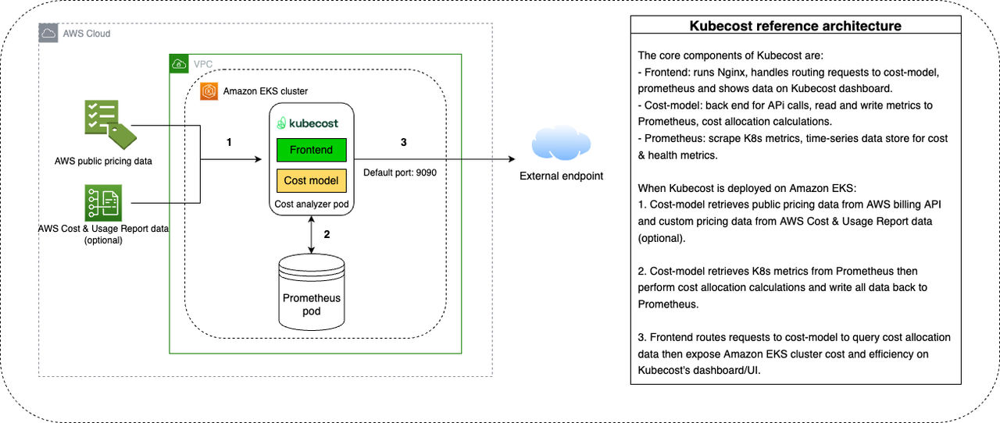
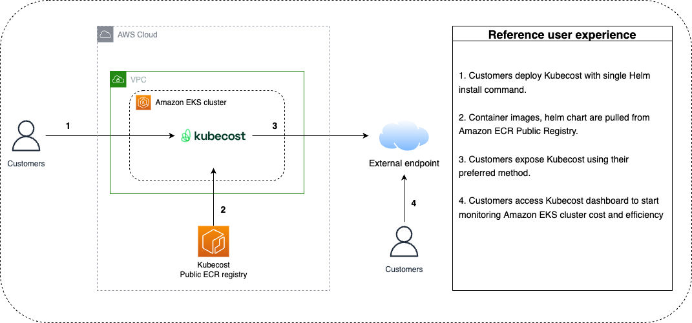
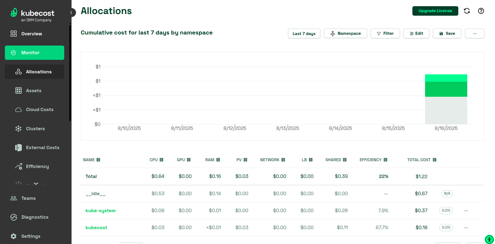
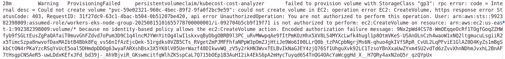

# Install and Configure Kubecost on Amazon EKS

This project gives an overview of the `kubecost` commercial tool that is used for fine-grained track of cost usage in multi-tenant and dynamic Kubernetes environments (e.g. AWS EKS).

## **What Is Kubecost?**

[Kubecost](http://www.kubecost.com/) is a Kubernetes-native cost monitoring and optimization platform designed to give engineering, DevOps, and FinOps teams clear visibility into where their Kubernetes spending goes. It measures resource usage, maps that usage to actual costs, and identifies opportunities to save money - without sacrificing performance.

While the **commercial version** of Kubecost offers advanced features and enterprise-level support, its core is built on [**OpenCost**](https://www.opencost.io/), a fully open-source CNCF project that provides cost allocation at the Kubernetes workload level.

At the same time, AWS Customers has an option to track their Kubernetes control plane and EC2 costs by using [AWS Cost and Usage Reports](https://docs.aws.amazon.com/cur/latest/userguide/what-is-cur.html) service. However, this service does not provide deeper insights to accurately track Kubernetes resource level costs by namespace, cluster, pod, or organizational concepts (e.g., by team or application). This is the exact challenge that Kubecost is dedicated to tackling.

## **How Kubecost Works**

In general, Kubecost delivers Amazon EKS cost monitoring through [Prometheus](https://prometheus.io/) - an open-source monitoring system and time-series database. In this architecture, Prometheus ingests resource usage metrics from the Kubernetes cluster. Kubecost retrieves these metrics from Prometheus, performs cost allocation computations, and writes the resulting cost metrics back to Prometheus. The Kubecost frontend then queries Prometheus for both usage and cost metrics, presenting the data through the Kubecost user interface (UI). The following diagram illustrates this architecture:



Kubecost operates by integrating directly with your Kubernetes cluster and cloud billing APIs:

1. **Data Collection**
   Kubecost collects resource consumption data (CPU, memory, storage, network) from Kubernetes metrics, often via Prometheus.
   It also connects to cloud billing systems like AWS Cost Explorer, Google Cloud Billing, or Azure Cost Management to retrieve accurate price data.

2. **Cost Allocation**
   Every pod, deployment, service, and namespace gets a cost breakdown.
   Kubecost uses Kubernetes labels and annotations to attribute shared resources - such as load balancers or persistent storage - to the correct cost center.

3. **Reporting and Visualization**
   Teams can view real-time and historical cost dashboards, filterable by namespace, deployment, or even individual workloads.
   This enables both **showback** (informing teams of their spending) and **chargeback** (billing teams for their usage).

4. **Optimization Insights**
   Kubecost provides actionable recommendations: right-sizing workloads, identifying unused resources, or switching to more cost-efficient instance types, including spot or preemptible VMs.

For more information about metrics, see [Kubecost Metrics](https://www.ibm.com/docs/en/kubecost/self-hosted/2.x?topic=kubecost-metrics)

## **Visualizing Kubecost Metrics**

The pre-installed Prometheus instance can be queried to integrate Kubecost data into existing business intelligence (BI) tools for advanced analysis. You can also configure Prometheus as a data source for existing Grafana dashboards to display Amazon EKS cost metrics in a familiar format. For details on writing Prometheus queries, see the [Kubecost documentation](https://opencost.io/docs/installation/prometheus/).

## **Different Versions and Tiers**

* [**OpenCost**](https://opencost.io/): 100% open-source cost allocation engine (Apache 2.0 license), maintained under the CNCF.
* **Kubecost Free Tier**: Commercial UI and dashboards with core features, limited to around 250 cores and \~15 days of metrics retention.
* **Kubecost Enterprise**: Full suite with multi-cluster management, SSO, extended history, governance reporting, and advanced optimization tools.

For more information, see [Kubecost](https://docs.aws.amazon.com/eks/latest/userguide/cost-monitoring-kubecost-bundles.html)

## **Why Kubecost Matters**

In a traditional infrastructure model, resource costs are often tied directly to a single machine or service. In Kubernetes, however, hundreds of workloads may share the same node pool, and scaling happens automatically. Without proper tooling, it’s nearly impossible to know which workloads or teams are driving the bulk of spending.

Kubecost bridges this gap by:

* **Empowering FinOps teams** with accurate, real-time spending data.
* **Enabling engineering accountability** through cost transparency.
* **Driving optimization** that reduces waste and improves resource efficiency.

## **The IBM Connection**

In September 2024, **IBM**, through its FinOps-focused subsidiary [**Apptio**](https://www.apptio.com/), acquired Kubecost.
While this move integrates Kubecost into IBM’s broader financial management product line, the **OpenCost** project remains a vendor-neutral, CNCF-hosted open-source initiative.

For teams that want **pure open source**, OpenCost delivers the fundamentals. For those needing **enterprise features**, Kubecost provides a polished, scalable platform for cost management in Kubernetes.

## **AWS Cost and Usage Report (AWS CUR) integration**

To calculate cost allocations for your Amazon EKS cluster, Kubecost retrieves public AWS service and resource pricing from the [AWS Price List API](https://docs.aws.amazon.com/awsaccountbilling/latest/aboutv2/price-changes.html). For greater pricing accuracy tailored to your AWS account - such as Enterprise Discount Programs, Reserved Instance usage, Savings Plans, and Spot usage — you can integrate Kubecost with the AWS Cost and Usage Report (CUR). For details on how the AWS CUR integration works, see [AWS Cloud Integration](https://guide.kubecost.com/hc/en-us/articles/4407595928087-AWS-Cloud-Integration#aws-cloud-integration).

## Deploy EKS Cluster

To deploy cluster:
```bash
terraform apply
```

To get access:
```bash
aws eks update-kubeconfig --region us-east-1 --name eks-cluster
```

## Deploy Kubecost on Amazon EKS



**Prerequisites:**  
- [Helm 3.9+](https://helm.sh/docs/intro/install/)
- If your cluster is running Kubernetes version 1.23 or later, you must have the [Amazon EBS CSI driver](https://docs.aws.amazon.com/eks/latest/userguide/ebs-csi.html) installed on your cluster.
- If your cluster is version 1.30 or later, there is by default no longer a default StorageClass assigned. See the [EKS 1.30 release notes](https://www.ibm.com/links?url=https%3A%2F%2Fdocs.aws.amazon.com%2Feks%2Flatest%2Fuserguide%2Fkubernetes-versions-standard.html%23kubernetes-1.30) for one of several alternatives.

Before deploying `kubecost`, you have to configure the StorageClass (because our cluster version later than 1.30). In our setup we're going to use `gp3`volumes. These volumes are the latest generation of General Purpose SSD volumes, introduced in December 2020 by AWS.

To create StorageClass object:
```bash
kubectl apply -f gp3-default-sc.yaml
```

Install Kubecost on your existing Amazon EKS cluster:
```bash
helm upgrade -i kubecost \
  oci://public.ecr.aws/kubecost/cost-analyzer \
  --version 2.8.2 \
  --namespace kubecost \
  --create-namespace \
  -f https://raw.githubusercontent.com/kubecost/kubecost/refs/heads/develop/kubecost/values-eks-cost-monitoring.yaml \
  --set prometheus.server.persistentVolume.enabled=true \
  --set prometheus.server.persistentVolume.storageClass=gp3 \
  --set cost-analyzer.persistence.enabled=true \
  --set cost-analyzer.persistence.storageClass=gp3
```

On successful installation, you should see the following message:
```bash
Kubecost 2.8.2 has been successfully installed.

Kubecost 2.x is a major upgrade from previous versions and includes major new features including a brand new API Backend. Please review the following documentation to ensure a smooth transition: https://www.ibm.com/docs/en/kubecost/self-hosted/2.x?topic=installation-kubecost-v2-installupgrade

When pods are Ready, you can enable port-forwarding with the following command:

    kubectl port-forward --namespace kubecost deployment/kubecost-cost-analyzer 9090

Then, navigate to http://localhost:9090 in a web browser.

Please allow 25 minutes for Kubecost to gather metrics. A progress indicator will appear at the top of the UI.

Having installation issues? View our Troubleshooting Guide at https://www.ibm.com/docs/en/kubecost/self-hosted/2.x?topic=troubleshoot-install
```

To track all deployment events:
```bash
kubectl get events -n kubecost --sort-by='.lastTimestamp'  
```

For more information, see [https://gallery.ecr.aws/kubecost/cost-analyzer](https://gallery.ecr.aws/kubecost/cost-analyzer)

By default, the installation includes certain prerequisite software including [Prometheus](https://github.com/prometheus/prometheus) and [kube-state-metrics](https://github.com/kubernetes/kube-state-metrics). To customize your deployment (e.g., skipping these prerequisites if you already have them running in your cluster), you can find a list of available configuration options in the [Helm configuration file](https://github.com/kubecost/kubecost/blob/develop/kubecost/values.yaml).

If you need to uninstall Kubecost:
```bash
helm uninstall kubecost --namespace kubecost 
```

## Generate Kubecost Dashboard Endpoint

You can run the following command to enable port-forwarding to expose the Kubecost dashboard:
```bash
kubectl port-forward --namespace kubecost deployment/kubecost-cost-analyzer 9090
```

On your web browser, navigate to [http://localhost:9090](http://localhost:9090) to access the dashboard.



## Alternative Ways to Expose Kubecost Dashboard

There are several options to expose Kubecost for on-going internal access:
- Check out the Kubecost documentation for [Ingress Examples](https://www.ibm.com/docs/en/kubecost/self-hosted/2.x?topic=installation-ingress-examples) as a reference for using Nginx ingress controller with basic auth.
- Consider using the [AWS Load Balancer Controller](https://docs.aws.amazon.com/eks/latest/userguide/aws-load-balancer-controller.html) to expose Kubecost and use [Amazon Cognito](https://aws.amazon.com/cognito/) for authentication, authorization, and user management. 

For more information, see [How to use Application Load Balancer and Amazon Cognito to authenticate users for your Kubernetes web apps](https://aws.amazon.com/blogs/containers/how-to-use-application-load-balancer-and-amazon-cognito-to-authenticate-users-for-your-kubernetes-web-apps/).

## Troubleshooting

To view all events from `kubecost` namespace:
```bash
kubectl get events -n kubecost --sort-by='.lastTimestamp'
```

### ProvisionFailed: You are not authorized to perform this operation

If you have error related to unsufficient permissions for provisioning required PV by kubecost:



you need to create an IAM role with required EBS CSI permissions. For more information, see [Use Kubernetes volume storage with Amazon EBS](https://docs.aws.amazon.com/eks/latest/userguide/ebs-csi.html)

Your clusters need a default storage class for the Kubecost and Prometheus persistent volumes to be successfully attached. To check if a storage class exists, run:
```bash
kubectl get storageclass
```

For more information, see [No persistent volumes available for this claim and/or no storage class is set](https://www.ibm.com/docs/en/kubecost/self-hosted/2.x?topic=troubleshoot-install#ariaid-title10).

## References
- [AWS EKS: Install Kubecost](https://docs.aws.amazon.com/eks/latest/userguide/cost-monitoring-kubecost.html)
- [Kubecost Docs: Deploying Kubecost on an Amazon EKS cluster using Helm](https://www.ibm.com/docs/en/kubecost/self-hosted/2.x?topic=installations-amazon-eks-integration#ariaid-title8)