# Building Web Applications based on Amazon EKS

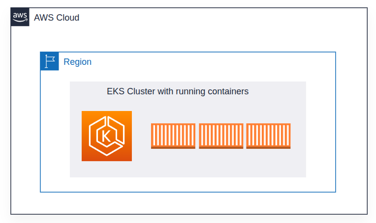

This workshop shows how to:
- Create container image using Docker
- Upload container images to Amazon ECR
- Deploy Amazon EKS clusters and services
- Explore [CloudWatch Container Insights](https://docs.aws.amazon.com/AmazonCloudWatch/latest/monitoring/ContainerInsights.html)
- Auto-Scaling Pod and Cluster

> ⚠️ **IMPORTANT:**  
> The original credits goes to the authors of the workshop at  
> https://catalog.us-east-1.prod.workshops.aws/workshops/9c0aa9ab-90a9-44a6-abe1-8dff360ae428/en-US

Before starting the workshop, clarify the fundamental concepts below:
- [About Kubernetes (k8s)](https://catalog.us-east-1.prod.workshops.aws/workshops/9c0aa9ab-90a9-44a6-abe1-8dff360ae428/en-US/10-about-eks/100-k8s)
- [Amazon EKS](https://catalog.us-east-1.prod.workshops.aws/workshops/9c0aa9ab-90a9-44a6-abe1-8dff360ae428/en-US/10-about-eks/200-eks)

## Kubernetes Overview

[Kubernetes](https://kubernetes.io/docs/concepts/overview/) is a portable, scalable open source platform for managing containerized workloads and services. Kubernetes is a container orchestration tool that facilitates both declarative configuration and automation.

### Kubernetes Cluster

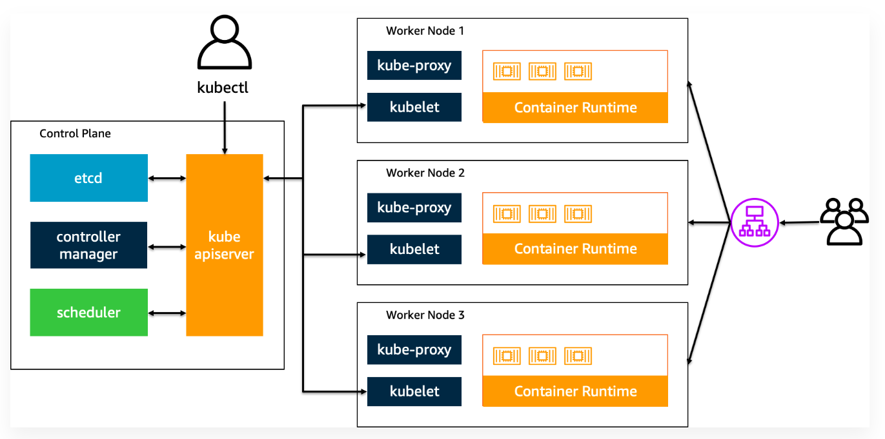

Deploying Kubernetes results in **cluster**. And this cluster is a **collection of nodes**. Nodes are largely divided into two types: **control plane** and **data plane**.
- The control plane manages and controls the worker node and the pods in the cluster.
- Data Plane is configured with **Worker nodes** and hosts **Pods**, a component of containerized applications.

Additionally, there are components for **Addon** that are not required, but are also available.

### Kubernetes Addons

In the context of Kubernetes, an **Addon** is an **optional component** that extends the functionality of the cluster. Addons are **not part of the core Kubernetes control plane**, but they enhance observability, networking, storage, security, or other features.

### Common Examples of Addons:

| Addon                    | Purpose                                                      |
| ------------------------ | ------------------------------------------------------------ |
| **CoreDNS**              | Handles internal DNS for service discovery                   |
| **kube-proxy**           | Manages networking rules for services on each node           |
| **Metrics Server**       | Collects resource usage metrics (CPU/memory)                 |
| **Ingress Controller**   | Manages external access to services (e.g., HTTP)             |
| **Dashboard**            | Web-based UI to manage and monitor the cluster               |
| **Prometheus & Grafana** | Monitoring and visualization tools                           |
| **EFK/ELK Stack**        | Centralized logging using Elasticsearch, Fluentd, and Kibana |

For more information, see [AWS EKS add-ons](https://docs.aws.amazon.com/eks/latest/userguide/workloads-add-ons-available-eks.html).

### Why Addons Matter:

* They are **optional** but **commonly used** in production environments.
* They are typically **deployed as pods** in the same cluster.
* You can install them using **YAML manifests**, **Helm charts**, or **managed options** from cloud providers.

So, while the **control plane** and **data plane** are essential for Kubernetes to function, **addons** improve usability, automation, and observability — making your cluster more powerful and user-friendly.

### Kubernetes Objects

The object in Kubernetes is a **record containing the desired state**. When you create an object, it is constantly managed to match the desired state with **current state** in the control plane of the Kubernetes.

Kubernetes' objects include pods, services, deployment and etc.

## Amazon EKS

[Amazon Elastic Kubernetes Service(Amazon EKS)](https://docs.aws.amazon.com/eks/latest/userguide/what-is-eks.html)  is a managed service that you can use to run Kubernetes on AWS without needing to install, operate, and maintain your own Kubernetes control plane or nodes.

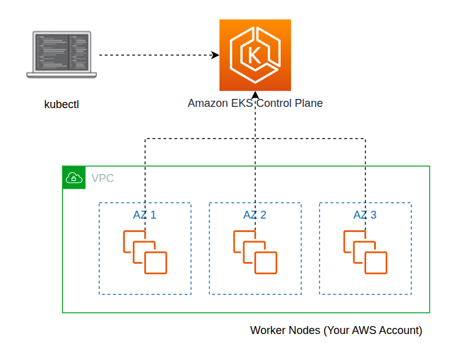

Amazon EKS ensures high availability by running Kubernetes control plane instances across multiple availability zones. It also automatically detects and replaces abnormal control plane instances, and provides automated version upgrades and patches.

Amazon EKS works with a variety of AWS services to provide scalability and security for applications.
- [Amazon ECR (Elastic Container Registry)](https://docs.aws.amazon.com/AmazonECR/latest/userguide/what-is-ecr.html) for container image repository
- [AWS Elastic Load Balancing (ELB)](https://aws.amazon.com/elasticloadbalancing/) for load balancing
- [AWS IAM](https://docs.aws.amazon.com/IAM/latest/UserGuide/introduction.html) for authentication
- Isolated [Amazon VPC](https://docs.aws.amazon.com/vpc/latest/userguide/what-is-amazon-vpc.html)

## Prerequisites

### Install Kubectl

Install the latest binary of `kubectl`:
```bash
sudo curl -o /usr/local/bin/kubectl  \
   https://s3.us-west-2.amazonaws.com/amazon-eks/1.33.0/2025-05-01/bin/linux/amd64/kubectl

sudo chmod +x /usr/local/bin/kubectl
```

Verify the installation:
```bash
kubectl version --client=true
```

For more information, see [Set up kubectl and eksctl](https://docs.aws.amazon.com/eks/latest/userguide/install-kubectl.html).

### Install eksctl

There are various ways to deploy an Amazon EKS cluster. AWS console, CloudFormation, CDK, `eksctl`, and Terraform are examples.

In this workshop, we will deploy the cluster using `eksctl`.

[`eksctl`](https://eksctl.io/) is a CLI tool for easily creating and managing EKS clusters. It is written in Go language and deployed in CloudFormation form.

Download the latest eksctl binary using the command below:
```bash
curl --silent --location "https://github.com/weaveworks/eksctl/releases/latest/download/eksctl_$(uname -s)_amd64.tar.gz" | tar xz -C /tmp
```

Move the binary to the location `/usr/local/bin`:
```bash
sudo mv -v /tmp/eksctl /usr/local/bin
```

Use the command below to check the installation:
```bash
eksctl version
```

## Container Image

[Docker](https://aws.amazon.com/docker/?nc1=h_ls) is a software **platform** that allows you to build, test and deploy **containerized applications**. Docker packages software into standardized units called containers, which contain everything you need to run the software, including libraries, system tools, code, runtime, and so on.

To learn more about Docker, click [here](https://www.docker.com/resources/what-container).

**Container image** is a combination of the files and settings required to run the container. These images can be uploaded and downloaded in the repository. And the state in which the image was executed is **container**. Container images can be downloaded and used by official image repositories such as [Amazon ECR Public Gallery](https://gallery.ecr.aws/), [Docker Hub](https://hub.docker.com/)  or created directly.

## Build Container Image

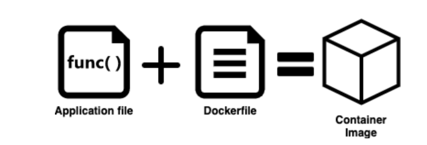

**Dockerfile** is a **setup file for building container images**. That is, think of it as a blueprint for the image to be built. When these images become containers, the application is actually running.

1. Create Dockerfile:
```bash
cat << EOF > Dockerfile
FROM nginx:latest
RUN  echo '<h1> test nginx web page </h1>'  >> index.html
RUN cp /index.html /usr/share/nginx/html
EOF
```

Instruction component in the Docker File is as follows:

| Instruction | Description                                                                 |
|-------------|-----------------------------------------------------------------------------|
| FROM        | Set the Base Image (Specify OS or version)                                  |
| RUN         | Execute any commands in a new layer on top of the current image and commit the results |
| WORKDIR     | Where to perform instructions such as RUN, CMD, ENTRYPOINT, COPY, ADD in the Dockerfile |
| EXPOSE      | Specify the port number to connect to the host                              |
| CMD         | Commands for running application                                            |

2. Create an image with the docker build command. In name, enter the name of the container image and in case of tag, if not named, you will have a value called **latest**:
```bash
docker build -t test-image . 
```
3. Check the images created with the `docker images` command:
```bash
docker images
```
4. Run the image as a container with the `docker run` command. The command below uses a container image named test-image to run a container named test-nginx, which means that 8080 ports of the host and 80 ports of the container are mapped:
```bash
docker run -p 8080:80 --name test-nginx test-image
```
In other words, information passed to 8080 ports on the host is forwarded through the docker to 80 ports on the container.

5. You can use the `docker ps` command to check which containers are running on the current host. Open a new terminal and type the command below:
```bash
docker ps
```
6. You can check the status by outputting logs from the container with the `docker logs` command:
```bash
docker logs -f test-nginx
```
7. You can access into the inside shell environment of the container with `docker exec` command. After access, you can apprehend the internal structure and exit through the exit command:
```bash
docker exec -it test-nginx /bin/bash
```
8. Stop running containers with `docker stop` command:
```bash
docker stop test-nginx
```
9. Delete the container with the `docker rm` command. The container deletion is possible only when the container is stopped:
```bash
docker rm test-nginx
```
10. Delete the container image with `docker rmi` command:
```bash
docker rmi test-image
```

## Create Amazon ECR Repository and Upload Image

[Amazon ECR](https://docs.aws.amazon.com/AmazonECR/latest/userguide/what-is-ecr.html) is a fully managed container image registry by AWS. It lets you securely store, share, and manage Docker and OCI images. You can use the AWS CLI or Docker CLI to push and pull images. With IAM permissions, you control who can access your private repositories.

Set env variables beforehand:
```bash
export AWS_REGION="us-east-1"
export ACCOUNT_ID="<your_aws_account_id>"
```

1. Download the source code to be containerized through the command below:
```bash
git clone https://github.com/joozero/amazon-eks-flask.git
```
2. Through the AWS CLI, create an image repository. In this lab, we will set the repository name to `demo-flask-backend`:
```bash
aws ecr create-repository \
--repository-name demo-flask-backend \
--image-scanning-configuration scanOnPush=true \
--region us-east-1
```
3. To push the container image to the repository, bring the authentication token and pass the authentication to the `docker login` command. At this point, specify the user name as `AWS` and specify the Amazon ECR registry URI that you want to authenticate with.
```bash
aws ecr get-login-password --region ${AWS_REGION} | docker login --username AWS --password-stdin $ACCOUNT_ID.dkr.ecr.$AWS_REGION.amazonaws.com
```
4. Input the downloaded source code location(for example, /home/ec2-user/environment/amazon-eks-flask) and enter the command below to build the docker image:
```bash
cd amazon-eks-flask
```
```bash
docker build -t demo-flask-backend .
```
5. When the image is built, use the `docker tag` command to enable it to be pushed to a specific repository:
```bash
docker tag demo-flask-backend:latest $ACCOUNT_ID.dkr.ecr.$AWS_REGION.amazonaws.com/demo-flask-backend:latest
```
6. Push the image into the repository via the `docker push` command:
```bash
docker push $ACCOUNT_ID.dkr.ecr.$AWS_REGION.amazonaws.com/demo-flask-backend:latest
```
7. In the Amazon ECR Console, click on the repository you just created to see the uploaded image as shown in the screen below:

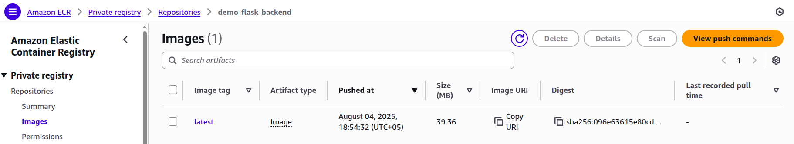

We have created container images to deploy on EKS clusters and pushed it into the repository.

## Create EKS Cluster

Amazon EKS clusters can be deployed in various ways:
- Deploy by clicking on [AWS console](https://console.aws.amazon.com/eks/home#/)
- Deploy by using IaC (Infrastructure as Code) tool such as [AWS CloudFormation](https://docs.aws.amazon.com/AWSCloudFormation/latest/UserGuide/Welcome.html) or [AWS CDK](https://docs.aws.amazon.com/cdk/api/latest/)
- Deploy by using [eksctl](https://eksctl.io/)  
- Deploy by Terraform, Pulumi, Rancher, etc.

In this workshop, we will create an EKS cluster using `eksctl`.

### Create EKS Cluster with eksctl

If you use eksctl to execute this command (`eksctl create cluster`) without giving any setting values, the cluster is deployed as a default parameter.

However, we will create configuration files to customize some values and deploy it.

1. Paste the values below in the root folder location:
```bash
cat << EOF > eks-demo-cluster.yaml
---
apiVersion: eksctl.io/v1alpha5
kind: ClusterConfig

metadata:
  name: eks-demo
  region: ${AWS_REGION}
  version: "1.31"

vpc:
  cidr: "10.0.0.0/16"
  nat:
    gateway: Single

managedNodeGroups:
  - name: node-group
    instanceType: t3.medium
    desiredCapacity: 3
    volumeSize: 20
    privateNetworking: true
    iam:
      withAddonPolicies:
        imageBuilder: true
        cloudWatch: true
        autoScaler: true
        ebs: true

cloudWatch:
  clusterLogging:
    enableTypes: ["*"]
EOF
```

If you look at the cluster configuration file, you can define policies through `iam.attachPolicyARNs` and through `iam.withAddonPolicies`, you can also define add-on policies. After the EKS cluster is deployed, you can check the IAM Role of the worker node instance in EC2 console to see added policies.

2. Using the commands below, deploy the cluster:
```bash
eksctl create cluster -f eks-demo-cluster.yaml
```

The cluster takes approximately 15 to 20 minutes to fully be deployed. You can see the progress of your cluster deployment in the terminal and also can see the status of events and resources in AWS CloudFormation console.

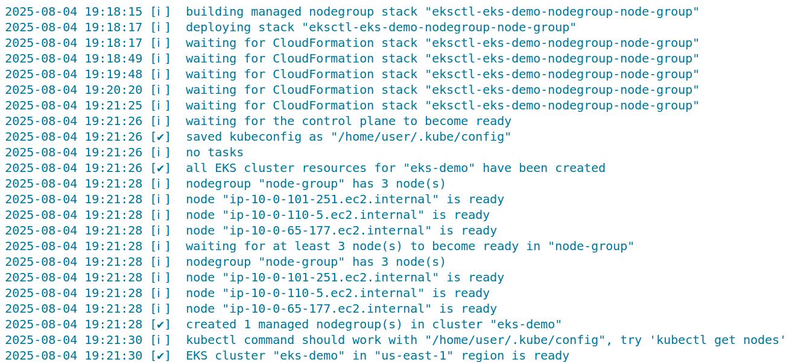

Also, you can see the cluster credentials added in `~/.kube/config`.

> ⚠️ **IMPORTANT:**  
> By default `eksctl` will deploy EKS cluster with `publicAccess=true, privateAccess=false` settings for Kubernetes API endpoint access

3. When the deployment is completed, use command below to check that the node is properly deployed:
```bash
kubectl get nodes
```

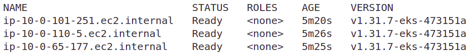

After creating a Kubernetes cluster with eksctl, the architecture of the services configured as of now is shown below:

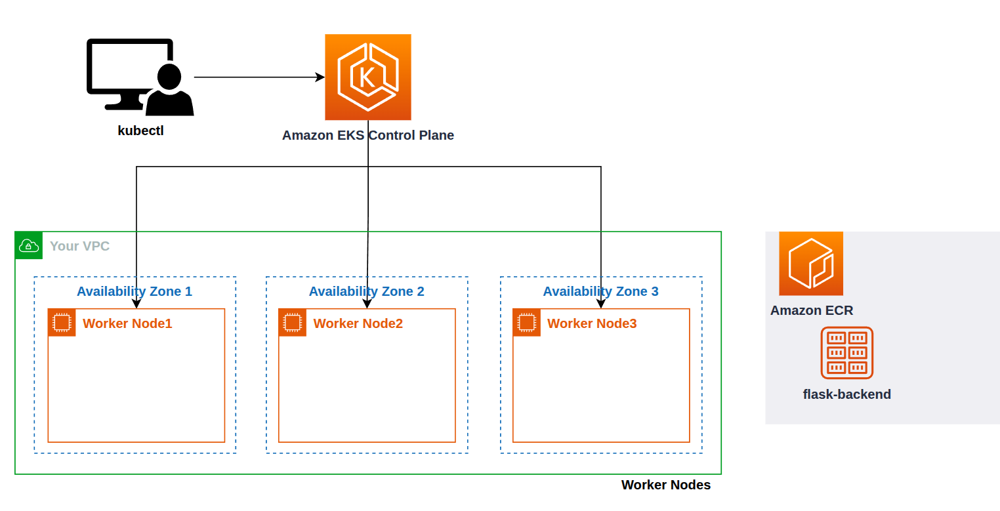

## Amazon EKS Access Entry

When accessing the EKS console, the currently signed-in IAM user does not have permissions to access Kubernetes objects by default. Therefore, an EKS IAM access entry must be created to explicitly grant the necessary access. [EKS access entries](https://docs.aws.amazon.com/eks/latest/userguide/access-entries.html) is the best way to grant users access to the Kubernetes API. For example, you can use access entries to grant developers access to use kubectl.

To be able to access and administer the cluster you have to use the AmazonEKSClusterAdminPolicy. This policy can be found in **EKS Access Entry** option attached to the IAM principal:

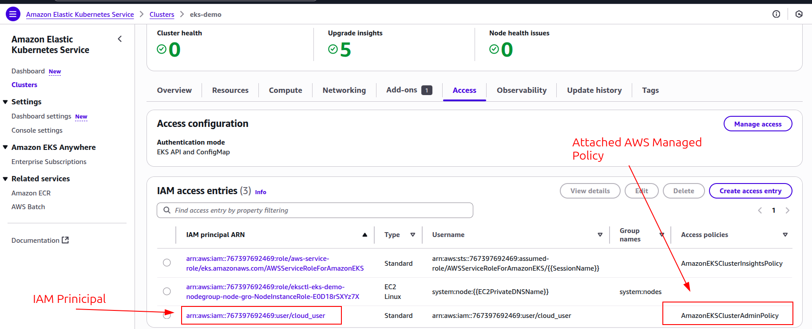

## Create Ingress Controller

This workshop uses [AWS Load Balancer Controller](https://kubernetes-sigs.github.io/aws-load-balancer-controller/latest/) for Ingress Controller.

> ⚠️ **NOTE:**  
> The **AWS ALB Ingress Controller** has been rebranded to **AWS Load Balancer Controller**. 

**Ingress** is a rule and resource object that defines how to handle requests, primarily when accessing from outside the cluster to inside the Kubernetes cluster. In short, it serve as a gateway for external requests to access inside of the cluster. You can set up it for load balancing for external requests, processing TLS/SSL certificates, routing to HTTP routes, and so on. Ingress processes requests from the L7.

In Kubernetes, you can also externally expose to NodePort or LoadBalancer type in Service object, but if you use a Serivce object without any Ingress, you must consider detailed options such as routing rules and TLS/SSL to all services. That's why Ingress is needed in Kubernetes environment.

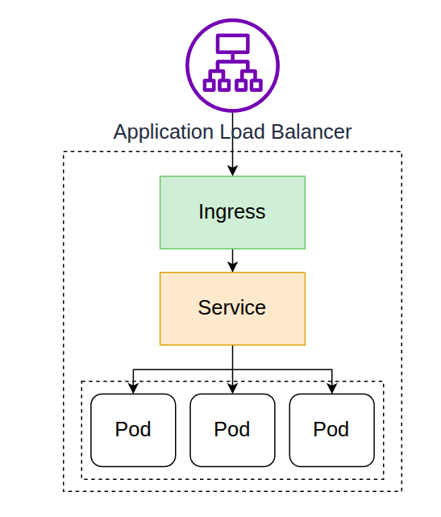

Ingress means the object that you have set up rules for handling external requests, and **Ingress Controller** is needed for these settings to work. Unlike other controllers that run as part of the kube-controller-manager, the ingress controller is not created with the cluster by nature. Therefore, you need to install it yourself.

## Create AWS Load Balancer Controller

The [AWS Load Balancer Controller](https://docs.aws.amazon.com/eks/latest/userguide/aws-load-balancer-controller.html)  manages AWS Elastic Load Balancers for a Kubernetes cluster. The controller provisions the following resources:
- It satisfies Kubernetes Ingress resources by provisioning **Application Load Balancers**.
- It satisfies Kubernetes Service resources by provisioning **Network Load Balancers**.

The controller was formerly named the AWS ALB Ingress Controller. There are two **traffic modes** supported by each type of AWS Load Balancer controller:
- **Instance(default)**: Register nodes in the cluster as targets for ALB. Traffic reaching the ALB is routed to NodePort and then proxied to the Pod.
- **IP**: Register the Pod as an ALB target. Traffic reaching the ALB is routed directly to the Pod. In order to use that traffic mode, you must explicitly specify it in the ingress.yaml file with comments.

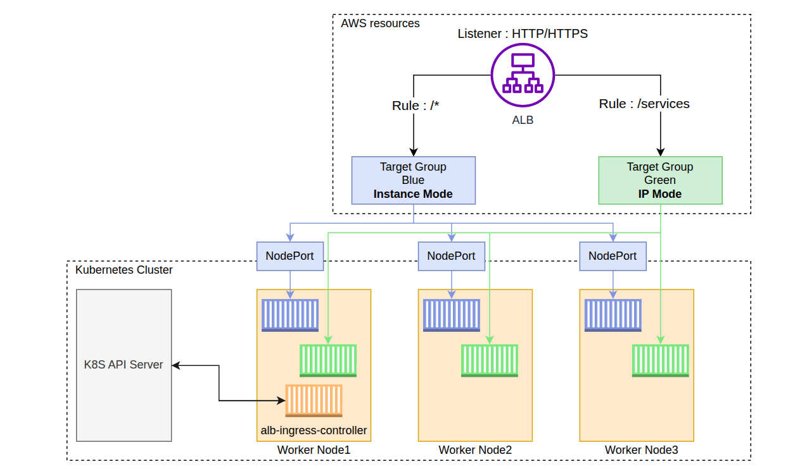

Create a folder named `manifests` in the root folder (for example, `/home/ec2-user/environment/`) to manage manifests. Then, inside the manifests folder, create a folder `alb-controller` to manage the manifest associated with the ALB Ingress Controller.
```bash
mkdir -p manifests/alb-ingress-controller && cd manifests/alb-ingress-controller
```

* Before deploying the **AWS Load Balancer Controller**, some setup is required.
* The controller runs on **Kubernetes worker nodes** and needs permissions to manage **AWS ALB/NLB resources**.
* To grant these permissions, you have two options:

  * **Use IAM Roles for Service Accounts (IRSA):** Create an IAM role with the necessary policies and associate it with a Kubernetes service account.
  * **Attach IAM policies directly to the worker node’s IAM role:** This grants the nodes (and everything running on them) the required access.
* Ensure the selected approach gives the controller the ability to interact with AWS Load Balancer resources.

In this workshop, we will use the IRSA approach.

1. First, create **IAM OpenID Connect (OIDC) identity provider** for the cluster. **IAM OIDC** provider must exist in the cluster (`eks-demo`) in order for objects created by Kubernetes to use [service account](https://kubernetes.io/docs/reference/access-authn-authz/service-accounts-admin/) which purpose is to authenticate to API Server or external services.
```bash
eksctl utils associate-iam-oidc-provider \
    --region ${AWS_REGION} \
    --cluster eks-demo \
    --approve
```
- The IAM OIDC identity provider you create can be found in Identity providers menu on IAM console or in the commands below.
- Check the OIDC provider URL of the cluster through the commands below.

```bash
aws eks describe-cluster --name eks-demo --query "cluster.identity.oidc.issuer" --output text
```
2. Create an IAM Policy to attach to the AWS Load Balancer Controller:
```bash
curl -O https://raw.githubusercontent.com/kubernetes-sigs/aws-load-balancer-controller/v2.13.3/docs/install/iam_policy.json
```

```bash
aws iam create-policy \
    --policy-name AWSLoadBalancerControllerIAMPolicy \
    --policy-document file://iam_policy.json
```

3. Create ServiceAccount for AWS Load Balancer Controller:
```bash
eksctl create iamserviceaccount \
    --cluster eks-demo \
    --namespace kube-system \
    --name aws-load-balancer-controller \
    --attach-policy-arn arn:aws:iam::$ACCOUNT_ID:policy/AWSLoadBalancerControllerIAMPolicy \
    --override-existing-serviceaccounts \
    --region ${AWS_REGION} \
    --approve
```

When deploying an EKS cluster, you can also add the IAM policy associated with the AWS Load Balancer Controller to the Worker nodes in the form of Addon. However, in this workshop we're using [IRSA](https://aws.amazon.com/blogs/opensource/introducing-fine-grained-iam-roles-service-accounts/) approach. For more information, see [IRSA](https://repost.aws/knowledge-center/eks-restrict-s3-bucket) and [AWS Load Balancer Controller installation](https://kubernetes-sigs.github.io/aws-load-balancer-controller/latest/deploy/installation/)

### Add Controller to the Cluster

1. Add AWS Load Balancer controller to the cluster. First, install [cert-manager](https://github.com/jetstack/cert-manager) to insert the certificate configuration into the Webhook. **Cert-manager** is an open source that automatically provisions and manages TLS certificates within a Kubernetes cluster.

- The **controller registers webhooks** with the Kubernetes API server to **validate and/or mutate Kubernetes objects** like `Ingress`.
- These webhooks **require TLS encryption** for secure communication.
- That’s why **cert-manager** is installed first - it **automatically generates and manages the TLS certificates** required by the webhook.

```bash
kubectl apply --validate=false -f https://github.com/cert-manager/cert-manager/releases/download/v1.12.3/cert-manager.yaml
```

2. Download the AWS Load Balancer Controller's configuration file:
```bash
curl -Lo v2_13_3_full.yaml https://github.com/kubernetes-sigs/aws-load-balancer-controller/releases/download/v2.13.3/v2_13_3_full.yaml
```
3. Run the following command to remove the **ServiceAccount** section in the manifest. If you don't remove this section, the required annotation that you made to the service account in a previous step is overwritten.
```bash
sed -i.bak -e '730,738d' ./v2_13_3_full.yaml
```

4. Replace cluster name in the Deployment spec section of the file with the name of your cluster:
```bash
sed -i.bak -e 's|your-cluster-name|eks-demo|' ./v2_13_3_full.yaml
```
5. Deploy the config file:
```bash
kubectl apply -f v2_13_3_full.yaml
```
6. Download the `IngressClass` and `IngressClassParams` manifests to your cluster. And apply the manifests to your cluster:
```bash
curl -Lo v2_13_3_ingclass.yaml https://github.com/kubernetes-sigs/aws-load-balancer-controller/releases/download/v2.13.3/v2_13_3_ingclass.yaml
```

```bash
kubectl apply -f v2_13_3_ingclass.yaml
```
7. Check that the deployment is successed and the controller is running:
```bash
kubectl get deployment -n kube-system aws-load-balancer-controller
```

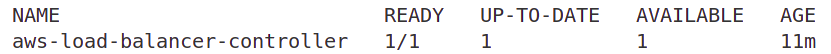

Check that service account has been created:
```bash
kubectl get sa aws-load-balancer-controller -n kube-system -o yaml
```

```yaml
apiVersion: v1
kind: ServiceAccount
metadata:
  annotations:
    eks.amazonaws.com/role-arn: arn:aws:iam::908418734551:role/eksctl-eks-demo-addon-iamserviceaccount-kube--Role1-15swlnf7g9Nb
  creationTimestamp: "2025-08-05T09:08:18Z"
  labels:
    app.kubernetes.io/managed-by: eksctl
  name: aws-load-balancer-controller
  namespace: kube-system
  resourceVersion: "10946"
  uid: 55ee9259-1a4f-43c5-b97e-e0a9c5eb12d5
```

**Addons** are optional components that extend Kubernetes functionality - for example, DNS, metrics collection, or ingress controllers. These addons run as Pods inside the cluster and are typically managed by Kubernetes controllers like Deployments or DaemonSets. Most core addons are deployed in the `kube-system` namespace, which is specified in their YAML configuration files.

You can also check the relevant logs:
```bash
kubectl logs -n kube-system $(kubectl get po -n kube-system | egrep -o "aws-load-balancer[a-zA-Z0-9-]+")
```

Detailed property values can be checked with the following commands:
```bash
ALBPOD=$(kubectl get pod -n kube-system | egrep -o "aws-load-balancer[a-zA-Z0-9-]+")

kubectl describe pod -n kube-system ${ALBPOD}
```

## Deploy Microservices

In this section, you will deploy the backend, frontend apps to Amazon EKS, which makes up the whole web service. The order in which each service is deployed is as follows:

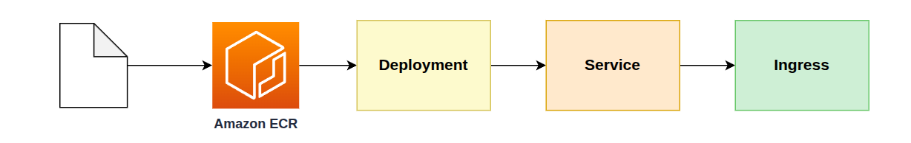

- Download source code from git repository
- Create a repository for each container image in Amazon ECR
- Build container image from the source code location, including Dockerfile, and push to the ECR repository
- Create and deploy Deployment, Service, Ingress manifest files for each service

The scheme below shows the order in which end users access the web service:

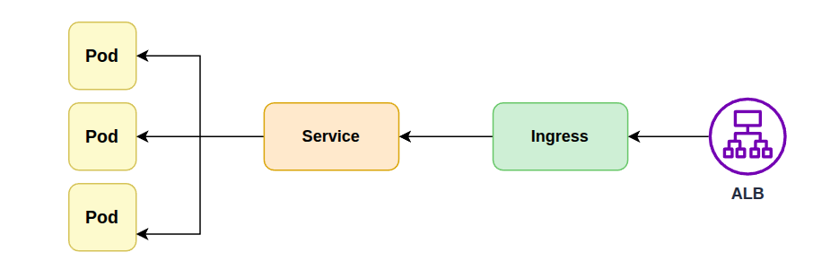

### Deploy First Backend Service

1. Move to `manifests` folder:
```bash
cd manifests
```
2. Create deploy manifest:
```bash
cat <<EOF> flask-deployment.yaml
---
apiVersion: apps/v1
kind: Deployment
metadata:
  name: demo-flask-backend
  namespace: default
spec:
  replicas: 3
  selector:
    matchLabels:
      app: demo-flask-backend
  template:
    metadata:
      labels:
        app: demo-flask-backend
    spec:
      containers:
        - name: demo-flask-backend
          image: $ACCOUNT_ID.dkr.ecr.$AWS_REGION.amazonaws.com/demo-flask-backend:latest
          imagePullPolicy: Always
          ports:
            - containerPort: 8080
EOF
```

3. Next, create service manifest:
```bash
cat <<EOF> flask-service.yaml
---
apiVersion: v1
kind: Service
metadata:
  name: demo-flask-backend
  annotations:
    alb.ingress.kubernetes.io/healthcheck-path: "/contents/aws"
spec:
  selector:
    app: demo-flask-backend
  type: NodePort
  ports:
    - port: 8080
      targetPort: 8080
      protocol: TCP
EOF
```

4. Finally, create ingress manifest:
```bash
cat <<EOF> flask-ingress.yaml
---
apiVersion: networking.k8s.io/v1
kind: Ingress
metadata:
    name: "flask-backend-ingress"
    namespace: default
    annotations:
      alb.ingress.kubernetes.io/scheme: internet-facing
      alb.ingress.kubernetes.io/target-type: ip
      alb.ingress.kubernetes.io/group.name: eks-demo-group
      alb.ingress.kubernetes.io/group.order: '1'
spec:
    ingressClassName: alb
    rules:
    - http:
        paths:
          - path: /contents
            pathType: Prefix
            backend:
              service:
                name: "demo-flask-backend"
                port:
                  number: 8080
EOF
```

5. Deploy the manifest created above in the order shown below. Ingress provisions Application Load Balancer(ALB):
```bash
kubectl apply -f flask-deployment.yaml
kubectl apply -f flask-service.yaml
kubectl apply -f flask-ingress.yaml
```

6. Paste the results of the following command into the Web browser or API platform(like Postman) to check:
```bash
echo http://$(kubectl get ingress/flask-backend-ingress -o jsonpath='{.status.loadBalancer.ingress[*].hostname}')/contents/aws
```

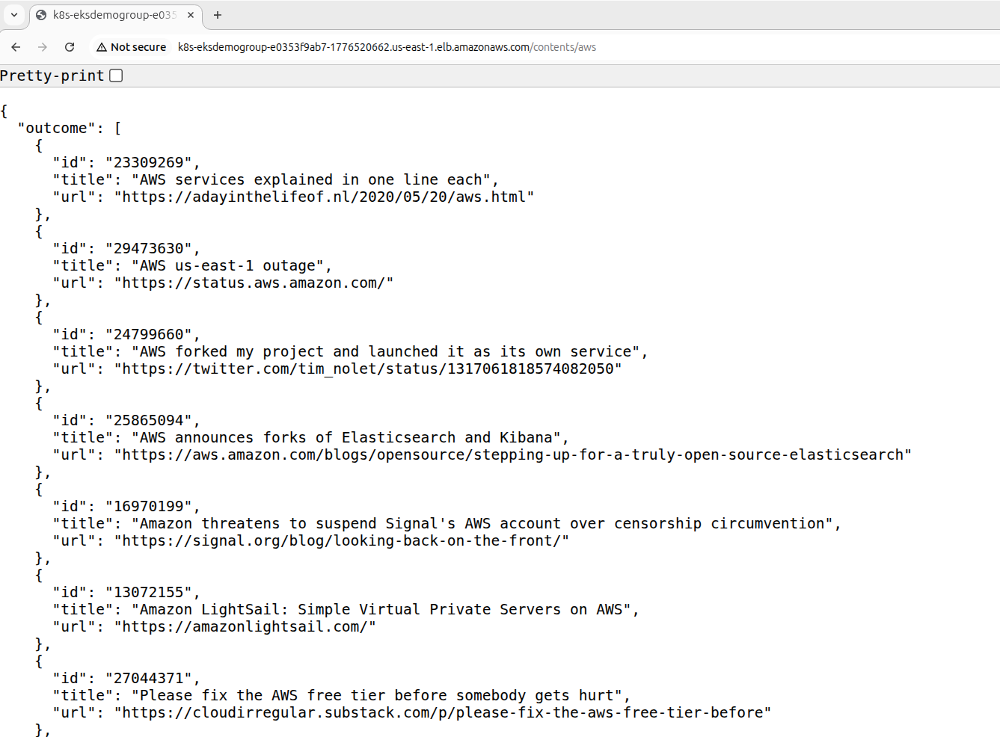

It will take some time for the ingress object to be deployed. Wait for the Load Balancers status to be active in [EC2 console](https://console.aws.amazon.com/ec2/v2/home#LoadBalancers:).

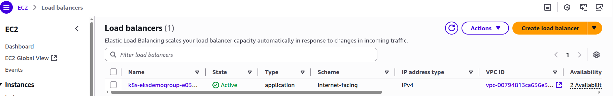

The deployed infrastructure architecture:

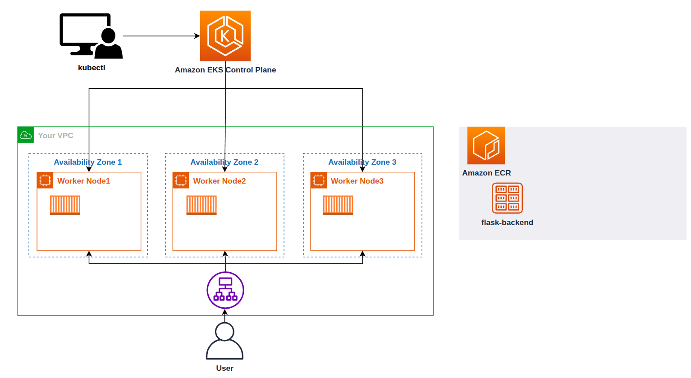

## Deploy Second Backend Service

Deploy the express backend in the same order as the flask backend.

In this section we will deploy pre-built container images to skip the image build and repository push process conducted in Upload container image to Amazon ECR.

The code is available at: [https://github.com/joozero/amazon-eks-nodejs](https://github.com/joozero/amazon-eks-nodejs).

> ⚠️ **IMPORTANT:**  
> There is an issue with displaying the images from the original repository. For more information, see [No Images Loaded in the Frontend App](https://github.com/joozero/amazon-eks-frontend/issues/2) Issue.

### With Images

To proceed with displaying images, you have to deploy your own S3 bucket with public access, place images their and change URLs in `app.js` file of the `amazon-eks-nodejs` repository. 

The fixed version is available at: [https://github.com/Brain2life/amazon-eks-nodejs](https://github.com/Brain2life/amazon-eks-nodejs)

1. Clone the Github repository for the NodeJS backend at the root of the project:
```bash
git clone git@github.com:Brain2life/amazon-eks-nodejs.git
```
2. Follow the instructions in the `README.md` section of `amazon-eks-nodejs` project and provision S3 bucket with images.
3. After uploading all the images into S3 bucket, create a Docker image:
```bash
docker build -t demo-nodejs-backend .
```
4. Tag the image in order to push it into AWS ECR:
```bash
docker tag demo-nodejs-backend:latest $ACCOUNT_ID.dkr.ecr.$AWS_REGION.amazonaws.com/demo-nodejs-backend:latest
```
4. Create the `demo-nodejs-backend` repository:
```bash
aws ecr create-repository \
--repository-name demo-nodejs-backend \
--image-scanning-configuration scanOnPush=true \
--region us-east-1
```
5. Push the image into the repository:
```bash
docker push $ACCOUNT_ID.dkr.ecr.$AWS_REGION.amazonaws.com/demo-nodejs-backend:latest
```
6. Create deploy manifest which contains pre-built container image:
```bash
cat <<EOF> nodejs-deployment-with-images.yaml
---
apiVersion: apps/v1
kind: Deployment
metadata:
  name: demo-nodejs-backend
  namespace: default
spec:
  replicas: 3
  selector:
    matchLabels:
      app: demo-nodejs-backend
  template:
    metadata:
      labels:
        app: demo-nodejs-backend
    spec:
      containers:
        - name: demo-nodejs-backend
          image: $ACCOUNT_ID.dkr.ecr.$AWS_REGION.amazonaws.com/demo-nodejs-backend:latest
          imagePullPolicy: Always
          ports:
            - containerPort: 3000
EOF
```
7. Deploy the manifest files:
```bash
kubectl apply -f nodejs-deployment-with-images.yaml
kubectl apply -f nodejs-service.yaml
kubectl apply -f nodejs-ingress.yaml
```

8. Paste the results of the following command into the Web browser or API platform(like Postman) to check:
```bash
echo http://$(kubectl get ingress/nodejs-backend-ingress -o jsonpath='{.status.loadBalancer.ingress[*].hostname}')/services/all
```

### Without Images

1. Move to `manifests` folder:
```bash
cd manifests
```
2. Create deploy manifest which contains pre-built container image:
```bash
cat <<EOF> nodejs-deployment.yaml
---
apiVersion: apps/v1
kind: Deployment
metadata:
  name: demo-nodejs-backend
  namespace: default
spec:
  replicas: 3
  selector:
    matchLabels:
      app: demo-nodejs-backend
  template:
    metadata:
      labels:
        app: demo-nodejs-backend
    spec:
      containers:
        - name: demo-nodejs-backend
          image: public.ecr.aws/y7c9e1d2/joozero-repo:latest
          imagePullPolicy: Always
          ports:
            - containerPort: 3000
EOF
```

3. Create service manifest file:
```bash
cat <<EOF> nodejs-service.yaml
---
apiVersion: v1
kind: Service
metadata:
  name: demo-nodejs-backend
  annotations:
    alb.ingress.kubernetes.io/healthcheck-path: "/services/all"
spec:
  selector:
    app: demo-nodejs-backend
  type: NodePort
  ports:
    - port: 8080
      targetPort: 3000
      protocol: TCP
EOF
```

4. Create ingress manifest:
```bash
cat <<EOF> nodejs-ingress.yaml
---
apiVersion: networking.k8s.io/v1
kind: Ingress
metadata:
  name: "nodejs-backend-ingress"
  namespace: default
  annotations:
    alb.ingress.kubernetes.io/scheme: internet-facing
    alb.ingress.kubernetes.io/target-type: ip
    alb.ingress.kubernetes.io/group.name: eks-demo-group
    alb.ingress.kubernetes.io/group.order: '2'
spec:
  ingressClassName: alb
  rules:
  - http:
        paths:
          - path: /services
            pathType: Prefix
            backend:
              service:
                name: "demo-nodejs-backend"
                port:
                  number: 8080
EOF
```

5. Deploy the manifest files:
```bash
kubectl apply -f nodejs-deployment.yaml
kubectl apply -f nodejs-service.yaml
kubectl apply -f nodejs-ingress.yaml
```

6. Paste the results of the following command into the Web browser or API platform(like Postman) to check:
```bash
echo http://$(kubectl get ingress/nodejs-backend-ingress -o jsonpath='{.status.loadBalancer.ingress[*].hostname}')/services/all
```

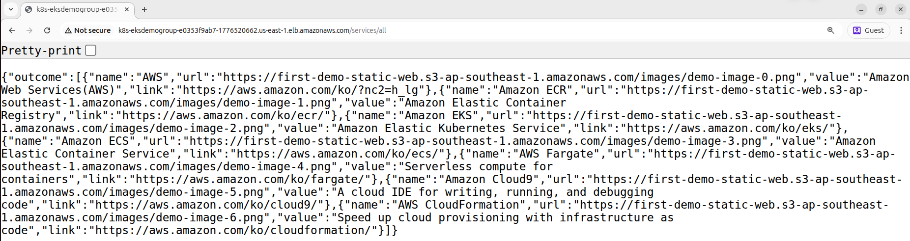

The architecture as of now:

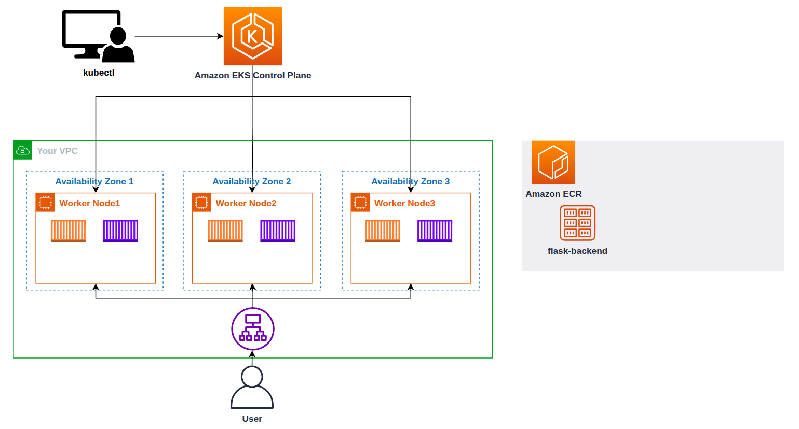

## Deploy Frontend Service

Once you have deployed two backend services, you will now deploy the frontend to configure the web page's screen.

1. Download the source code to be containerized:
```bash
git clone https://github.com/joozero/amazon-eks-frontend.git
```
2. Create ECR image repository for frontend:
```bash
aws ecr create-repository \
--repository-name demo-frontend \
--image-scanning-configuration scanOnPush=true \
--region ${AWS_REGION}
```

3. To view two backend API data on the web screen, we have to change source code. Change the url values in `App.js` file and `page/UpperPage.js` file from the frontend source code `src/`:

in `App.js` file
```javascript 
  const url = `{backend-ingress ADDRESS}/contents/${search}`;
```
replace `url` value with the output from:
```bash
echo http://$(kubectl get ingress/flask-backend-ingress -o jsonpath='{.status.loadBalancer.ingress[*].hostname}')/contents/'${search}'
```

and in the `UpperPage.js`:
```javascript
  const url = '{backend-ingress ADDRESS}/services/all';
```
replace `url` value with the output from:
```bash
echo http://$(kubectl get ingress/nodejs-backend-ingress -o jsonpath='{.status.loadBalancer.ingress[*].hostname}')/services/all
```

4. In the root of `amazon-eks-frontend`:
```bash
npm install
npm run build
```

5. Build and push the Docker image in `amazon-eks-frontend`:
```bash
docker build -t demo-frontend .

docker tag demo-frontend:latest $ACCOUNT_ID.dkr.ecr.$AWS_REGION.amazonaws.com/demo-frontend:latest

docker push $ACCOUNT_ID.dkr.ecr.$AWS_REGION.amazonaws.com/demo-frontend:latest
```

6. Move to `manifests` folder and create deployment files for `demo-frontend`:
```bash
cd /home/ec2-user/environment/manifests
```

```bash
cat <<EOF> frontend-deployment.yaml
---
apiVersion: apps/v1
kind: Deployment
metadata:
  name: demo-frontend
  namespace: default
spec:
  replicas: 3
  selector:
    matchLabels:
      app: demo-frontend
  template:
    metadata:
      labels:
        app: demo-frontend
    spec:
      containers:
        - name: demo-frontend
          image: $ACCOUNT_ID.dkr.ecr.$AWS_REGION.amazonaws.com/demo-frontend:latest
          imagePullPolicy: Always
          ports:
            - containerPort: 80
EOF
```

```bash
cat <<EOF> frontend-service.yaml
---
apiVersion: v1
kind: Service
metadata:
  name: demo-frontend
  annotations:
    alb.ingress.kubernetes.io/healthcheck-path: "/"
spec:
  selector:
    app: demo-frontend
  type: NodePort
  ports:
    - protocol: TCP
      port: 80
      targetPort: 80
EOF
```

```bash
cat <<EOF> frontend-ingress.yaml
---
apiVersion: networking.k8s.io/v1
kind: Ingress
metadata:
  name: "frontend-ingress"
  namespace: default
  annotations:
    alb.ingress.kubernetes.io/scheme: internet-facing
    alb.ingress.kubernetes.io/target-type: ip
    alb.ingress.kubernetes.io/group.name: eks-demo-group
    alb.ingress.kubernetes.io/group.order: '3'
spec:
  ingressClassName: alb
  rules:
    - http:
        paths:
          - path: /
            pathType: Prefix
            backend:
              service:
                name: "demo-frontend"
                port:
                  number: 80
EOF
```

7. Deploy manifests files:
```bash
kubectl apply -f frontend-deployment.yaml
kubectl apply -f frontend-service.yaml
kubectl apply -f frontend-ingress.yaml
```

8. To get the URL of the frontend application:
```bash
echo http://$(kubectl get ingress/frontend-ingress -o jsonpath='{.status.loadBalancer.ingress[*].hostname}')
```

You should see the following website:

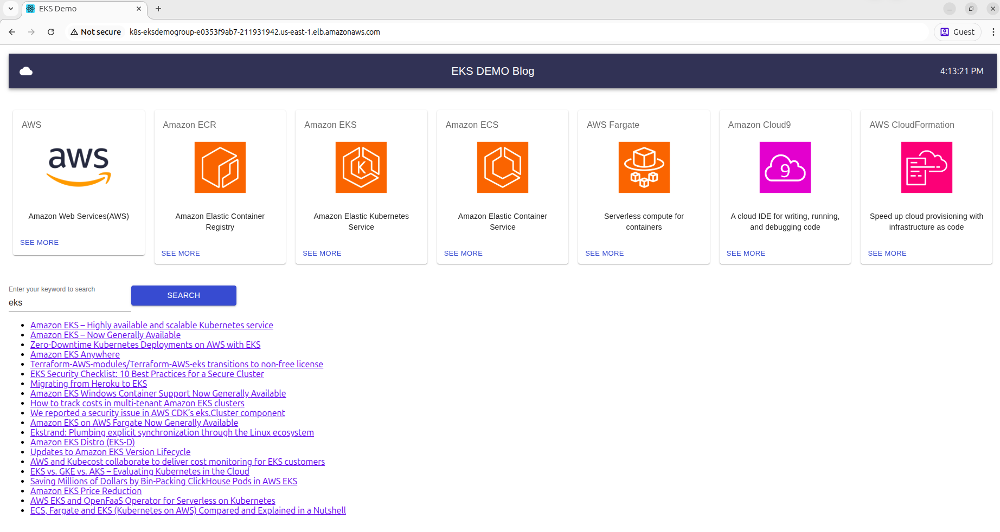

> ⚠️ **NOTE:**  
> Images on the website are not loaded due to the access permission problem. The related issue is described here: [No Images Loaded in the Frontend App](https://github.com/joozero/amazon-eks-frontend/issues/2)

After deploying Ingress Controller and Service objects, the architecture configured is shown below:

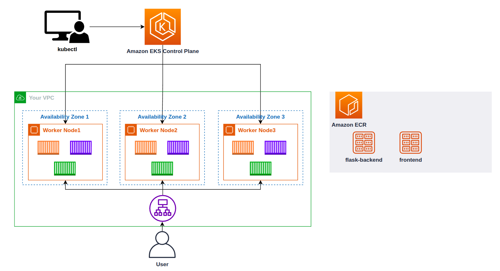

## Amazon CloudWatch Container Insights

Use [CloudWatch Container Insights](https://docs.aws.amazon.com/AmazonCloudWatch/latest/monitoring/ContainerInsights.html) to collect, aggregate, and summarize metrics and logs from your containerized applications and microservices. Container Insights is available for Amazon Elastic Container Service (Amazon ECS), Amazon Elastic Kubernetes Service (Amazon EKS), and Kubernetes platforms on Amazon EC2. Amazon ECS support includes support for Fargate.

CloudWatch automatically collects metrics for many resources, such as CPU, memory, disk, and network. Container Insights also provides diagnostic information, such as container restart failures, to help you isolate issues and resolve them quickly. You can also set CloudWatch alarms on metrics that Container Insights collects.

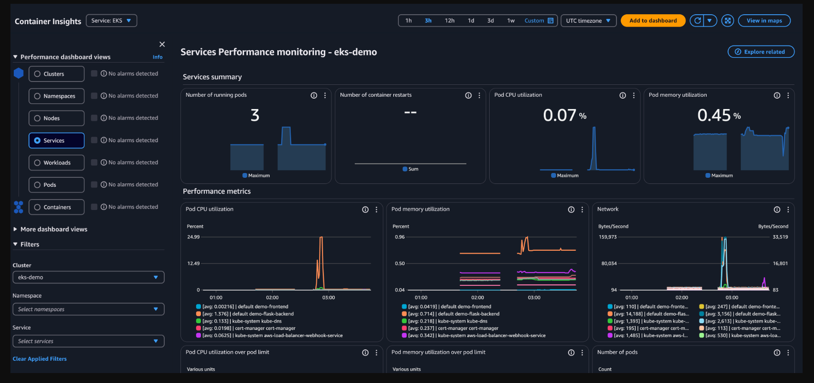

In this workshop, you will use [Fluent Bit](https://fluentbit.io/)  to route logs. In this section you will first:
- install CloudWatch Agent to collect metric of the cluster 
- install Fluent Bit to send logs to CloudWatch Logs in DaemonSet type.

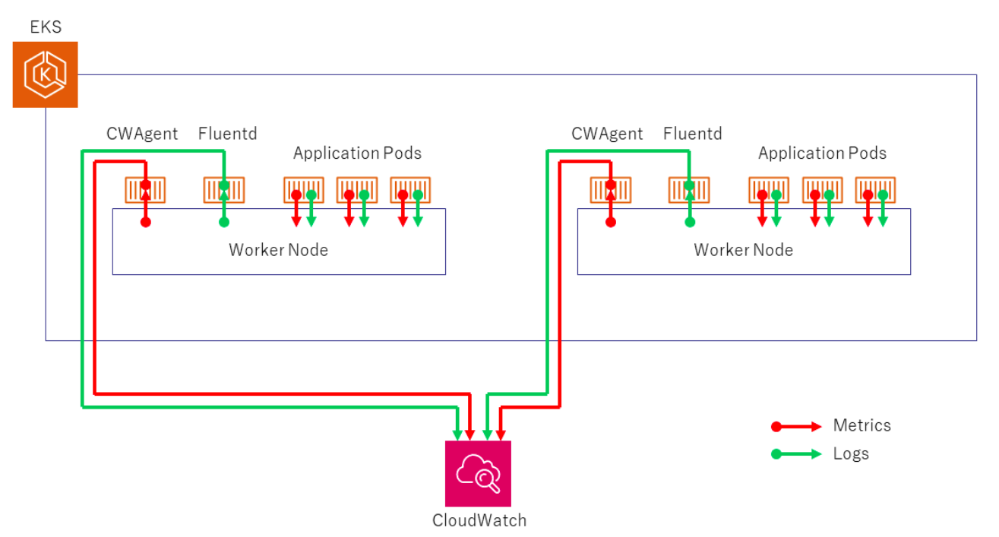

First, create a folder at the root of the project to manage manifest files for Monitoring:
```bash
mkdir -p manifests/cloudwatch-insight && cd manifests/cloudwatch-insight
```

### Install CloudWatch Agent and FluentBit

> ⚠️ **IMPORTANT:**  
> When we created EKS cluster, CloudWatch related permissions were already placed in the worker node by default.

1. Create namespace named `amazon-cloudwatch`:
```bash
kubectl create ns amazon-cloudwatch
```

To verify:
```bash
kubectl get ns
```

2. After specifying the following settings variables, install CloudWatch agent and Fluent Bit. Copy and paste one line at a time:
```bash
ClusterName=eks-demo
RegionName=$AWS_REGION
FluentBitHttpPort='2020'
FluentBitReadFromHead='Off'
[[ ${FluentBitReadFromHead} = 'On' ]] && FluentBitReadFromTail='Off'|| FluentBitReadFromTail='On'
[[ -z ${FluentBitHttpPort} ]] && FluentBitHttpServer='Off' || FluentBitHttpServer='On'
``` 

**Settings Explained**  

```bash
FluentBitHttpPort='2020'
```

* This defines the port where Fluent Bit's **HTTP server** (for metrics/debugging) should run.
* Default HTTP server is used for exposing `/api/v1/metrics` and other endpoints.

---

```bash
FluentBitReadFromHead='Off'
```

* This flag controls whether Fluent Bit **starts reading logs from the head or tail** of the log file.

  * `'On'` --> read from the beginning
  * `'Off'` --> read from the end (tail)
* Useful when you don’t want Fluent Bit to reprocess older logs.

---

```bash
[[ ${FluentBitReadFromHead} = 'On' ]] && FluentBitReadFromTail='Off' || FluentBitReadFromTail='On'
```

* This is a conditional expression:

  * If `FluentBitReadFromHead` is `'On'` --> set `FluentBitReadFromTail='Off'`
  * Otherwise --> set `FluentBitReadFromTail='On'`

In other words:

> You can't read both from head and tail — it's one or the other, so this keeps them mutually exclusive.

---

```bash
[[ -z ${FluentBitHttpPort} ]] && FluentBitHttpServer='Off' || FluentBitHttpServer='On'
```

* Checks if `FluentBitHttpPort` is **empty**:

  * If it is --> disable the HTTP server
  * If not --> enable it

So here:

* Since we already set `FluentBitHttpPort='2020'`, the result will be:

  ```bash
  FluentBitHttpServer='On'
  ```

---

| Variable                | Purpose                                                 |
| ----------------------- | ------------------------------------------------------- |
| `ClusterName`           | Tag logs with cluster name                              |
| `RegionName`            | AWS region for log delivery                             |
| `FluentBitHttpPort`     | Port for HTTP server (e.g., metrics API)                |
| `FluentBitHttpServer`   | Enable/disable Fluent Bit HTTP server                   |
| `FluentBitReadFromHead` | Start log reading from beginning (`On`) or tail (`Off`) |
| `FluentBitReadFromTail` | Opposite of above — mutually exclusive                  |

3. Download the following CloudWatch Container Insights sample config file:
```bash
wget https://raw.githubusercontent.com/aws-samples/amazon-cloudwatch-container-insights/latest/k8s-deployment-manifest-templates/deployment-mode/daemonset/container-insights-monitoring/quickstart/cwagent-fluent-bit-quickstart.yaml
```
4. Apply our evnironment files to the config file:
```bash
sed -i 's/{{cluster_name}}/'${ClusterName}'/;s/{{region_name}}/'${RegionName}'/;s/{{http_server_toggle}}/"'${FluentBitHttpServer}'"/;s/{{http_server_port}}/"'${FluentBitHttpPort}'"/;s/{{read_from_head}}/"'${FluentBitReadFromHead}'"/;s/{{read_from_tail}}/"'${FluentBitReadFromTail}'"/' cwagent-fluent-bit-quickstart.yaml 
```
5. Deploy the file:
```bash
kubectl apply -f cwagent-fluent-bit-quickstart.yaml 
```
6. Verify the deployment:
```bash
kubectl get po -n amazon-cloudwatch
```
or
```bash
kubectl get daemonsets -n amazon-cloudwatch
```

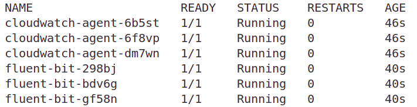

You can view logs under: [**Amazon CloudWatch console**](https://console.aws.amazon.com/cloudwatch) --> **Container Insights** --> **Insights menu** in the left sidebar

## Kubernetes Auto Scaling

Kubernetis has two main auto-scaling capabilities.

- **HPA(Horizontal Pod AutoScaler)**
- **Cluster Autoscaler**

### **HPA (Horizontal Pod Autoscaler)**

* **What it does:** Automatically **adds or removes pods** in a Deployment, ReplicaSet, or StatefulSet based on CPU, memory, or custom metrics.
* **Use case:** Ensures your app scales **horizontally** (more pods) when under load and scales down when idle.
* **Example:** If CPU usage > 80%, HPA can increase pod count from 3 to 6.

---

### **Cluster Autoscaler**

* **What it does:** Automatically **adds or removes nodes (EC2 instances)** in your cluster when pods can't be scheduled due to resource shortage.
* **Use case:** Ensures your **cluster infrastructure** grows or shrinks based on actual usage.
* **Example:** If a new pod can’t be scheduled due to lack of memory, Cluster Autoscaler adds a new node.

---

### Key Difference:

| Feature | HPA                         | Cluster Autoscaler   |
| ------- | --------------------------- | -------------------- |
| Scales  | Pods                        | Nodes                |
| Trigger | Resource usage (CPU/memory) | Unschedulable pods   |
| Scope   | Application layer           | Infrastructure layer |

---

## Applying Pod Scaling with HPA

The **HPA (Horizontal Pod Autoscaler)** controller allocates the number of pods based on metric. To apply pod scaling, you must specify the amount of resources required for the container and create conditions to scale through HPA.

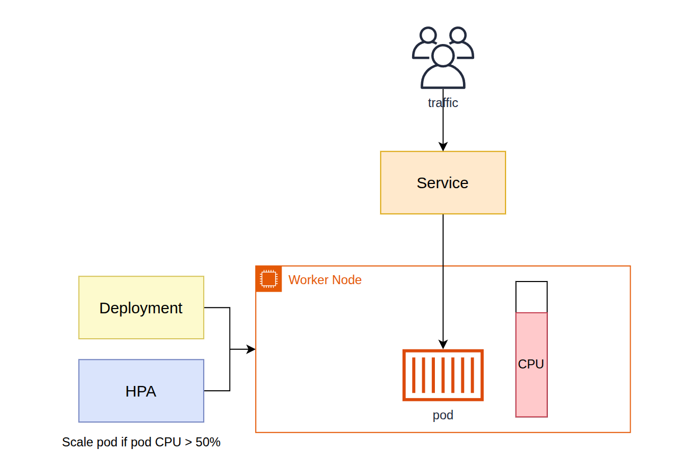

1. [Metrics Server](https://docs.aws.amazon.com/eks/latest/userguide/metrics-server.html) aggregates resource usage data across the Kubernetes cluster. Collect metrics such as the CPU and memory usage of the worker node or container through kubelet installed on each worker node. Deploy the Metrics Server with the following command:
```bash
kubectl apply -f https://github.com/kubernetes-sigs/metrics-server/releases/latest/download/components.yaml
```
To verify the deployment:
```bash
kubectl get deployment metrics-server -n kube-system
```
2. Create a new modification of `flask-deployment.yaml` file with 1 replica and changed resource requests and limits:
```bash
cat <<EOF> flask-deployment-hpa.yaml
---
apiVersion: apps/v1
kind: Deployment
metadata:
  name: demo-flask-backend
  namespace: default
spec:
  replicas: 1
  selector:
    matchLabels:
      app: demo-flask-backend
  template:
    metadata:
      labels:
        app: demo-flask-backend
    spec:
      containers:
        - name: demo-flask-backend
          image: $ACCOUNT_ID.dkr.ecr.$AWS_REGION.amazonaws.com/demo-flask-backend:latest
          imagePullPolicy: Always
          ports:
            - containerPort: 8080
          resources:
            requests:
              cpu: 250m
            limits:
              cpu: 500m
EOF
```
3. Redeploy the flask service:
```bash
kubectl apply -f flask-deployment-hpa.yaml
```
4. Create config file for Flask HPA:
```bash
cat <<EOF> flask-hpa.yaml
---
apiVersion: autoscaling/v1
kind: HorizontalPodAutoscaler
metadata:
  name: demo-flask-backend-hpa
  namespace: default
spec:
  scaleTargetRef:
    apiVersion: apps/v1
    kind: Deployment
    name: demo-flask-backend
  minReplicas: 1
  maxReplicas: 5
  targetCPUUtilizationPercentage: 30
EOF
```
5. Deploy the file:
```bash
kubectl apply -f flask-hpa.yaml
```
6. Verify that HPA works:
```bash
kubectl get hpa
```

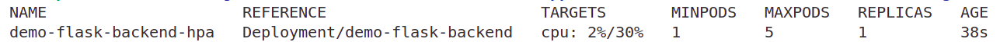

7. Watch the amount of changes in the pod:
```bash
kubectl get hpa -w
```
8. Install `hey` tool for load testing:
```bash
curl -LO https://hey-release.s3.us-east-2.amazonaws.com/hey_linux_amd64
chmod +x hey_linux_amd64
sudo mv hey_linux_amd64 /usr/local/bin/hey
```
9. Export Flask API for load testing:
```bash
export flask_api=$(kubectl get ingress/flask-backend-ingress -o jsonpath='{.status.loadBalancer.ingress[*].hostname}')/contents/aws
```
10. Load test the API:
```bash
hey -n 20000 -c 1000 http://$flask_api
```

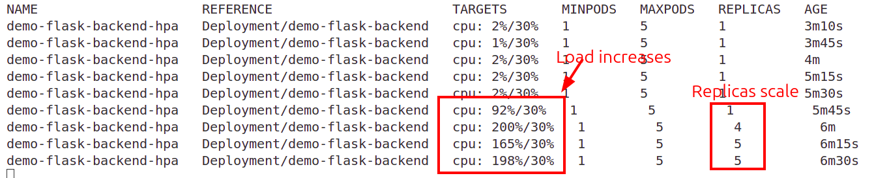

## Cluster Autoscaler

[Cluster Autoscaler](https://docs.aws.amazon.com/eks/latest/best-practices/cas.html) scales **nodes** in the event of **pods are in pending state** by using **EC2 Auto Scaling Groups**.

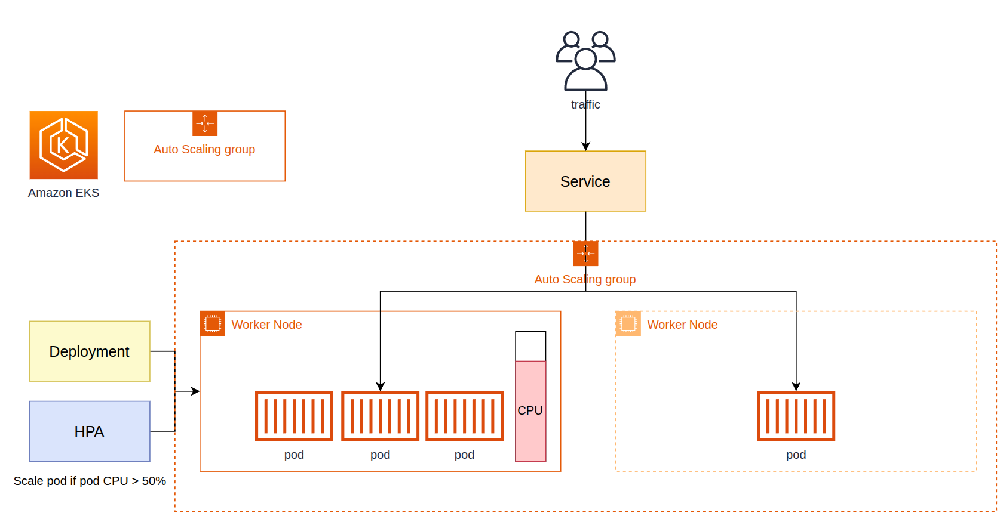

1. Store the name of the current EKS worker node group's Auto Scaling Group into an environment variable:
```bash
export ASG_NAME=$(aws autoscaling describe-auto-scaling-groups \
  --query "AutoScalingGroups[?Tags[?Key=='eks:cluster-name' && Value=='eks-demo']].AutoScalingGroupName | [0]" \
  --output text)
```

Verify:
```bash
echo ${ASG_NAME}
```

2. Use the command below to check the **value of ASG (Auto Scaling Group)** applied to the current cluster's worker nodes:
```bash
aws autoscaling describe-auto-scaling-groups \
  --auto-scaling-group-names "$ASG_NAME" \
  --query "AutoScalingGroups[].[AutoScalingGroupName, MinSize, MaxSize, DesiredCapacity]" \
  --output table
```
3. Increase maximum size to 5:
```bash
aws autoscaling update-auto-scaling-group \
  --auto-scaling-group-name $ASG_NAME \
  --max-size 5
```
4. Download the deployment example file provided by the Cluster Autooscaler project:
```bash
cd manifests
```

```bash
wget https://raw.githubusercontent.com/kubernetes/autoscaler/master/cluster-autoscaler/cloudprovider/aws/examples/cluster-autoscaler-autodiscover.yaml
```
5. Set the cluster name to `eks-demo` and deploy it:
```bash
sed -i 's|<YOUR CLUSTER NAME>|eks-demo|g' cluster-autoscaler-autodiscover.yaml
```
6. Deploy the autoscaler:
```bash
kubectl apply -f cluster-autoscaler-autodiscover.yaml
```
7. Monitor the nodes:
```bash
kubectl get nodes -w
```
8. In separate terminal deploy 100 pods to increase the load:
```bash
kubectl create deployment autoscaler-demo --image=nginx
kubectl scale deployment autoscaler-demo --replicas=100
```

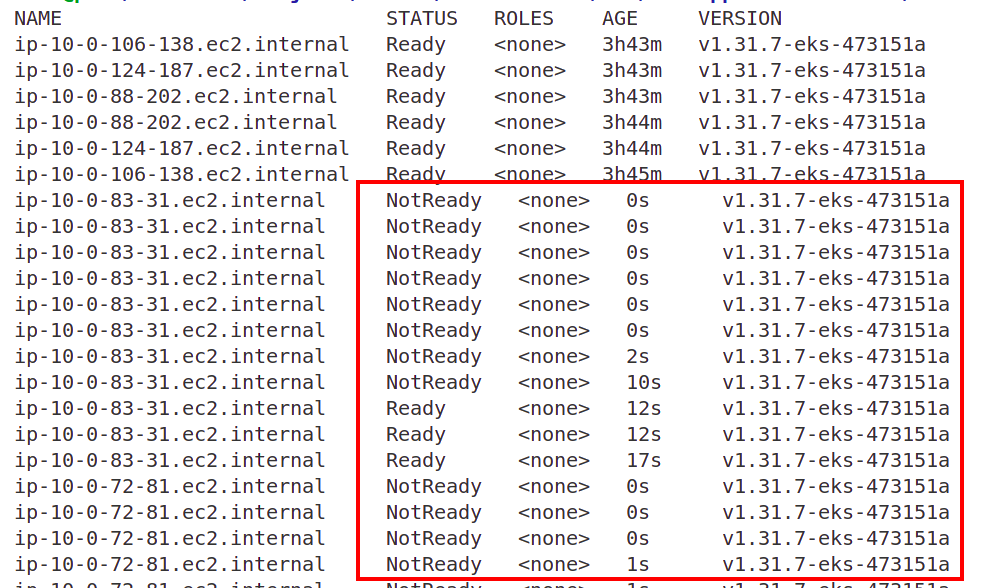

9. If you delete a previously created pods with the command below, you can see that the worker node will be scaled in:
```bash
kubectl delete deployment autoscaler-demo
```

## References
- [Repo with fixed images for the frontend: github.com/Brain2life/amazon-eks-nodejs](https://github.com/Brain2life/amazon-eks-nodejs)
- [github.com/joozero](https://github.com/joozero)
- [AWS EKS Workshop at IITU]()https://www.meetup.com/aws-cloud-club-at-iitu/events/310078745/
