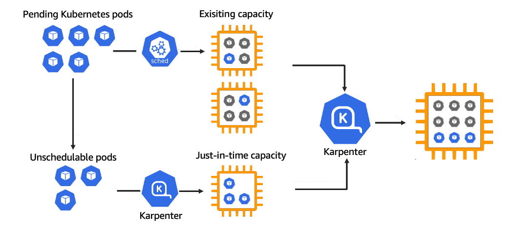

# Deploy Karpenter Autoscaler on EKS with Managed Node Groups

[Karpenter](https://karpenter.sh/) is an open-source cluster autoscaler for Kubernetes developed by AWS. It dynamically launches and terminates EC2 instances (or other cloud provider VMs) based on the real-time scheduling needs of the cluster. Unlike the [Kubernetes Cluster Autoscaler](https://docs.aws.amazon.com/eks/latest/best-practices/cas.html), Karpenter makes decisions based on pods that failed to schedule and directly interacts with the cloud provider's APIs.

## How Karpenter Works

Karpenter observes the Kubernetes cluster for pods that cannot be scheduled due to insufficient compute resources (marked as **"unschedulable"** by the Kubernetes scheduler). It then:
1. **Evaluates Pod Requirements**: Analyzes pod specifications, including resource requests (CPU, memory), [node selectors](https://kubernetes.io/docs/concepts/scheduling-eviction/assign-pod-node/#nodeselector), [affinities](https://kubernetes.io/docs/concepts/scheduling-eviction/assign-pod-node/#node-affinity), [tolerations](https://kubernetes.io/docs/concepts/scheduling-eviction/taint-and-toleration/), and [topology spread constraints](https://kubernetes.io/docs/concepts/scheduling-eviction/topology-spread-constraints/).
2. **Provisions Nodes**: Dynamically launches nodes (e.g., EC2 instances in AWS) that match the workload’s requirements, directly interacting with the cloud provider’s APIs (bypassing node groups).
3. **Binds Pods**: Assigns pods to the newly provisioned nodes, reducing scheduling latency.
4. **Deprovisions Nodes**: Removes underutilized nodes when they are no longer needed, optimizing costs and resource efficiency.



## Key Features

- **Workload-Driven Scaling**: Karpenter provisions nodes based on specific pod requirements rather than predefined node group configurations, enabling precise resource allocation.
- **No Node Groups**: Unlike CA, Karpenter manages individual instances directly, eliminating the need for multiple Auto Scaling Groups, which simplifies configuration and reduces overhead.


- **Fast Scaling**: It can provision nodes in under a minute (often ~40-60 seconds), making it ideal for spiky or fluctuating workloads like batch jobs or machine learning tasks.[](https://vishnudeva.medium.com/scaling-kubernetes-with-karpenter-1dc785e79010)[](https://www.fairwinds.com/blog/spotlight-on-goldilocks-karpenter-and-autoscaling-with-open-source)
- **Cost Optimization**: Uses a [bin-packing algorithm](https://blog.techiescamp.com/docs/kubernetes-bin-packing/) to consolidate workloads onto [fewer nodes and supports spot instances to reduce costs](https://scaleops.com/blog/karpenter-vs-cluster-autoscaler/).
- **Flexibility**: Supports [diverse instance types, availability zones, and purchase options](https://www.kloia.com/blog/karpenter-cluster-autoscaler) (e.g., On-Demand, Spot) without requiring preconfigured node groups.
- **Custom CRDs**: Uses Kubernetes Custom Resource Definitions (CRDs) called [NodePool](https://karpenter.sh/docs/concepts/nodepools/), [NodeClass](https://karpenter.sh/docs/concepts/nodeclasses/), [NodeClaims](https://karpenter.sh/docs/concepts/nodeclaims/) to define resource allocation policies tailored to workload needs.
- **Zone Awareness**: Ensures nodes are provisioned in the [correct availability zones](https://karpenter.sh/docs/concepts/scheduling/), addressing issues like volume affinity for stateful workloads.
- **Consolidation**: Actively [consolidates workloads](https://karpenter.sh/v1.0/concepts/disruption/#consolidation) by moving pods to more efficient nodes and terminating underutilized ones, enhancing resource utilization.
- **GPU-based Workloads**: Launches EC2 GPU instances (e.g., `p3`, `g5`) dynamically when pods request specific resources.
- **Multi-Architecture Support**: Schedules pods on ARM-based (Graviton) or x86_64 instances depending on image compatibility.

## Comparison with Cluster Autoscaler

- **Approach**: CA scales nodes based on overall cluster demand and predefined node groups, while Karpenter focuses on pod-level requirements for just-in-time provisioning.
- **Speed**: Karpenter is faster due to direct API calls and bypassing node group orchestration.
- **Flexibility**: Karpenter supports a wider range of instance types and configurations without manual node group setup.
- **Complexity**: CA can be complex to configure with multiple node groups, whereas Karpenter simplifies setup with CRDs and Helm chart installation.

## Use Cases

Karpenter is particularly suited for:
- Clusters with dynamic, spiky, or diverse workloads (e.g., machine learning, batch processing, or financial simulations).
- Environments prioritizing cost optimization and efficient resource utilization.
- As Kubernetes native cloud agnostic autoscaler

## Example scenario

Let’s say you’re running an **EKS cluster for a CI/CD pipeline**. Builds are triggered on each push, requiring 20 pods with 2 vCPU / 4 GB RAM. Karpenter detects the pending pods, calculates the optimal instance types (e.g., `c6a.large`), and launches EC2 instances on the fly. Once the build is complete and pods are terminated, Karpenter also decommissions the nodes - saving cost and removing complexity.

## Installation and Setup

Karpenter is typically installed on an EKS cluster using Helm charts. Key steps include:
1. Setting up IAM roles for the Karpenter controller and nodes (using IRSA for permissions).
2. Installing Karpenter via Helm.
3. Configuring  NodePools and NodeClass to define scaling behavior.
4. Ensuring the cluster has at least one small node group or Fargate profile for the Karpenter controller.

## OIDC in EKS

In **Amazon EKS**, an [**OIDC provider**](https://docs.aws.amazon.com/eks/latest/userguide/enable-iam-roles-for-service-accounts.html) is needed to enable **fine-grained IAM permissions** for Kubernetes workloads. This is a critical component when you want your **pods to securely assume IAM roles** - using a feature called [**IAM Roles for Service Accounts (IRSA)**](https://docs.aws.amazon.com/eks/latest/userguide/iam-roles-for-service-accounts.html).

---

### Why You Need an OIDC Provider in EKS

| Purpose                                             | Description                                                                                                                                 |
| --------------------------------------------------- | ------------------------------------------------------------------------------------------------------------------------------------------- |
| **1. Enable IAM Roles for Pods (IRSA)**             | Allows specific Kubernetes pods to assume IAM roles with scoped permissions, avoiding the need to attach AWS credentials or expose secrets. |
| **2. Secure Access to AWS Resources**               | For example, only a specific pod can access an S3 bucket, DynamoDB table, or Secrets Manager based on its service account.                  |
| **3. Follows Least Privilege Principle**            | Each workload gets exactly the AWS permissions it needs — no more, no less.                                                                 |
| **4. Decouples Node IAM Role from Pod Permissions** | Previously, all pods inherited the node’s IAM role. With IRSA, pods use separate, dedicated IAM roles.                                      |
| **5. Integrates with AWS STS via OIDC**             | The OIDC provider allows AWS STS to authenticate service accounts from your EKS cluster via a signed identity token.                        |

---

### How It Works (Simplified Flow)

1. You create an OIDC provider in AWS that trusts your EKS cluster’s OIDC URL (e.g., `https://oidc.eks.<region>.amazonaws.com/id/XYZ`).
2. Kubernetes issues a **service account token** (JWT) for a pod.
3. This token includes information like the service account name and namespace.
4. AWS **verifies this token via the OIDC provider**.
5. If valid, AWS allows the pod to assume a specified IAM role using STS.

---

### Example Use Case

You have a pod running in EKS that needs to **upload files to an S3 bucket**. Instead of:

* Baking AWS credentials into the image, or
* Granting broad permissions via the EC2 node role,

You:

* Create a **service account** in Kubernetes.
* Create an **IAM role** that allows access to the S3 bucket.
* **Annotate** the service account with the IAM role ARN.
* Now only pods using that service account can access the bucket securely.

---

### OIDC Provider Creation (Terraform Example)

```hcl
resource "aws_iam_openid_connect_provider" "eks" {
  url = "https://oidc.eks.${var.region}.amazonaws.com/id/${var.cluster_oidc_id}"
  client_id_list = ["sts.amazonaws.com"]
  thumbprint_list = [var.oidc_thumbprint]
}
```

For more information, see [Resource: aws_iam_openid_connect_provider](https://registry.terraform.io/providers/hashicorp/aws/latest/docs/resources/iam_openid_connect_provider)


The **OIDC provider** in EKS enables **secure, token-based authentication** between your Kubernetes pods and AWS IAM - unlocking powerful, least-privilege integrations without managing credentials manually.

## Access EKS Cluster

To update your local kubeconfig file and access cluster, run:
```bash
aws eks update-kubeconfig --region us-east-1 --name eks-cluster
```

To verify access:
```bash
kubectl get no
```

## IAM Role for Karpenter

IAM Node role for Karpenter must have permissions for EC2, as it will directly deploy required additional nodes during autoscaling process. Additionally you have to specify permissions for SQS queue, used to process EC2 Spot interruption events.

The required Node IAM role provisioned via `karpenter` module. To get the name of Node IAM Role use:
```bash
terraform output
```

For more information about Karpenter IAM role permissions, see [KarpenterControllerPolicy](https://karpenter.sh/docs/reference/cloudformation/#karpentercontrollerpolicy)

## Installing Karpenter via Helm

Set cluster name variable:
```bash
export EKS_CLUSTER_NAME=eks-cluster
export SQS_NAME=karpenter-sqs
export KARPENTER_NAMESPACE="karpenter"
export TAG=1.5.0
```

Before installing Karpenter, logout from repository:
```bash
docker logout public.ecr.aws
```

Install Karpenter:
```bash
helm upgrade --install karpenter oci://public.ecr.aws/karpenter/karpenter \
  --version ${TAG} \
  --namespace "${KARPENTER_NAMESPACE}" \
  --create-namespace \
  --set settings.clusterName=${EKS_CLUSTER_NAME} \
  --set settings.interruptionQueue=${SQS_NAME} \
  --set controller.resources.requests.cpu=1 \
  --set controller.resources.requests.memory=1Gi \
  --set controller.resources.limits.cpu=1 \
  --set controller.resources.limits.memory=1Gi \
  --set controller.nodeSelector.karpenter\.sh/controller=true \
  --wait
```

Karpenter Controller pods are installed on dedicated node group. Only controller pods that tolerate the taint `karpenter.sh/controller-only=true:NoSchedule` are scheduled on the node.

> [!CAUTION] 
> To ensure stability and performance, **run the Karpenter controller on EKS Fargate or a dedicated node group**. If the controller runs on nodes it manages, it could accidentally scale them down, causing instability. Using EKS Fargate keeps the controller separate from managed nodes, ensuring consistent operation. Alternatively, a dedicated node group isolates the controller from application workloads, preventing resource competition and improving reliability.


To get default values used by Karpenter Helm chart:
```bash
helm get values karpenter -n karpenter --all > karpenter-default-values.yaml
```

For more information about Karpenter Helm chart, see [gallery.ecr.aws/karpenter/karpenter](https://gallery.ecr.aws/karpenter/karpenter)

| Component                                                     | Explanation                                                                                             |
|---------------------------------------------------------------|---------------------------------------------------------------------------------------------------------|
| `helm upgrade --install karpenter`                            | Installs the Karpenter Helm chart if not installed, or upgrades it if it already exists.               |
| `oci://public.ecr.aws/karpenter/karpenter`                    | Specifies the OCI-based Helm chart location from AWS’s public ECR registry.                            |
| `--version ${TAG}`                                            | Specifies the version of the Karpenter chart to deploy.                                                 |
| `--namespace karpenter`                                       | Installs Karpenter in the `karpenter` Kubernetes namespace.                                             |
| `--create-namespace`                                          | Creates the namespace if it doesn’t already exist.                                                      |
| `--set settings.clusterName=${EKS_CLUSTER_NAME}`              | Sets the EKS cluster name that Karpenter will manage and interact with.                                |
| `--set settings.interruptionQueue=${SQS_NAME}`                | Specifies the SQS queue name that receives EC2 Spot interruption events.                               |
| `--set controller.resources.requests.cpu=1`                   | Sets the minimum CPU request for the Karpenter controller pod to 1 vCPU.                               |
| `--set controller.resources.requests.memory=1Gi`              | Sets the minimum memory request for the controller pod to 1Gi.                                          |
| `--set controller.resources.limits.cpu=1`                     | Sets the CPU limit for the controller pod to 1 vCPU.                                                    |
| `--set controller.resources.limits.memory=1Gi`                | Sets the memory limit for the controller pod to 1Gi.                                                    |
| `--set controller.nodeSelector.karpenter\.sh/controller=true`| Ensures the Karpenter controller pod is scheduled only on nodes labeled with `karpenter.sh/controller=true`. |
| `--wait`                                                      | Waits for all resources to be fully deployed and healthy before completing the Helm operation.          |

To verify Karpenter installation:
```bash
kubectl get all -n karpenter
```

To validate if Karpenter pods are running on dedicated node:
```bash
kubectl get pods -n karpenter -o wide
kubectl get nodes --show-labels | grep karpenter.sh/controller
```

You can watch Karpenter's controller logs with:
```bash
kubectl logs -f -n karpenter -l app.kubernetes.io/name=karpenter -c controller
```

To delete Karpenter Helm release:
```bash
helm uninstall karpenter --namespace karpenter
```

## SQS Interruption Queue for Karpenter

Karpenter uses an SQS queue for **interruption handling**, enabling it to react to events that might disrupt nodes, such as:
- **Spot Interruption Warnings**
- **Scheduled Change Health Events (Maintenance Events)**
- **Instance Terminating Events**
- **Instance Stopping Events**

By watching this queue, Karpenter can proactively drain pods from an interrupted node and provision a new node to host those pods, ensuring a graceful workload migration. 

To allow Karpenter to process **interruption notices** via your **SQS queue**, you need to add the necessary `sqs:*` permissions to Karpenter Controller IAM policy.

For more information, see [Karpenter Interruption](https://karpenter.sh/docs/concepts/disruption/#interruption)

## NodePool and NodeClass

In **Karpenter v0.30+**, the concepts of **`NodePool`** and **`NodeClass`** were introduced as a more modular and cloud-agnostic way to provision and manage nodes. These replace the earlier `Provisioner` object.

---

### Key Concepts

| Concept       | Purpose                                                                    |
| ------------- | -------------------------------------------------------------------------- |
| **NodePool**  | Defines scheduling constraints and behavior (e.g., labels, taints, limits) |
| **NodeClass** | Defines infrastructure-level details (e.g., AMI, subnets, security groups) |

---

### NodePool (Workload-facing: pods)

When you first installed Karpenter, you set up a default NodePool. The NodePool sets constraints on the nodes that can be created by Karpenter and the pods that can run on those nodes. The NodePool can be set to do things like:

- Define taints to limit the pods that can run on nodes Karpenter creates
- Define any startup taints to inform Karpenter that it should taint the node initially, but that the taint is temporary.
- Limit node creation to certain zones, instance types, and computer architectures
- Set defaults for node expiration

> ⚠️ **NOTE:**  
> In Kubernetes, taints are properties applied to nodes that **prevent certain pods from being scheduled on those nodes unless they have matching tolerations**. They act as a way to repel pods that don't have the specific features or capabilities required to run on a particular node. Taints are like "locks" on a node, and pods need "keys" (tolerations) to bypass the lock. 

You can change your NodePool or add other NodePools to Karpenter. Here are things you should know about NodePools:
- Karpenter won’t do anything if there is not at least one NodePool configured.
- Each NodePool that is configured is looped through by Karpenter.
- If Karpenter encounters a taint in the NodePool that is not tolerated by a Pod, Karpenter won’t use that NodePool to provision the pod.
- If Karpenter encounters a startup taint in the NodePool it will be applied to nodes that are provisioned, but pods do not need to tolerate the taint. Karpenter assumes that the taint is temporary and some other system will remove the taint.
- It is recommended to create NodePools that are mutually exclusive. So no Pod should match multiple NodePools. If multiple NodePools are matched, Karpenter will use the NodePool with the highest weight.

For more information, see [NodePool](https://karpenter.sh/v1.3/concepts/nodepools/)

For some example NodePool configurations, see the [examples in the Karpenter GitHub repository](https://github.com/aws/karpenter/blob/main/examples/v1/).

### Example:

```yaml
apiVersion: karpenter.sh/v1
kind: NodePool
metadata:
  name: default
spec:
  # Template section that describes how to template out NodeClaim resources that Karpenter will provision
  # Karpenter will consider this template to be the minimum requirements needed to provision a Node using this NodePool
  # It will overlay this NodePool with Pods that need to schedule to further constrain the NodeClaims
  # Karpenter will provision to launch new Nodes for the cluster
  template:
    metadata:
      # Labels are arbitrary key-values that are applied to all nodes
      labels:
        billing-team: my-team

      # Annotations are arbitrary key-values that are applied to all nodes
      annotations:
        example.com/owner: "my-team"
    spec:
      # References the Cloud Provider's NodeClass resource, see your cloud provider specific documentation
      nodeClassRef:
        group: karpenter.k8s.aws  # Updated since only a single version will be served
        kind: EC2NodeClass
        name: default

      # Provisioned nodes will have these taints
      # Taints may prevent pods from scheduling if they are not tolerated by the pod.
      taints:
        - key: example.com/special-taint
          effect: NoSchedule

      # Provisioned nodes will have these taints, but pods do not need to tolerate these taints to be provisioned by this
      # NodePool. These taints are expected to be temporary and some other entity (e.g. a DaemonSet) is responsible for
      # removing the taint after it has finished initializing the node.
      startupTaints:
        - key: example.com/another-taint
          effect: NoSchedule

      # The amount of time a Node can live on the cluster before being removed
      # Avoiding long-running Nodes helps to reduce security vulnerabilities as well as to reduce the chance of issues that can plague Nodes with long uptimes such as file fragmentation or memory leaks from system processes
      # You can choose to disable expiration entirely by setting the string value 'Never' here

      # Note: changing this value in the nodepool will drift the nodeclaims.
      expireAfter: 720h | Never

      # The amount of time that a node can be draining before it's forcibly deleted. A node begins draining when a delete call is made against it, starting
      # its finalization flow. Pods with TerminationGracePeriodSeconds will be deleted preemptively before this terminationGracePeriod ends to give as much time to cleanup as possible.
      # If your pod's terminationGracePeriodSeconds is larger than this terminationGracePeriod, Karpenter may forcibly delete the pod
      # before it has its full terminationGracePeriod to cleanup.

      # Note: changing this value in the nodepool will drift the nodeclaims.
      terminationGracePeriod: 48h

      # Requirements that constrain the parameters of provisioned nodes.
      # These requirements are combined with pod.spec.topologySpreadConstraints, pod.spec.affinity.nodeAffinity, pod.spec.affinity.podAffinity, and pod.spec.nodeSelector rules.
      # Operators { In, NotIn, Exists, DoesNotExist, Gt, and Lt } are supported.
      # https://kubernetes.io/docs/concepts/scheduling-eviction/assign-pod-node/#operators
      requirements:
        - key: "karpenter.k8s.aws/instance-category"
          operator: In
          values: ["c", "m", "r"]
          # minValues here enforces the scheduler to consider at least that number of unique instance-category to schedule the pods.
          # This field is ALPHA and can be dropped or replaced at any time
          minValues: 2
        - key: "karpenter.k8s.aws/instance-family"
          operator: In
          values: ["m5","m5d","c5","c5d","c4","r4"]
          minValues: 5
        - key: "karpenter.k8s.aws/instance-cpu"
          operator: In
          values: ["4", "8", "16", "32"]
        - key: "karpenter.k8s.aws/instance-hypervisor"
          operator: In
          values: ["nitro"]
        - key: "karpenter.k8s.aws/instance-generation"
          operator: Gt
          values: ["2"]
        - key: "topology.kubernetes.io/zone"
          operator: In
          values: ["us-west-2a", "us-west-2b"]
        - key: "kubernetes.io/arch"
          operator: In
          values: ["arm64", "amd64"]
        - key: "karpenter.sh/capacity-type"
          operator: In
          values: ["spot", "on-demand", "reserved"]

  # Disruption section which describes the ways in which Karpenter can disrupt and replace Nodes
  # Configuration in this section constrains how aggressive Karpenter can be with performing operations
  # like rolling Nodes due to them hitting their maximum lifetime (expiry) or scaling down nodes to reduce cluster cost
  disruption:
    # Describes which types of Nodes Karpenter should consider for consolidation
    # If using 'WhenEmptyOrUnderutilized', Karpenter will consider all nodes for consolidation and attempt to remove or replace Nodes when it discovers that the Node is empty or underutilized and could be changed to reduce cost
    # If using `WhenEmpty`, Karpenter will only consider nodes for consolidation that contain no workload pods
    consolidationPolicy: WhenEmptyOrUnderutilized | WhenEmpty

    # The amount of time Karpenter should wait to consolidate a node after a pod has been added or removed from the node.
    # You can choose to disable consolidation entirely by setting the string value 'Never' here
    consolidateAfter: 1m | Never # Added to allow additional control over consolidation aggressiveness

    # Budgets control the speed Karpenter can scale down nodes.
    # Karpenter will respect the minimum of the currently active budgets, and will round up
    # when considering percentages. Duration and Schedule must be set together.
    budgets:
    - nodes: 10%
    # On Weekdays during business hours, don't do any deprovisioning.
    - schedule: "0 9 * * mon-fri"
      duration: 8h
      nodes: "0"

  # Resource limits constrain the total size of the pool.
  # Limits prevent Karpenter from creating new instances once the limit is exceeded.
  limits:
    cpu: "1000"
    memory: 1000Gi

  # Priority given to the NodePool when the scheduler considers which NodePool
  # to select. Higher weights indicate higher priority when comparing NodePools.
  # Specifying no weight is equivalent to specifying a weight of 0.
  weight: 10
status:
  conditions:
    - type: Initialized
      status: "False"
      observedGeneration: 1
      lastTransitionTime: "2024-02-02T19:54:34Z"
      reason: NodeClaimNotLaunched
      message: "NodeClaim hasn't succeeded launch"
  resources:
    cpu: "20"
    memory: "8192Mi"
    ephemeral-storage: "100Gi"
```

---

## NodeClass (Infra-facing)

Configure AWS-specific settings with `EC2NodeClasses`

Node Classes **enable configuration of AWS specific settings**. **Each NodePool must reference an EC2NodeClass** using `spec.template.spec.nodeClassRef`. Multiple NodePools may point to the same `EC2NodeClass`.


For more information, see [NodeClasses](https://karpenter.sh/v1.3/concepts/nodeclasses/)

### Example:

```yaml
apiVersion: karpenter.sh/v1
kind: NodePool
metadata:
  name: default
spec:
  template:
    spec:
      nodeClassRef:
        group: karpenter.k8s.aws
        kind: EC2NodeClass
        name: default
---
apiVersion: karpenter.k8s.aws/v1
kind: EC2NodeClass
metadata:
  name: default
spec:
  kubelet:
    podsPerCore: 2
    maxPods: 20
    systemReserved:
        cpu: 100m
        memory: 100Mi
        ephemeral-storage: 1Gi
    kubeReserved:
        cpu: 200m
        memory: 100Mi
        ephemeral-storage: 3Gi
    evictionHard:
        memory.available: 5%
        nodefs.available: 10%
        nodefs.inodesFree: 10%
    evictionSoft:
        memory.available: 500Mi
        nodefs.available: 15%
        nodefs.inodesFree: 15%
    evictionSoftGracePeriod:
        memory.available: 1m
        nodefs.available: 1m30s
        nodefs.inodesFree: 2m
    evictionMaxPodGracePeriod: 60
    imageGCHighThresholdPercent: 85
    imageGCLowThresholdPercent: 80
    cpuCFSQuota: true
    clusterDNS: ["10.0.1.100"]
  # Optional, dictates UserData generation and default block device mappings.
  # May be ommited when using an `alias` amiSelectorTerm, otherwise required.
  amiFamily: AL2

  # Required, discovers subnets to attach to instances
  # Each term in the array of subnetSelectorTerms is ORed together
  # Within a single term, all conditions are ANDed
  subnetSelectorTerms:
    # Select on any subnet that has the "karpenter.sh/discovery: ${CLUSTER_NAME}"
    # AND the "environment: test" tag OR any subnet with ID "subnet-09fa4a0a8f233a921"
    - tags:
        karpenter.sh/discovery: "${CLUSTER_NAME}"
        environment: test
    - id: subnet-09fa4a0a8f233a921

  # Required, discovers security groups to attach to instances
  # Each term in the array of securityGroupSelectorTerms is ORed together
  # Within a single term, all conditions are ANDed
  securityGroupSelectorTerms:
    # Select on any security group that has both the "karpenter.sh/discovery: ${CLUSTER_NAME}" tag
    # AND the "environment: test" tag OR any security group with the "my-security-group" name
    # OR any security group with ID "sg-063d7acfb4b06c82c"
    - tags:
        karpenter.sh/discovery: "${CLUSTER_NAME}"
        environment: test
    - name: my-security-group
    - id: sg-063d7acfb4b06c82c

  # Optional, IAM role to use for the node identity.
  # The "role" field is immutable after EC2NodeClass creation. This may change in the
  # future, but this restriction is currently in place today to ensure that Karpenter
  # avoids leaking managed instance profiles in your account.
  # Must specify one of "role" or "instanceProfile" for Karpenter to launch nodes
  role: "KarpenterNodeRole-${CLUSTER_NAME}"

  # Optional, IAM instance profile to use for the node identity.
  # Must specify one of "role" or "instanceProfile" for Karpenter to launch nodes
  instanceProfile: "KarpenterNodeInstanceProfile-${CLUSTER_NAME}"

  # Each term in the array of amiSelectorTerms is ORed together
  # Within a single term, all conditions are ANDed
  amiSelectorTerms:
    # Select on any AMI that has both the `karpenter.sh/discovery: ${CLUSTER_NAME}`
    # AND `environment: test` tags OR any AMI with the name `my-ami` OR an AMI with
    # ID `ami-123`
    - tags:
        karpenter.sh/discovery: "${CLUSTER_NAME}"
        environment: test
    - name: my-ami
    - id: ami-123
    # Select EKS optimized AL2023 AMIs with version `v20240703`. This term is mutually
    # exclusive and can't be specified with other terms.
    # - alias: al2023@v20240703

  # Optional, each term in the array of capacityReservationSelectorTerms is ORed together.
  capacityReservationSelectorTerms:
    - tags:
        karpenter.sh/discovery: ${CLUSTER_NAME}
    - id: cr-123

  # Optional, propagates tags to underlying EC2 resources
  tags:
    team: team-a
    app: team-a-app

  # Optional, configures IMDS for the instance
  metadataOptions:
    httpEndpoint: enabled
    httpProtocolIPv6: disabled
    httpPutResponseHopLimit: 1 # This is changed to disable IMDS access from containers not on the host network
    httpTokens: required

  # Optional, configures storage devices for the instance
  blockDeviceMappings:
    - deviceName: /dev/xvda
      ebs:
        volumeSize: 100Gi
        volumeType: gp3
        iops: 10000
        encrypted: true
        kmsKeyID: "1234abcd-12ab-34cd-56ef-1234567890ab"
        deleteOnTermination: true
        throughput: 125
        snapshotID: snap-0123456789

  # Optional, use instance-store volumes for node ephemeral-storage
  instanceStorePolicy: RAID0

  # Optional, overrides autogenerated userdata with a merge semantic
  userData: |
    echo "Hello world"    

  # Optional, configures detailed monitoring for the instance
  detailedMonitoring: true

  # Optional, configures if the instance should be launched with an associated public IP address.
  # If not specified, the default value depends on the subnet's public IP auto-assign setting.
  associatePublicIPAddress: true
status:
  # Resolved subnets
  subnets:
    - id: subnet-0a462d98193ff9fac
      zone: us-east-2b
    - id: subnet-0322dfafd76a609b6
      zone: us-east-2c
    - id: subnet-0727ef01daf4ac9fe
      zone: us-east-2b
    - id: subnet-00c99aeafe2a70304
      zone: us-east-2a
    - id: subnet-023b232fd5eb0028e
      zone: us-east-2c
    - id: subnet-03941e7ad6afeaa72
      zone: us-east-2a

  # Resolved security groups
  securityGroups:
    - id: sg-041513b454818610b
      name: ClusterSharedNodeSecurityGroup
    - id: sg-0286715698b894bca
      name: ControlPlaneSecurityGroup-1AQ073TSAAPW

  # Resolved AMIs
  amis:
    - id: ami-01234567890123456
      name: custom-ami-amd64
      requirements:
        - key: kubernetes.io/arch
          operator: In
          values:
            - amd64
    - id: ami-01234567890123456
      name: custom-ami-arm64
      requirements:
        - key: kubernetes.io/arch
          operator: In
          values:
            - arm64

  # Capacity Reservations
  capacityReservations:
    - availabilityZone: us-west-2a
      id: cr-01234567890123456
      instanceMatchCriteria: targeted
      instanceType: g6.48xlarge
      ownerID: "012345678901"
    - availabilityZone: us-west-2c
      id: cr-12345678901234567
      instanceMatchCriteria: open
      instanceType: g6.48xlarge
      ownerID: "98765432109"

  # Generated instance profile name from "role"
  instanceProfile: "${CLUSTER_NAME}-0123456778901234567789"
  conditions:
    - lastTransitionTime: "2024-02-02T19:54:34Z"
      status: "True"
      type: InstanceProfileReady
    - lastTransitionTime: "2024-02-02T19:54:34Z"
      status: "True"
      type: SubnetsReady
    - lastTransitionTime: "2024-02-02T19:54:34Z"
      status: "True"
      type: SecurityGroupsReady
    - lastTransitionTime: "2024-02-02T19:54:34Z"
      status: "True"
      type: AMIsReady
    - lastTransitionTime: "2024-02-02T19:54:34Z"
      status: "True"
      type: Ready
```

### Benefits of NodePool + NodeClass

*  **Decoupled design**: Easier to manage infra and scheduling separately
*  **Cloud provider abstraction**: NodeClass is provider-specific; NodePool is common
*  **Scoped permissions**: Easier to scope IAM roles per class
*  **Reusable templates**: Reuse NodeClass for multiple pools

## Deploy NodePool and NodeClass

Before deployment set several variables, including `ALIAS_VERSION`. This variable defines **EKS AMI version alias**, which you then pass to Karpenter’s `EC2NodeClass` definition file. This tells Karpenter which AMI version to use for provisioning EC2 worker nodes compatible with your EKS cluster.
```bash
export K8S_VERSION=1.32
```

Next, set Karpenter role name variable that you've created via Terraform:
```bash
export KARPENTER_ROLE=karpenter-node-iam-role
```

Set Cluster name:
```bash
export EKS_CLUSTER_NAME=eks-cluster
```

Set AMI ID:
```bash
export AMI_ID=$(aws ssm get-parameter \
  --name "/aws/service/eks/optimized-ami/${K8S_VERSION}/amazon-linux-2023/x86_64/standard/recommended/image_id" \
  --query "Parameter.Value" \
  --output text)
```

You can verify AMI ID with:
```bash
echo $AMI_ID
```

Run `envsubst` to replace all variables and create `karpenter.yaml` file:
```bash
envsubst < karpenter.yaml.template > karpenter.yaml
```

Then deploy it:
```bash
kubectl apply -f karpenter.yaml
```

> ⚠️ **Important:**  
> `karpenter.sh/discovery` tag is used by Karpenter to auto-discover subnets for launching EC2 worker nodes. It must match the EKS cluster name.
> In our VPC definition, we attached this tag to private subnets.
> The same tag is used for node security groups.

## Troubleshooting Karpenter

To get Karpenter Controller logs:
```bash
kubectl logs -f -n karpenter -l app.kubernetes.io/name=karpenter -c controller
```

To list all NodePools:
```bash
kubectl get nodepools
```

To get details of NodePools (e.g. `default`):
```bash
kubectl describe nodepool default
```

To delete All NodePools
```bash
kubectl delete nodepool --all
```

To list all EC2NodeClasses:
```bash
kubectl get ec2nodeclasses
```

To get details of EC2NodeClass:
```bash
kubectl describe ec2nodeclass default
```

To delete All EC2NodeClasses
```bash
kubectl delete ec2nodeclass --all
```

## Get EKS-optmizied AMI ID

For more information about selecting AMI IDs for Karpenter, see [Managing AMIs](https://karpenter.sh/docs/tasks/managing-amis/)

To get the EKS-optimized Amazon Linux 2023 AMI ID for your Kubernetes version and region, use the AWS Systems Manager (SSM) Parameter Store:
```bash
export K8S_VERSION=1.32
aws ssm get-parameter \
  --name "/aws/service/eks/optimized-ami/${K8S_VERSION}/amazon-linux-2023/x86_64/standard/recommended/image_id" \
  --query "Parameter.Value" \
  --output text
```

## App

To deploy app:
```bash
kubectl apply -f inflate.yaml
```

To scale app:
```bash
kubectl scale deployment inflate --replicas=20
```

## References
- [AWS Blog: Introducing Karpenter – An Open-Source High-Performance Kubernetes Cluster Autoscaler](https://aws.amazon.com/blogs/aws/introducing-karpenter-an-open-source-high-performance-kubernetes-cluster-autoscaler/)
- [ELS Cluster Autoscaling: Karpenter](https://docs.aws.amazon.com/eks/latest/best-practices/karpenter.html)
- [Implementing Karpenter In EKS (From Start To Finish)](https://www.cloudnativedeepdive.com/implementing-karpenter-in-eks-from-start-to-finish/)
- [What Are The Best Practices For Setting Up Karpenter?](https://www.nops.io/blog/best-practices-for-setting-up-karpenter/)
- [github.com/terraform-aws-modules/terraform-aws-eks/tree/master/examples/karpenter](https://github.com/terraform-aws-modules/terraform-aws-eks/tree/master/examples/karpenter)
- [Karpenter Terraform Module](https://registry.terraform.io/modules/terraform-aws-modules/eks/aws/latest/submodules/karpenter)
- [Karpenter Workshop](https://catalog.workshops.aws/karpenter/en-US)
- [github.com/4l0n3r/karpenter-on-eks/tree/main](https://github.com/4l0n3r/karpenter-on-eks/tree/main)
- [github.com/aws/karpenter-provider-aws/issues/2649](https://github.com/aws/karpenter-provider-aws/issues/2649)