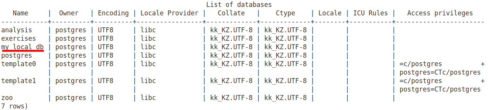
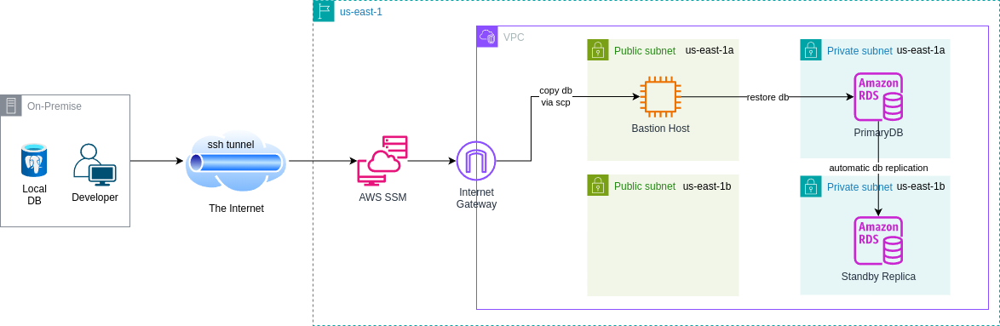

# Example of Database migration to AWS RDS PostgreSQL

The following project showcases the most common PostgreSQL database migration technique: `pg_dump/restore`. This technique is best suited for databases that has sizes **no more than 100 GB**. In **edge cases**, it can be used **up to 500 GB** size databases.

Follow this checklist during database migration: [PostgresDB Migration Checklist](https://gist.github.com/Brain2life/283fc1fab34b953e6f69b69393069275)

## Migration strategies

The following diagram compares the various PostgreSQL native migrations strategies to migrate Amazon RDS for PostgreSQL or Aurora PostgreSQL.


[**Logical replication**](https://docs.aws.amazon.com/prescriptive-guidance/latest/migration-databases-postgresql-ec2/logical-replication-considerations.html) in PostgreSQL is a method for replicating data changes from one PostgreSQL database (the publisher) to another (the subscriber) by copying logical changes, such as INSERTs, UPDATEs, and DELETEs, rather than physical data blocks. It’s particularly useful for migrations, upgrades, or maintaining real-time data synchronization between databases.


## Sample Database

As a sample database, you can use the compressed [PostgreSQL Dump of IMDB Data for JOB Workload](https://dataverse.harvard.edu/dataset.xhtml?persistentId=doi:10.7910/DVN/2QYZBT) of 1.2GB in size.

For other sample databases, see [PostgreSQL Sample Databases](https://wiki.postgresql.org/wiki/Sample_Databases).

### Sample Lego Database

A dataset containing information about various LEGO sets, their themes, parts, colors, and other associated data.

1. Create a `lego` database:

    ```sql
    CREATE DATABASE lego;
    ```

2. Download the source file:

    <CodeBlock shouldWrap>

    ```bash
    wget https://raw.githubusercontent.com/neondatabase/postgres-sample-dbs/main/lego.sql
    ```

    </CodeBlock>

3. Navigate to the directory where you downloaded the source file, and run the following command:

    ```bash
    psql -d "postgres://<user>:<password>@<hostname>/lego" -f lego.sql
    ```

4. Connect to the `lego` database:

    ```bash
    psql postgres://<user>:<password>@<hostname>/lego
    ```

5. Find the top 5 LEGO themes by the number of sets:

    ```sql
    SELECT lt.name AS theme_name, COUNT(ls.set_num) AS number_of_sets
    FROM lego_themes lt
    JOIN lego_sets ls ON lt.id = ls.theme_id
    GROUP BY lt.name
    ORDER BY number_of_sets DESC
    LIMIT 5;
    ```

## Install PostgreSQL on Ubuntu

To install PostgreSQL:
```bash
sudo apt update
sudo apt install postgresql
```

To install PostgreSQL 17.x version:
```bash
sudo apt install -y postgresql-17
```

If you need to install additional tools, extensions, modules to the core PostgreSQL, run the following command:
```bash
sudo apt install postgresql-contrib 
```

For more information, see [Install and configure PostgreSQL](https://documentation.ubuntu.com/server/how-to/databases/install-postgresql/index.html)

To check if PostgreSQL is running:
```bash
sudo systemctl status postgresql
```

## Basic PostgreSQL commands

To check version of installed PostgreSQL:
```bash
psql --version
```

PostgreSQL runs under the **postgres** system user. To use psql (the PostgreSQL interactive shell), switch to this user:
```bash
sudo -i -u postgres
psql
```
or run directly:
```bash
sudo -u postgres psql
```

### Create a new database  
Inside the `psql` shell, create a new database:
```bash
CREATE DATABASE my_local_db;
```
Verify it exists:
```bash
\l
```



### Create a New PostgreSQL User
By default, PostgreSQL uses the **postgres** superuser. If you want to create a separate user:
```bash
CREATE USER my_user WITH ENCRYPTED PASSWORD 'my_password';
GRANT ALL PRIVILEGES ON DATABASE my_local_db TO my_user;
```

### Connect to database

Exit `psql` shell:
```bash
\q
```

Connect to my_local_db:
```bash
psql -U my_user -d my_local_db -h localhost -p 5432
```

### Create a Table and Insert Sample Data
Add sample table:
```bash
CREATE TABLE users (
    id SERIAL PRIMARY KEY,
    name VARCHAR(100),
    email VARCHAR(100) UNIQUE NOT NULL
);
```

If you'll get error on public schema, add permissions:
```bash
sudo -u postgres psql

ALTER DATABASE my_local_db OWNER TO my_user;

GRANT ALL ON SCHEMA public TO my_user;
ALTER SCHEMA public OWNER TO my_user;
```

Insert some data:
```bash
INSERT INTO users (name, email) VALUES ('Alice', 'alice@example.com');
INSERT INTO users (name, email) VALUES ('Bob', 'bob@example.com');
```

Verify the data:
```bash
Script to fill database table with dummy data. Approximately up to 2GBSELECT * FROM users;
```


## **What is a Schema in PostgreSQL?**
A **schema** in PostgreSQL is a **logical namespace** within a database that organizes database objects such as **tables, views, indexes, functions, and sequences**.

Think of a schema as a **folder** inside a database that helps **group related database objects together**.

---

## **🔹 How Schemas Work**
- Every PostgreSQL **database** has at least one schema.
- By default, PostgreSQL creates a schema called **`public`**.
- When you create a new table without specifying a schema, it is placed in the **`public` schema**.
- Users can **create multiple schemas** to separate different parts of an application.

---

## **🔹 Why Use Schemas?**
### **1️⃣ Organizing Data**
Schemas help organize different parts of your database. For example:
- **`sales` schema** → Contains tables related to sales (`customers`, `orders`).
- **`inventory` schema** → Contains tables related to inventory (`products`, `stock`).

### **2️⃣ Security and Access Control**
Schemas allow **different user roles** to access only specific parts of the database. Example:
- **`finance` schema** → Accessible only by finance team.
- **`hr` schema** → Accessible only by HR team.

### **3️⃣ Avoiding Name Conflicts**
Schemas allow the **same table names** in different contexts. Example:
```sql
SELECT * FROM sales.customers;  -- Customers in sales schema
SELECT * FROM hr.customers;     -- Customers in HR schema
```

---

## **🔹 Schema Examples in PostgreSQL**
### **1️⃣ List Available Schemas**
In `psql`, run:
```sql
SELECT schema_name FROM information_schema.schemata;
```
You'll typically see:
```
       schema_name
------------------------
 public
 pg_catalog
 information_schema
(3 rows)
```
- `public`: Default schema for user-created tables.
- `pg_catalog`: Contains PostgreSQL system tables.
- `information_schema`: Metadata about the database.

### **2️⃣ Creating a Custom Schema**
```sql
CREATE SCHEMA finance;
```

### **3️⃣ Creating a Table Inside a Schema**
```sql
CREATE TABLE finance.transactions (
    id SERIAL PRIMARY KEY,
    amount DECIMAL(10,2),
    transaction_date TIMESTAMP DEFAULT NOW()
);
```
Now, to access the table, use:
```sql
SELECT * FROM finance.transactions;
```

### **4️⃣ Changing the Default Schema**
If you don’t want to always type `schema_name.table_name`, set your schema as default:
```sql
SET search_path TO finance;
```
Now, you can query without specifying the schema:
```sql
SELECT * FROM transactions;
```

## Create big_data_table

Run the following command to create `big_data_table`:
```bash
CREATE TABLE big_data_table (
    id SERIAL PRIMARY KEY,
    name TEXT NOT NULL,
    description TEXT NOT NULL,
    random_number INTEGER,
    large_blob BYTEA,  -- Simulating large binary data
    created_at TIMESTAMP DEFAULT NOW()
);
```

To fill this table with dummy data, run the `./fill_db.sh` script.


To check if table exists:
```bash
\dt big_data_table;
```

To see how many rows are inserted:
```bash
SELECT COUNT(*) FROM big_data_table;
```

To check the size of the table in human-readable format:
```bash
SELECT pg_size_pretty(pg_total_relation_size('big_data_table'));
```


## Provision AWS infrastructure



To provision infrastructure:
```bash
terraform init
terraform apply
```

To get outputs:
```bash
terraform output
```

## Configure SCP

1. Generate SSH keys on your local machine:
```bash
ssh-keygen -t ed25519 -C "SSH key to access EC2 bastion host"
```
2. Copy the public key:
```bash
xclip -sel clip < ~/.ssh/id_ed25519.pub
```
3. Connect to the Bastion host via SSM:
```bash
aws ssm start-session --target <bastion_host_instance_id>
```
4. Add public key into `~/.ssh/authorized_keys`
5. Test SSH connection:
```bash
ssh -i ~/.ssh/id_ed25519 ubuntu@<bastion_public_ip>
```

## Copy DB into EC2 instance

1. To export database from local machine, create a database dump by using `pg_dump`:
```bash
pg_dump -U my_user -h localhost -p 5432 -d my_local_db -F c -f my_local_db.dump
```

- `-U my_user` --> Your PostgreSQL username.
- `-h localhost` --> Local database host.
- `-p 5432` --> PostgreSQL default port.
- `-d my_local_db` --> The database name.
- `-F c` --> Custom format dump (recommended for large databases).
- `-f my_local_db.dump` --> Output file.

Another way to backup database is to use [DBeaver tool](https://dbeaver.io/). To backup data with DBeaver:
- Select the desired database
- Right-click on the database and choose Tools -> Backup
- The Dump window will appear.


For more information, see [DBeaver Backup Restore](https://dbeaver.com/docs/dbeaver/Backup-Restore/).

> [!CAUTION]  
> By default DBeaver creates a **plain-text SQL dump**, which must be restored using `psql`, not `pg_restore`.  
> There are two backup options in DBeaver: **backup** and **global backup**. **Global backup** copies all databases in the cluster, while **backup** only takes snapshot of one database.

2. SCP the dumped DB file into EC2 bastion host:
```bash
scp -i ~/.ssh/id_ed25519 my_local_db.dump ubuntu@<bastion_public_ip>:/home/ubuntu/
```


3. Ensure that you can connect to RDS:
```bash
psql -h <rds-endpoint> -U my_rds_user -d my_rds_db -p 5432
```
4. To get password for a new database in RDS from AWS Secrets Manager:

List the secrets and note the secret name:
```bash
aws secretsmanager list-secrets --query 'SecretList[*].Name' --output text
```
Retrieve the password for the database:
```bash
aws secretsmanager get-secret-value --secret-id MyDatabaseSecret --query SecretString --output text | jq -r '.password'
```
5. Restore the database:
```bash
pg_restore -U my_rds_user -h my-rds-endpoint.rds.amazonaws.com -p 5432 --create --jobs 2 -d my_rds_db -F c /home/ec2-user/my_local_db.dump
```
`--jobs` - parameter specifies parallel jobs to run to execute the restore process  

6. For direct SQL file:
```bash
psql -U <rds-user> -h <rds-endpoint> -p 5432 -d <rds-db-name> -f <sample-db>.sql
```

## References
1. [Heroku Blog: Planning Your PostgreSQL Migration: Best Practices and Key Considerations](https://blog.heroku.com/planning-your-postgresql-migration)
2. [Importing data from Amazon S3 into an RDS for PostgreSQL DB instance](https://docs.aws.amazon.com/AmazonRDS/latest/UserGuide/USER_PostgreSQL.S3Import.html)
3. [PostgreSQL 17 Installation on Ubuntu 24.04](https://dev.to/johndotowl/postgresql-17-installation-on-ubuntu-2404-5bfi)
4. [PostgreSQL Sample Databases](https://wiki.postgresql.org/wiki/Sample_Databases)
5. [AWS Blog: Best practices for migrating PostgreSQL databases to Amazon RDS and Amazon Aurora](https://aws.amazon.com/blogs/database/best-practices-for-migrating-postgresql-databases-to-amazon-rds-and-amazon-aurora/)
6. [AWS Docs: PostgreSQL pg_dump and pg_restore utility](https://docs.aws.amazon.com/dms/latest/sbs/chap-manageddatabases.postgresql-rds-postgresql-full-load-pd_dump.html)
7. [github.com/aws-samples/aws-database-migration-samples/tree/master/PostgreSQL/sampledb/v1](https://github.com/aws-samples/aws-database-migration-samples/tree/master/PostgreSQL/sampledb/v1)
8. [Postgres Sample DBs from NeonDatabaseLabs](https://github.com/neondatabase-labs/postgres-sample-dbs?tab=readme-ov-file#wikipedia-vector-embeddings)