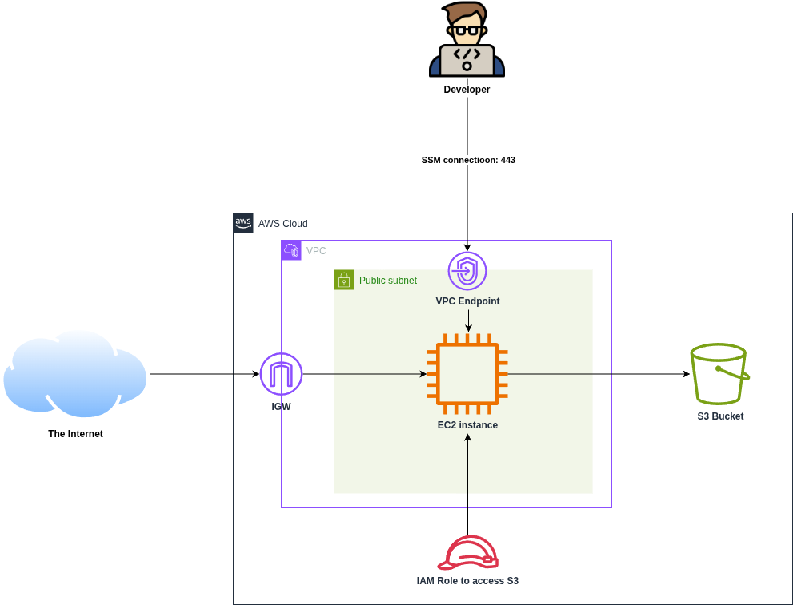

# Mount S3 bucket by using fstab

This project shows how to mount S3 bucket by using fstab. This new feature was announced on 30 May 2025. To learn more, see [AWS Blog: Mountpoint for Amazon S3 now lets you automatically mount your S3 buckets using fstab](https://aws.amazon.com/about-aws/whats-new/2025/05/mountpoint-amazon-s3-mount-buckets-fstab/)

## Mountpoint for S3

[Mountpoint for Amazon S3](https://aws.amazon.com/s3/features/mountpoint/) is an open source file client that you can use to **mount an S3 bucket on your compute instance and access it as a local file system**. It automatically translates local file system API calls to REST API calls on S3 objects. Mountpoint for Amazon S3 is **optimized for high-throughput performance**. It builds on the [AWS Common Runtime (CRT) library](https://docs.aws.amazon.com/sdkref/latest/guide/common-runtime.html), which is purpose-built for high performance and low-resource usage to make efficient use of your compute resources.


### Mountpoint Use Cases 

Mountpoint for Amazon S3 is ideal for **workloads that read large datasets (terabytes to petabytes in size)** and require the elasticity and high throughput of Amazon Simple Storage Service (Amazon S3). Common use cases include: 
- large-scale machine learning (ML) training, 
- autonomous vehicle simulation, 
- genomics analysis, 
- image rendering. 

When these workloads run, they **read big amounts of data using many computers at once** (this is the parallel part). But when it's time to **write results to a file**, **only one computer does the writing**, and it writes the data **in order, one part after another** (this is called *sequential writing*).

Because only one computer writes to the file, they **don’t need a shared file system** that supports complex features like *file locking* (which is used to stop multiple computers from writing to the same file at the same time and causing conflicts).

## What is fstab?

The `/etc/fstab` file, or filesystem table, is a crucial configuration file in Unix-like systems (like Linux) that dictates how and when different file systems are mounted during system startup. It acts as a central directory for system administrators to define how file systems are handled, especially for automatic mounting of devices like hard drives, USB drives, and network shares.

In a nutshell, mounting is the process where a raw (physical) partition is prepared for access and assigned a location on the file system tree (or mount point).

For more information, see [Ubuntu Wiki: fstab](https://help.ubuntu.com/community/Fstab#:~:text=Other%20Resources-,Introduction%20to%20fstab,)

## fstab Features

**Automated Mounting**:  
The primary function of fstab is to **automatically mount file systems during the boot process**, ensuring that devices are readily available for use.

**Mount Options**:  
It allows administrators to set specific mount options for each file system, such as read/write access (`rw`), user permissions (`user`), or options for network shares.

**Efficiency**:  
By defining mounting rules, fstab eliminates the need for manual mounting for specific devices, saving time and reducing errors. 

### fstab Structure:

Each entry in `fstab` typically consists of six fields, separated by spaces or tabs: 
1. **Device/Partition**:
Specifies the storage device or partition to be mounted (e.g., /dev/sda1 or a UUID). 
2. **Mount Point**:
The directory where the file system will be mounted (e.g., /media/MyDrive). 
3. **File System Type**:
The type of file system (e.g., ext4, ntfs, swap). 
4. **Options**:
Specifies additional parameters for mounting, such as read/write access or user permissions. 
5. **Dump**:
Indicates whether the file system should be included in backup routines (0 for no, 1 for yes). 
6. **Pass**:
Specifies the order in which the file system should be checked during boot or when running `fsck` (the file system check utility). 

## What was added?

Now, **Mountpoint for Amazon S3** makes it easy to automatically connect an **S3 bucket** to your **Amazon EC2 instance** every time it starts up. This helps you keep things consistent and saves you from doing it manually after every reboot.


Before, you had to **manually mount the S3 bucket** each time your EC2 instance restarted, and you had to make sure all the settings were correct. But now, you can just **add your S3 mount settings to a special system file called `fstab`**.

The `fstab` file is used on Linux systems to remember which drives or file systems should be mounted automatically. By adding your Mountpoint configuration there, your EC2 instance will **automatically mount the S3 bucket** every time it boots up - **no manual steps needed**.

## Deploy infrastructure



Before deploying infrastructure via Terraform, create AMI image with S3 Mountpoint client installed:
```bash
cd packer
packer init .
packer build s3mount.pkr.hcl
```

To deploy infrastructure:
```bash
terraform apply
```

To connect to EC2 instance via SSM, output the connection command:
```bash
terraform output
```

To check the installed S3 Mountpoint client version:
```bash
mount-s3 --version
```

## Automatic mount of S3

Connect to EC2 instance:
```bash
aws ssm start-session --target <ec2_instance_id> --region us-east-1
```

Login as `ubuntu` user:
```bash
sudo su ubuntu
cd
```

Edit `fstab`:
```bash
sudo vim /etc/fstab
```

Create a mount directory for the bucket:
```bash
sudo mkdir -p /mnt/s3-bucket
```

Add the following line to the `fstab` file and save it. Make sure to replace these with your actual bucket name and mount location:

```bash
s3://<your_s3_bucket_name>/ /mnt/s3-bucket mount-s3 _netdev,nosuid,nodev,nofail,rw 0 0
```


See the following table for an explanation of the options used in the example:

| Option   | Description                                                                 |
|----------|-----------------------------------------------------------------------------|
| `_netdev` | Specifies that the filesystem requires networking to mount.                |
| `nosuid`  | Specifies that the filesystem cannot contain set user ID files.            |
| `nodev`   | Specifies that the filesystem cannot contain special devices.              |
| `nofail`  | Specifies that failure to mount the filesystem should still allow the system to boot. |
| `rw`      | Specifies that the mount point is created with read and write permissions. Alternatively, use `ro` for read only. |

After saving the file, test the mount using the following command:
```bash
sudo mount -a
```

On a successful mount you will get the following message:


For more information, see [Configuring and using Mountpoint](https://docs.aws.amazon.com/AmazonS3/latest/userguide/mountpoint-usage.html)

## References
- [AWS Blog: Mountpoint for Amazon S3 now lets you automatically mount your S3 buckets](https://aws.amazon.com/about-aws/whats-new/2025/05/mountpoint-amazon-s3-mount-buckets-fstab/)
- [AWS Docs: Mount an Amazon S3 bucket as a local file system](https://docs.aws.amazon.com/AmazonS3/latest/userguide/mountpoint.html)
- [AWS Docs: Installing Mountpoint](https://docs.aws.amazon.com/AmazonS3/latest/userguide/mountpoint-installation.html)
- [Blog: S3 Bucket is Mounted using Mountpoint for Amazon S3](https://blog.jineshkumar.com/s3-bucket-is-mounted-using-mountpoint-for-amazon-s3)
- [GitHub Example: EC2 instance w/ private network access via Session Manager](https://github.com/terraform-aws-modules/terraform-aws-ec2-instance/tree/v5.8.0/examples/session-manager)

