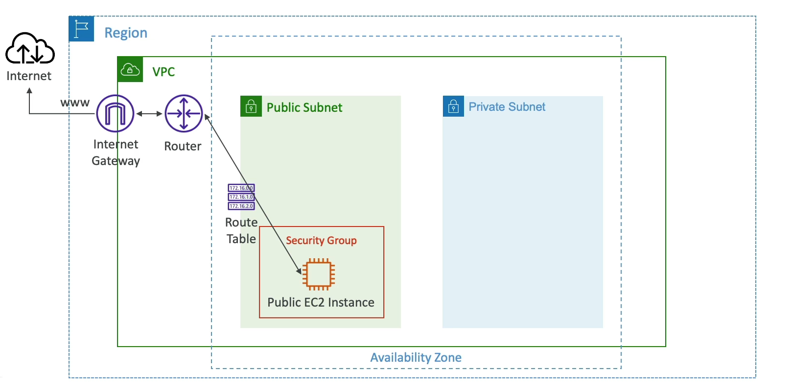
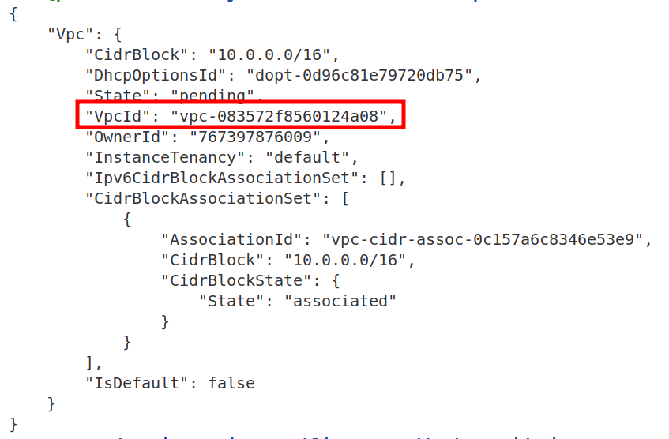
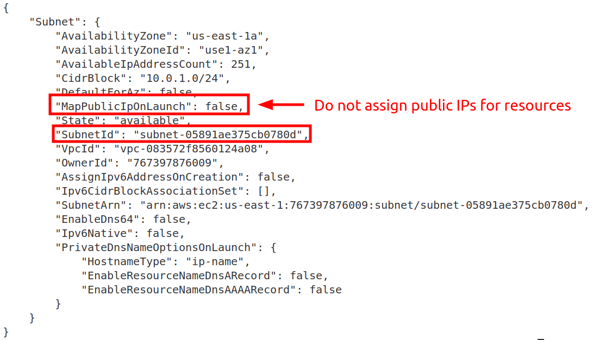
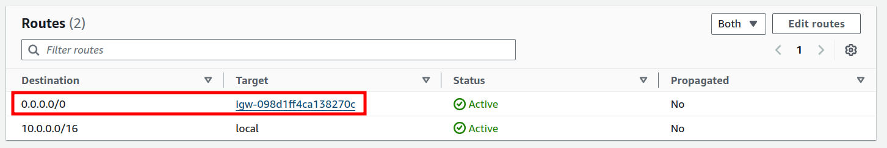
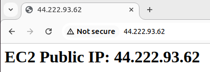

# Use Internet Gateway to provide Internet access

This example project shows how to provide Internet access for resources deployed in a public subnet in a custom VPC setup. 



**REMEMBER**  
A subnet in AWS is referred as **public subnet** when corresponding VPC **has Internet Gateway (IGW) provisioned** and there is a **route to an IGW in route table**. To learn more, see [this video](https://youtube.com/watch?v=8nNurTFy-h4&t=8m22s) from AWS ReInvent conference.

## Table of contents:
- [Step 1: Create a Custom VPC](#step-1-create-a-custom-vpc)
- [Step 2: Create Subnets](#step-2-create-subnets)
- [Step 3: Create an Internet Gateway and Attach It to the VPC](#step-3-create-an-internet-gateway-and-attach-it-to-the-vpc)
- [Step 4: Create a Route Table and Associate It with the Public Subnet](#step-4-create-a-route-table-and-associate-it-with-the-public-subnet)
- [Step 5: Launch the EC2 Instance in the Public Subnet](#step-5-launch-the-ec2-instance-in-the-public-subnet)
- [Step 6: Install a Web Server and Output Public IP Address](#step-6-install-a-web-server-and-output-public-ip-address)
- [Step 7: Access the Web Server](#step-7-access-the-web-server)
- [References](#references)

To accomplish this using the AWS CLI, you need to follow these steps:

### Step 1: Create a Custom VPC
```bash
aws ec2 create-vpc --cidr-block 10.0.0.0/16
```
Note the VPC ID from the response.



### Step 2: Create Subnets
#### Create a Public Subnet
```bash
aws ec2 create-subnet --vpc-id <vpc-id> --cidr-block 10.0.1.0/24 --availability-zone us-east-1a
```
Note the Subnet ID.



#### Create a Private Subnet
```bash
aws ec2 create-subnet --vpc-id <vpc-id> --cidr-block 10.0.2.0/24 --availability-zone us-east-1b
```
Note the Subnet ID.

### Step 3: Create an Internet Gateway and Attach It to the VPC
```bash
aws ec2 create-internet-gateway
```
Note the Internet Gateway ID.

Attach the Internet Gateway to the VPC:
```bash
aws ec2 attach-internet-gateway --internet-gateway-id <igw-id> --vpc-id <vpc-id>
```

### Step 4: Create a Route Table and Associate It with the Public Subnet
Create the route table:
```bash
aws ec2 create-route-table --vpc-id <vpc-id>
```
Note the Route Table ID.

Associate the route table with the public subnet:
```bash
aws ec2 associate-route-table --route-table-id <route-table-id> --subnet-id <public-subnet-id>
```

Add a default route to the Internet Gateway:
```bash
aws ec2 create-route --route-table-id <route-table-id> --destination-cidr-block 0.0.0.0/0 --gateway-id <igw-id>
```



### Step 5: Launch the EC2 Instance in the Public Subnet
#### Create a Key Pair
```bash
aws ec2 create-key-pair --key-name MyKeyPair --query 'KeyMaterial' --output text > MyKeyPair.pem
chmod 400 MyKeyPair.pem
```

#### Create a Security Group
```bash
aws ec2 create-security-group --group-name WebServerSG --description "Security group for web server" --vpc-id <vpc-id>
```
Note the Security Group ID.

#### Allow HTTP and SSH Access
```bash
aws ec2 authorize-security-group-ingress --group-id <sg-id> --protocol tcp --port 22 --cidr 0.0.0.0/0
aws ec2 authorize-security-group-ingress --group-id <sg-id> --protocol tcp --port 80 --cidr 0.0.0.0/0
```

#### Launch the EC2 Instance
```bash
aws ec2 run-instances --image-id ami-0453ec754f44f9a4a --count 1 --instance-type t2.micro --key-name MyKeyPair --security-group-ids <sg-id> --subnet-id <public-subnet-id> --associate-public-ip-address
```
Replace `ami-0453ec754f44f9a4a` (Amazon Linux 2023) with a valid AMI ID for your region.

### Step 6: Install a Web Server and Output Public IP Address
#### Connect to the EC2 Instance
```bash
ssh -i MyKeyPair.pem ec2-user@<public-ip>
```

#### Install and Configure the Web Server
```bash
sudo yum update -y
sudo yum install -y httpd
sudo systemctl start httpd
sudo systemctl enable httpd

# Fetch the IMDSv2 token
TOKEN=$(curl -X PUT "http://169.254.169.254/latest/api/token" -H "X-aws-ec2-metadata-token-ttl-seconds: 21600")

# Fetch the public IP using the token
PUBLIC_IP=$(curl -s -H "X-aws-ec2-metadata-token: $TOKEN" http://169.254.169.254/latest/meta-data/public-ipv4)

# Write the public IP to the index.html file
echo "<h1>EC2 Public IP: $PUBLIC_IP</h1>" | sudo tee /var/www/html/index.html
```

**NOTE**  
**Instance Metadata Service Version 2 (IMDSv2)** is enabled on EC2 instances with newer AMI IDs, which requires a token to access metadata. To learn more, see [Use the Instance Metadata Service to access instance metadata](https://docs.aws.amazon.com/AWSEC2/latest/UserGuide/configuring-instance-metadata-service.html#instance-metadata-retrieval-examples-imdsv1)

### Step 7: Access the Web Server
Visit the EC2 instance's public IP address in a browser:  
`http://<public-ip>`

You should see the public IP displayed on the page.



### References
- [AWS re:Invent 2023 - AWS networking foundations (NTA307)](https://www.youtube.com/watch?v=8nNurTFy-h4&t=502s)
- [AWS Docs: Enable VPC internet access using internet gateways](https://docs.aws.amazon.com/vpc/latest/userguide/VPC_Internet_Gateway.html)