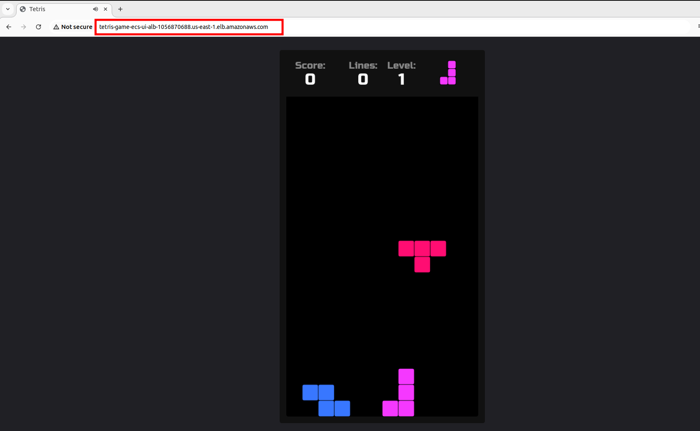

# Provision ECS cluster via AWS CLI

This poject shows how to build the core components of Amazon ECS, including an ECS cluster, task definition, and ECS service. The ultimate goal is to deploy a container sitting behind an Application Load Balancer (ALB). 


## Table of contents:
- [Sample application](#sample-application)
- [Create IAM roles](#create-iam-roles)
- [Create the CloudWatch Log Group](#create-the-cloudwatch-log-group)
- [Create cluster](#create-cluster)
- [Create task definition](#create-task-definition)
- [Create services](#create-services)

## Sample application

The sample application models a Tetris game:


Application Docker image is availalbe here: [https://hub.docker.com/r/makbanov/tetris-game](https://hub.docker.com/r/makbanov/tetris-game)

## Create IAM roles

ECS does not create IAM roles automatically when referencing them in task definitions. These roles need to be pre-created to ensure the task has the necessary permissions for execution and accessing AWS services. This design prevents accidental privilege escalation or unintentional access to AWS services.

You need to create two IAM roles `tetrisGameEcsTaskExecutionRole` and `tetrisGameEcsTaskRole`. These roles need to be manually created or provisioned before referencing them in the task definition.


### Create the Task Execution Role

The **execution role** is used by ECS to pull container images and send logs to Amazon CloudWatch.

Run the following command to create the `tetrisGameEcsTaskExecutionRole`:

```bash
aws iam create-role --role-name tetrisGameEcsTaskExecutionRole \
    --assume-role-policy-document '{
        "Version": "2012-10-17",
        "Statement": [
            {
                "Effect": "Allow",
                "Principal": {
                    "Service": "ecs-tasks.amazonaws.com"
                },
                "Action": "sts:AssumeRole"
            }
        ]
    }'

aws iam attach-role-policy --role-name tetrisGameEcsTaskExecutionRole \
    --policy-arn arn:aws:iam::aws:policy/service-role/AmazonECSTaskExecutionRolePolicy
```

This role grants ECS tasks permissions to:
- Pull images from Amazon ECR or public registries.
- Write logs to Amazon CloudWatch.

### Create the Task Role

The **task role** is used by the application containers within the ECS tasks to interact with other AWS services (e.g., accessing S3, DynamoDB, etc.).

Run the following command to create the `tetrisGameEcsTaskRole`:

```bash
aws iam create-role --role-name tetrisGameEcsTaskRole \
    --assume-role-policy-document '{
        "Version": "2012-10-17",
        "Statement": [
            {
                "Effect": "Allow",
                "Principal": {
                    "Service": "ecs-tasks.amazonaws.com"
                },
                "Action": "sts:AssumeRole"
            }
        ]
    }'
```

You can attach additional policies to this role as needed. For example, if the task needs access to S3:

```bash
aws iam attach-role-policy --role-name tetrisGameEcsTaskRole \
    --policy-arn arn:aws:iam::aws:policy/AmazonS3ReadOnlyAccess
```

### Update Environment Variables

Ensure that `${ACCOUNT_ID}` and `$AWS_REGION` in your task definition template are correctly set in your environment:

```bash
export ACCOUNT_ID=$(aws sts get-caller-identity --query 'Account' --output text)
export AWS_REGION=us-east-1
```

### Verify the Roles

To confirm the roles exist and are correctly configured, use:

```bash
aws iam get-role --role-name tetrisGameEcsTaskExecutionRole
aws iam get-role --role-name tetrisGameEcsTaskRole
```

## Create the CloudWatch Log Group

Create the **CloudWatch log group** (`tetris-game-ecs-tasks`) used by ECS tasks to send and save the logs.

You must create the log group in CloudWatch before running the ECS service. Use the following AWS CLI command to create the log group:

```bash
aws logs create-log-group --log-group-name tetris-game-ecs-tasks
```

### Verify the Log Group

After creating the log group, confirm its existence:

```bash
aws logs describe-log-groups --log-group-name-prefix tetris-game-ecs-tasks
```

### Check Permissions for the Execution Role

Ensure the **task execution role** (`tetrisGameEcsTaskExecutionRole`) has the necessary permissions to write logs to CloudWatch. The role should have the **`AmazonECSTaskExecutionRolePolicy`** attached. Reattach it if missing:

```bash
aws iam attach-role-policy --role-name tetrisGameEcsTaskExecutionRole \
    --policy-arn arn:aws:iam::aws:policy/service-role/AmazonECSTaskExecutionRolePolicy
```

You can verify the permissions with:

```bash
aws iam list-attached-role-policies --role-name tetrisGameEcsTaskExecutionRole
```

Ensure that the policy `AmazonECSTaskExecutionRolePolicy` is listed.

## Create cluster

Create an Amazon ECS Cluster named tetris-game-ecs-cluster with [CloudWatch Container Insights](https://docs.aws.amazon.com/AmazonECS/latest/developerguide/cloudwatch-container-insights.html)  enabled. Container Insights collects, aggregates, and summarizes metrics and logs from your containerized applications and microservices.

**NOTE**  
Metrics collected by CloudWatch Container Insights are charged as custom metrics. For more information about CloudWatch pricing, see [CloudWatch Pricing](https://aws.amazon.com/cloudwatch/pricing/).

To create ECS cluster:
```bash
aws ecs create-cluster --cluster-name tetris-game-ecs-cluster --region us-east-1 --settings name=containerInsights,value=enabled
```


## Create task definition

A task definition is a blueprint that describes how a container (or containers) should run on Amazon ECS. It includes various configurations such as the container image to use, the required CPU and memory, the ports to open, and the environment variables needed.

Create the task definition to be used for the Tetris game app. The app is available at [https://hub.docker.com/r/makbanov/tetris-game](https://hub.docker.com/r/makbanov/tetris-game)

1. Create a Template File: Save the JSON template into a file (e.g., `tetris-game-ecs-ui-taskdef.template.json`) with placeholders for variables.

```bash
cat << EOF > tetris-game-ecs-ui-taskdef.tmpl
{
    "family": "tetris-game-ecs-ui",
    "networkMode": "awsvpc",
    "requiresCompatibilities": [
        "FARGATE"
    ],
    "cpu": "1024",
    "memory": "2048",
    "runtimePlatform": {
        "cpuArchitecture": "X86_64",
        "operatingSystemFamily": "LINUX"
    },
    "containerDefinitions": [
        {
            "name": "application",
            "image": "makbanov/tetris-game:latest",
            "portMappings": [
                {
                    "name": "application",
                    "containerPort": 80,
                    "hostPort": 80,
                    "protocol": "tcp",
                    "appProtocol": "http"
                }
            ],
            "essential": true,
            "linuxParameters": {
                "initProcessEnabled": true
            },
            "healthCheck": {
                "command": [
                    "CMD-SHELL",
                    "curl -f http://localhost:80/actuator/health || exit 1"
                ],
                "interval": 10,
                "timeout": 5,
                "retries": 3,
                "startPeriod": 60
            },
            "logConfiguration": {
                "logDriver": "awslogs",
                "options": {
                    "awslogs-group": "tetris-game-ecs-tasks",
                    "awslogs-region": "$AWS_REGION",
                    "awslogs-stream-prefix": "ui-service"
                }
            }
        }
    ],
    "executionRoleArn": "arn:aws:iam::${ACCOUNT_ID}:role/tetrisGameEcsTaskExecutionRole",
    "taskRoleArn": "arn:aws:iam::${ACCOUNT_ID}:role/tetrisGameEcsTaskRole"
}
EOF
```

2. Ensure that the required environment variables (`AWS_REGION` and `ACCOUNT_ID`) are set.

```bash
export AWS_REGION="us-east-1"
export ACCOUNT_ID="123456789012"
```

3. Use the envsubst command to substitute the placeholders with the actual values from the environment variables. 

```bash
envsubst < tetris-game-ecs-ui-taskdef.tmpl > tetris-game-ecs-ui-taskdef.json
```

4. Register the task definition:
```bash
aws ecs register-task-definition --cli-input-json file://tetris-game-ecs-ui-taskdef.json
```

This command will display the full details of the task definition you just created:
```json
{
    "taskDefinition": {
        "taskDefinitionArn": "arn:aws:ecs:us-east-1:975049978758:task-definition/tetris-game-ecs-ui:1",
        "containerDefinitions": [
            {
                "name": "application",
                "image": "makbanov/tetris-game:latest",
                "cpu": 0,
                "portMappings": [
                    {
                        "containerPort": 80,
                        "hostPort": 80,
                        "protocol": "tcp",
                        "name": "application",
                        "appProtocol": "http"
                    }
                ],
                "essential": true,
                "environment": [],
                "mountPoints": [],
                "volumesFrom": [],
                "linuxParameters": {
                    "initProcessEnabled": true
                },
                "logConfiguration": {
                    "logDriver": "awslogs",
                    "options": {
                        "awslogs-group": "tetris-game-ecs-tasks",
                        "awslogs-region": "us-east-1",
                        "awslogs-stream-prefix": "ui-service"
                    }
                },
                "healthCheck": {
                    "command": [
                        "CMD-SHELL",
                        "curl -f http://localhost:80/actuator/health || exit 1"
                    ],
                    "interval": 10,
                    "timeout": 5,
                    "retries": 3,
                    "startPeriod": 60
                },
                "systemControls": []
            }
        ],
        "family": "tetris-game-ecs-ui",
        "taskRoleArn": "arn:aws:iam::975049978758:role/tetrisGameEcsTaskRole",
        "executionRoleArn": "arn:aws:iam::975049978758:role/tetrisGameEcsTaskExecutionRole",
        "networkMode": "awsvpc",
        "revision": 1,
        "volumes": [],
        "status": "ACTIVE",
        "requiresAttributes": [
            {
                "name": "com.amazonaws.ecs.capability.logging-driver.awslogs"
            },
            {
                "name": "ecs.capability.execution-role-awslogs"
            },
            {
                "name": "com.amazonaws.ecs.capability.docker-remote-api.1.19"
            },
            {
                "name": "com.amazonaws.ecs.capability.task-iam-role"
            },
            {
                "name": "com.amazonaws.ecs.capability.docker-remote-api.1.25"
            },
            {
                "name": "ecs.capability.container-health-check"
            },
            {
                "name": "com.amazonaws.ecs.capability.docker-remote-api.1.18"
            },
            {
                "name": "ecs.capability.task-eni"
            },
            {
                "name": "com.amazonaws.ecs.capability.docker-remote-api.1.29"
            }
        ],
        "placementConstraints": [],
        "compatibilities": [
            "EC2",
            "FARGATE"
        ],
        "runtimePlatform": {
            "cpuArchitecture": "X86_64",
            "operatingSystemFamily": "LINUX"
        },
        "requiresCompatibilities": [
            "FARGATE"
        ],
        "cpu": "1024",
        "memory": "2048",
        "registeredAt": "2024-12-10T20:28:50.525000+05:00",
        "registeredBy": "arn:aws:iam::975049978758:user/cloud_user"
    }
}
```

You can find detailed explanations of the parameters within the ECS task definition in the [official documentation](https://docs.aws.amazon.com/AmazonECS/latest/developerguide/task_definition_parameters.html).

Task definitions are split into separate parts: the task family, the AWS Identity and Access Management (IAM) task role, the network mode, container definitions, volumes, task placement constraints, and launch types. The family and container definitions are required in a task definition. In contrast, task role, network mode, volumes, task placement constraints, and launch type are optional.


You can retrieve the task definition using the AWS CLI:
```bash
aws ecs describe-task-definition --task-definition tetris-game-ecs-ui
```

This command will display the full details of the task definition you created.

## Create services

An ECS service enables you to run and maintain a specified number of instances of a task definition simultaneously in an Amazon ECS cluster. If any of these tasks fail or stop for any reason, the ECS service scheduler launches another instance of your task definition to replace it, maintaining the desired number of tasks in the service. This ensures high availability for your application.

ECS services are used to manage long-running applications, microservices, or other software components that require high availability. Services in ECS can be integrated with [Elastic Load Balancing (ELB)](https://aws.amazon.com/elasticloadbalancing/getting-started/?nc=sn&loc=4) to distribute traffic evenly across the tasks in the service, providing a seamless way to deploy, manage, and scale your containerized applications.

### Create Application Load Balancer (ALB)

For these purposes, you need to create Application Load Balancer that will distribute the traffic evenly across your containers in ECS cluster.

To create an **Application Load Balancer (ALB)** using the AWS CLI, follow these steps. I'll provide commands for each required step:

**NOTE**  
If no tasks/services are deployed, ECS has no VPC association. You must create a VPC or use an existing one and specify it when deploying Fargate tasks. Use the steps below to create a properly configured VPC for Fargate tasks.

**Create a new VPC**  

Create a new VPC for Fargate tasks:
```bash
VPC_ID=$(aws ec2 create-vpc --cidr-block 10.0.0.0/16 \
    --query 'Vpc.VpcId' --output text)

aws ec2 modify-vpc-attribute --vpc-id $VPC_ID --enable-dns-support
aws ec2 modify-vpc-attribute --vpc-id $VPC_ID --enable-dns-hostnames
```

**Create subnets**  

Fargate requires at least two subnets (preferably in different availability zones for high availability):
```bash
SUBNET_ID1=$(aws ec2 create-subnet --vpc-id $VPC_ID --cidr-block 10.0.1.0/24 \
    --availability-zone <availability-zone-1> \
    --query 'Subnet.SubnetId' --output text)

SUBNET_ID2=$(aws ec2 create-subnet --vpc-id $VPC_ID --cidr-block 10.0.2.0/24 \
    --availability-zone <availability-zone-2> \
    --query 'Subnet.SubnetId' --output text)
```

Replace <availability-zone-1> and <availability-zone-2> with the desired availability zones in your region. For example, `us-east-1a` and `us-east-1b`.

**Create and Attach an Internet Gateway**  

If your tasks require internet access, create an internet gateway and attach it to the VPC.
```bash
IGW_ID=$(aws ec2 create-internet-gateway --query 'InternetGateway.InternetGatewayId' --output text)
aws ec2 attach-internet-gateway --vpc-id $VPC_ID --internet-gateway-id $IGW_ID
```

**Create a Route Table (for IGW)**  

Create a route table and associate it with the subnets for routing internet traffic.
```bash
ROUTE_TABLE_ID=$(aws ec2 create-route-table --vpc-id $VPC_ID \
    --query 'RouteTable.RouteTableId' --output text)

aws ec2 create-route --route-table-id $ROUTE_TABLE_ID --destination-cidr-block 0.0.0.0/0 --gateway-id $IGW_ID

aws ec2 associate-route-table --route-table-id $ROUTE_TABLE_ID --subnet-id $SUBNET_ID1
aws ec2 associate-route-table --route-table-id $ROUTE_TABLE_ID --subnet-id $SUBNET_ID2
```


**Create a Security Group**  

Set up a security group to allow traffic to and from your ECS tasks.

```bash
SECURITY_GROUP_ID=$(aws ec2 create-security-group --group-name Fargate-SG \
    --description "Security group for Fargate tasks" --vpc-id $VPC_ID \
    --query 'GroupId' --output text)

aws ec2 authorize-security-group-ingress --group-id $SECURITY_GROUP_ID \
    --protocol tcp --port 80 --cidr 0.0.0.0/0
```

**Create the ALB**  

Ensure you have an ALB set up with subnets in your VPC.
```bash
ALB_ARN=$(aws elbv2 create-load-balancer --name tetris-game-ecs-ui-alb \
    --subnets $SUBNET_ID1 $SUBNET_ID2 \
    --security-groups $SECURITY_GROUP_ID \
    --scheme internet-facing \
    --type application \
    --ip-address-type ipv4 \
    --query 'LoadBalancers[0].LoadBalancerArn' --output text)
```

**Create a Target Group**  

The target group is required to route traffic to ECS tasks.
```bash
TARGET_GROUP_ARN=$(aws elbv2 create-target-group --name ecs-target-group \
    --protocol HTTP \
    --port 80 \
    --vpc-id $VPC_ID \
    --target-type ip \
    --query 'TargetGroups[0].TargetGroupArn' --output text)
```

This creates a target group that ECS Fargate tasks will register with.

**Create a Listener**  

Attach a listener to the ALB to forward traffic to the target group.
```bash
aws elbv2 create-listener --load-balancer-arn $ALB_ARN \
    --protocol HTTP \
    --port 80 \
    --default-actions Type=forward,TargetGroupArn=$TARGET_GROUP_ARN
```

### Create ECS service

When creating the ECS service, specify the ALB and target group in the `loadBalancers` and `networkConfiguration` fields.
```bash
aws ecs create-service --cluster tetris-game-ecs-cluster \
    --service-name tetris-app \
    --task-definition tetris-game-ecs-ui \
    --launch-type FARGATE \
    --load-balancers "targetGroupArn=$TARGET_GROUP_ARN,containerName=application,containerPort=80" \
    --network-configuration "awsvpcConfiguration={subnets=[$SUBNET_ID1,$SUBNET_ID2],securityGroups=[$SECURITY_GROUP_ID],assignPublicIp=ENABLED}" \
    --desired-count 2
```

You need to wait for the service to stabilize with the AWS CLI (~ 2 min):
```bash
aws ecs wait services-stable --cluster tetris-game-ecs-cluster --services tetris-app
```

Once the service is stable, you can view the running tasks from the CLI:
```bash
aws ecs describe-tasks \
    --cluster tetris-game-ecs-cluster \
    --tasks $(aws ecs list-tasks --cluster tetris-game-ecs-cluster --query 'taskArns[]' --output text) \
    --query "tasks[*].[group, launchType, lastStatus, healthStatus, taskArn]" --output table
```


You can retrieve the load balancer URL:
```bash
export TETRIS_ALB=$(aws elbv2 describe-load-balancers --name tetris-game-ecs-ui-alb \
 --query 'LoadBalancers[0].DNSName' --output text)

echo http://${TETRIS_ALB} ; echo
```

Access the URL for Tetris game:



**NOTE**  
In case of adding new changes, restart ECS service:
```bash
aws ecs update-service --cluster tetris-game-ecs-cluster --service tetris-app --force-new-deployment
```