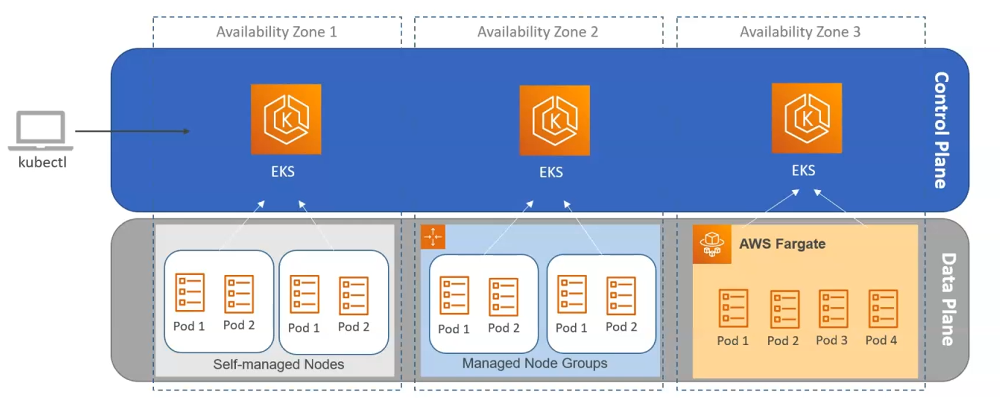
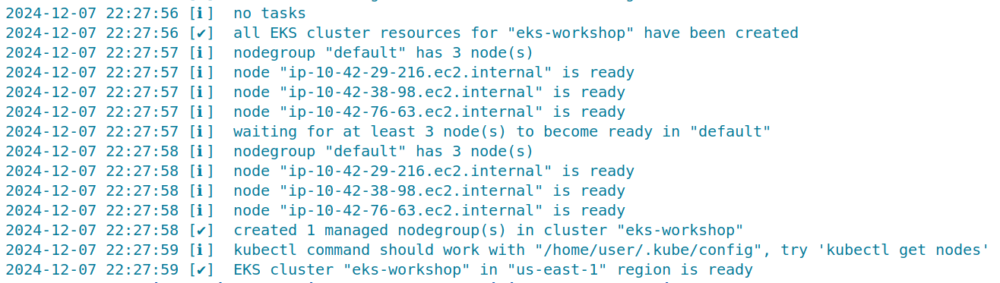
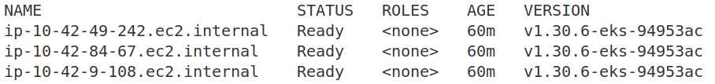
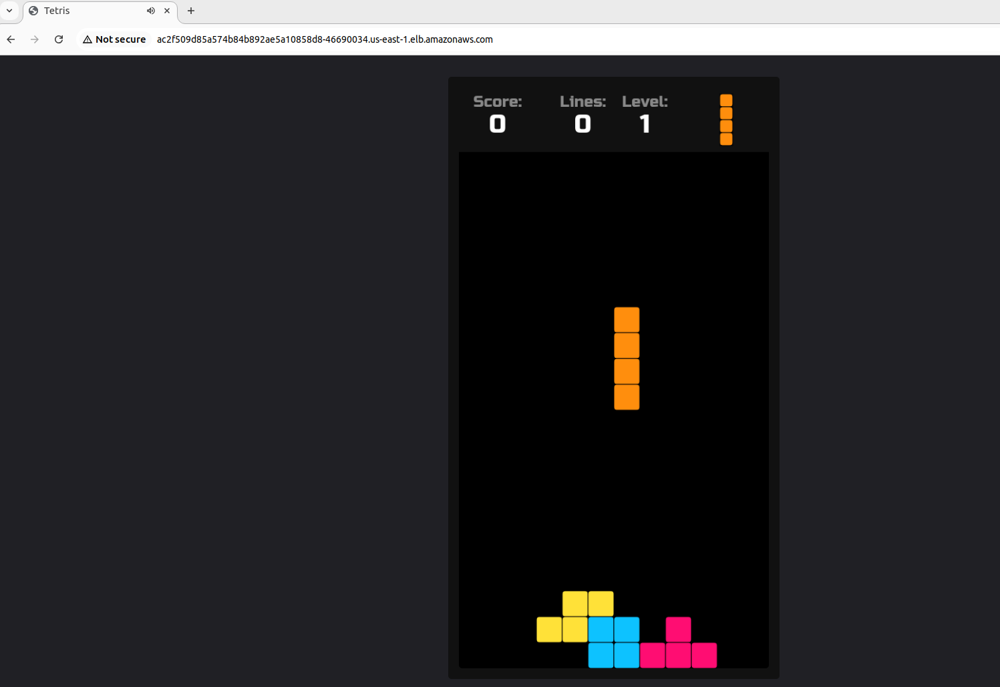

# Provision EKS cluster with eksctl

## Overview

In general there are three types of EKS cluster related to the worker nodes configuration in Data Plane:



This example project provisions [**EKS cluster with Managed Node Groups**](https://docs.aws.amazon.com/eks/latest/userguide/managed-node-groups.html) with the cheap EC2 instance type for worker nodes `t3.micro`. Deployed Kubernetes version is [`1.30.0`](https://kubernetes.io/blog/2024/04/17/kubernetes-v1-30-release/). This configuration is well-suited for development or workshop environments, focusing on simplicity and cost-effectiveness.

EKS cluster provisioned via `eksctl` tool. [`eksctl`](https://eksctl.io/) - is an open-source CLI tool provided by AWS for creating and managing clusters on EKS - Amazon's managed Kubernetes service for EC2.

Cluster created by using config file instead of flags. For more information, see [Using Config Files](https://eksctl.io/usage/creating-and-managing-clusters/#using-config-files)

**NOTE**  
To find more different examples of config files used for the cluster configuration, see [https://github.com/eksctl-io/eksctl/tree/main/examples](https://github.com/eksctl-io/eksctl/tree/main/examples)

## Configuration file for the cluster

This is the configuration that will be used to build the cluster:
```yaml
apiVersion: eksctl.io/v1alpha5
kind: ClusterConfig
availabilityZones:
  - ${AWS_REGION}a
  - ${AWS_REGION}b
  - ${AWS_REGION}c
metadata:
  name: ${EKS_CLUSTER_NAME}
  region: ${AWS_REGION}
  version: "1.30" # Kubernetes version
  tags: # User defined custom AWS resource tags added to the cluster
    karpenter.sh/discovery: ${EKS_CLUSTER_NAME}
    created-by: eks-workshop
    env: ${EKS_CLUSTER_NAME} # Cluster environment
iam:
  withOIDC: true # Enables OIDC (OpenID Connect) for integrating IAM roles with Kubernetes Service Accounts
vpc:
  cidr: 10.42.0.0/16
  clusterEndpoints:
    privateAccess: true # Allows access to the Kubernetes API from within the VPC.
    publicAccess: true # Allows access to the Kubernetes API from the internet.
addons: # Specifies Kubernetes addons and it's configurations to be installed on the cluster.
  - name: vpc-cni
    version: 1.16.0 # vpc-cni addon version
    configurationValues: '{"env":{"ENABLE_PREFIX_DELEGATION":"true", "ENABLE_POD_ENI":"true", "POD_SECURITY_GROUP_ENFORCING_MODE":"standard"},"enableNetworkPolicy": "true", "nodeAgent": {"enablePolicyEventLogs": "true"}}'
    resolveConflicts: overwrite # In case of configuration conflicts - overwrite
managedNodeGroups: # Specifies configurations for managed worker nodes in the cluster.
  - name: default # Name of the node group
    desiredCapacity: 3
    minSize: 3
    maxSize: 6
    instanceType: t3.micro
    privateNetworking: true # Ensures nodes use private IPs within the VPC.
    releaseVersion: "1.30.0-20240625" # Specific Kubernetes version for the nodes.
    updateConfig:
      maxUnavailablePercentage: 50 # During updates, up to 50% of nodes can be unavailable simultaneously.
    labels: 
      workshop-default: "yes" # Adds Kubernetes labels to nodes

karpenter:
  version: '0.37.0'
  createServiceAccount: true
```

This file provisions an Amazon EKS cluster with three `t3.micro` nodes for cost efficiency.

- Creates a VPC across three availability zones.
- Enables private and public access to the Kubernetes API.
- Integrates IAM for Kubernetes with OIDC for secure access.
- Deploys the `vpc-cni` addon with enhanced networking configurations.
- Configures auto-scaling and update settings for managed nodes.

## Provisioning cluster

Before provisioning cluster, ensure that you have [`envsubst`](https://github.com/a8m/envsubst) tool installed. This is a CLI tool used to substitute environment variables for a Go based templates and apps. 

Export required variables:
```bash
export AWS_REGION=us-east-1
export EKS_CLUSTER_NAME=eks-workshop
```

Create `eks-cluster.yaml` file by substituting the environment variables in `eks-cluster.tmpl` file:
```bash
envsubst < eks-cluster.tmpl > eks-cluster.yaml
```

Provision cluster:
```bash
eksctl create cluster -f eks-cluster.yaml
```



To check the running cluster:
```bash
kubectl get nodes
```



To delete the cluster:
```bash
eksctl delete cluster $EKS_CLUSTER_NAME --wait
```

## Deploy tetris game

As an example deploy tetris game from Docker image [`makbanov/tetris-game`](https://hub.docker.com/r/makbanov/tetris-game) with service type of LoadBalancer:
```bash
kubectl apply -f tetris-deployment.yaml
```

To access the app from browser, go to:
```
http://<load-balancer-external-ip>
```



## References
- [EKS workshop](https://www.eksworkshop.com/docs/introduction/setup/your-account/using-eksctl)
- [YouTube: Amazon EKS Explained](https://www.youtube.com/watch?v=E956xeOt050)
- [Available EKS Addons](https://docs.aws.amazon.com/eks/latest/userguide/workloads-add-ons-available-eks.html)
- [Understanding AWS EKS Kubernetes Pricing and Costs](https://www.sedai.io/blog/understanding-aws-eks-kubernetes-pricing-and-costs)
- [Understanding the Amazon EKS Pricing and Costs](https://pump.co/blog/amazon-eks-pricing)
- [https://github.com/eksctl-io/eksctl/tree/main/examples](https://github.com/eksctl-io/eksctl/tree/main/examples)
- [Blog: 9 Ways to Spin Up an EKS Cluster: eksctl](https://www.perfectscale.io/blog/9-ways-to-spin-up-an-eks-cluster-part-3)
- [karpenter.sh](https://karpenter.sh/)